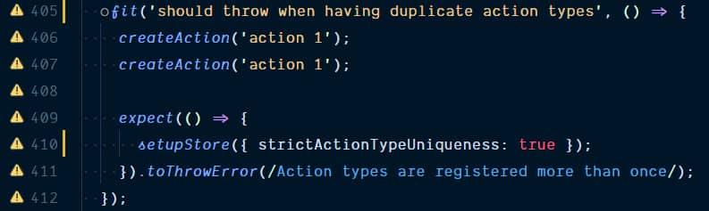

We've all done it, committing a focused test. Most of the time this won't be spotted during a review, and this might lead to bigger problems. So... how can this be prevented?

## Visual Studio Code extension

Last week, [Dzhavat Ushev](https://twitter.com/dzhavatushev) created the [Test Focus Highlighter](https://marketplace.visualstudio.com/items?itemName=dzhavat.test-focus-highlighter) Visual Studio Code extension which highlights focused tests.



Neat right?! But this doesn't prevent us from committing tests, for this we have to take it a step further.

## TSLint

For projects that are using TSLint, the built-in [ban rule](https://palantir.github.io/tslint/rules/ban/) can be used to ban the usage of specific functions or global methods. I didn't know this existed, but [Maxime Robert](https://twitter.com/maxime1992) pointed me to it.

This ban rule can be configured in the `tslint.json` file.

```json:tslint.json
{
  "rules": {
    "ban": [
      true,
      { "name": ["describe", "only"], "message": "don't focus tests" },
      { "name": "fdescribe", "message": "don't focus tests" },
      { "name": ["it", "only"], "message": "don't focus tests" },
      { "name": "fit", "message": "don't focus tests" }
    ]
  }
}
```

## ESLint

### eslint-plugin-ban

Sadly, for ESLint there isn't a built-in rule but there are options. Inspired by the TSLint ban rule, there's an ESLint [ban rule](https://www.npmjs.com/package/eslint-plugin-ban) that is created by the community. It has the same configuration and behaves the same way as the TSLint version.

This ban rule can be configured in the `.eslintrc.json` file.

```json:.eslintrc.json
{
  "rules": {
    "ban/ban": [
      true,
      { "name": ["describe", "only"], "message": "don't focus tests" },
      { "name": "fdescribe", "message": "don't focus tests" },
      { "name": ["it", "only"], "message": "don't focus tests" },
      { "name": "fit", "message": "don't focus tests" }
    ]
  }
}
```

### eslint-plugin-jest

The second option, if you're using Jest, is to use the [eslint-plugin-jest](https://www.npmjs.com/package/eslint-plugin-jest) ESLint plugin. This plugin has a set of options and one of these is [no-focused-tests](https://github.com/jest-community/eslint-plugin-jest/blob/HEAD/docs/rules/no-focused-tests.md). You can enable the rule specifically, use the "all configuration", or the "recommended configuration".

```json:.eslintrc.json
{
  "extends": ["plugin:jest/recommended"]
}
```

## Conclusion

Using the Visual Studio Code extension helps you to spot focused tests, but doesn't prevent that these tests are committed. Using a linter helps to spot these focused tests (or skipped tests).
Linting your project during a continuous integration run will give you a warning or will throw an error (depending on how it's configured) to prevent an accidental commit.

Happy linting!
