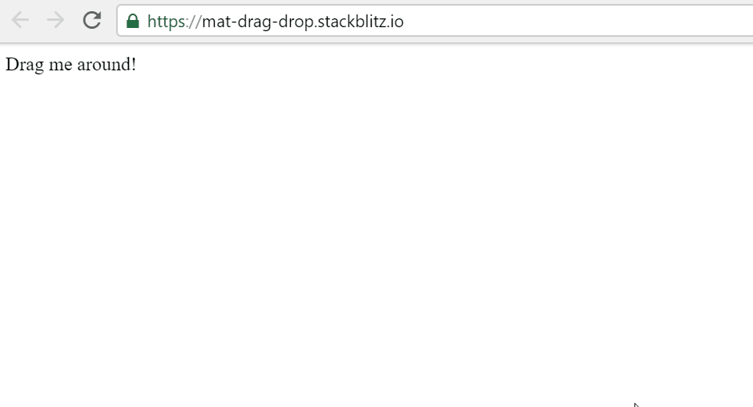
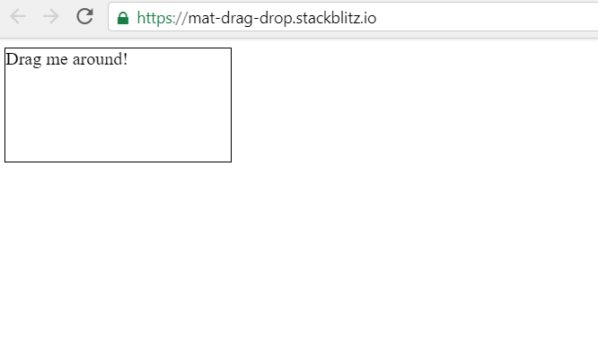
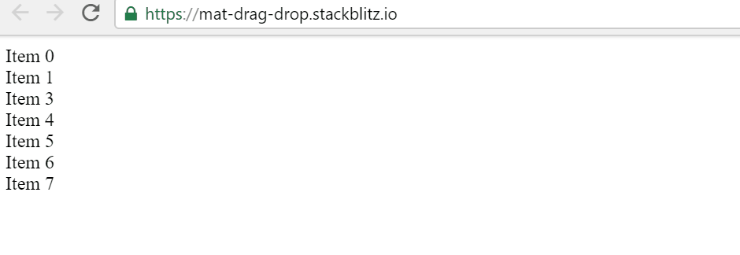
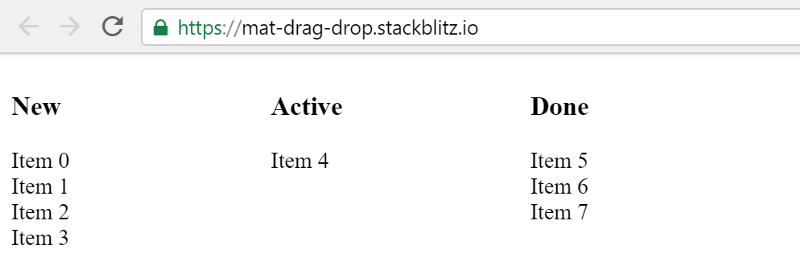
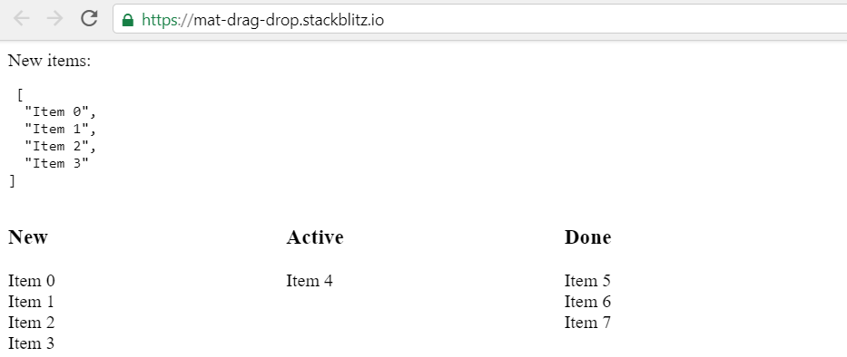
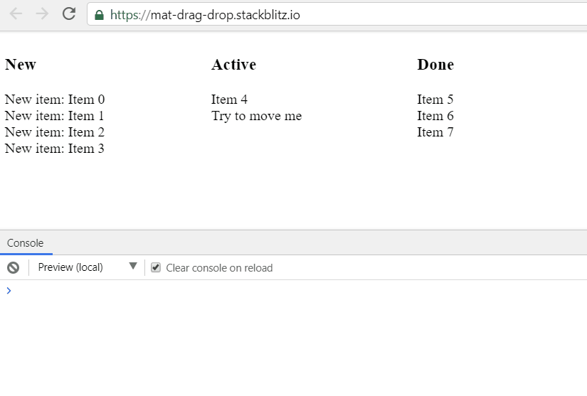
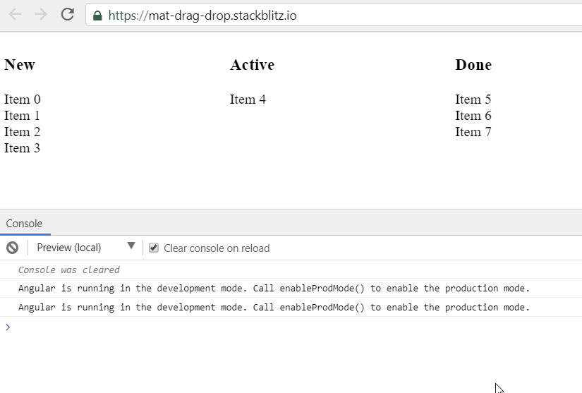
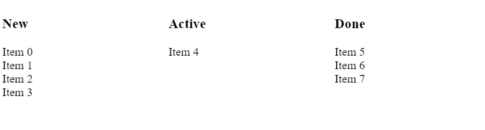
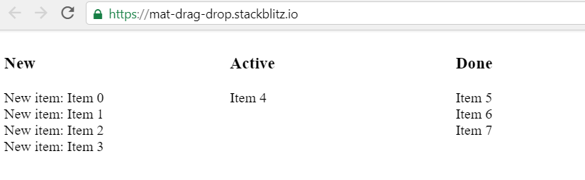
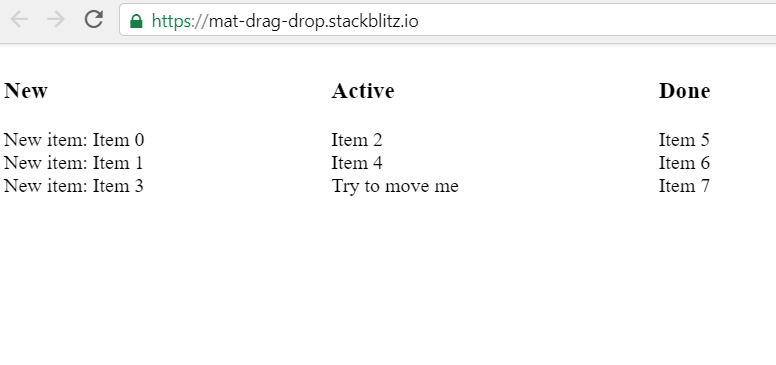

I’ve heard that Angular Material had a new drag and drop CDK in their upcoming version. Now with the first Angular and Angular Material release candidate being released, I think it’s time to explore some of the new stuff. I’m really looking forward to this and I’m assuming you’re too, so let’s not waste any time and let’s get started. We’ll start of with a simple example and build our way up to a simple task board.

## A simple example

Let’s start by exploring the API with the simplest example I can think of, a div that can be dragged and dropped.

The first step is to install Angular Material and since this isn’t a released version we have to install it by specifying its version:

> This post is edited at 2018–10–09 to be compatible with @angular/material@7.0.0-rc.1. In this release the cdk-drop component is been refactored to a cdkDrop directive. It also prefixes all the input and output properties with cdkDrop, e.g. data becomes cdkDropData. These modifications streamlines the whole API and gives us as developers more power over it. [https://github.com/angular/material2/pull/13441](https://github.com/angular/material2/pull/13441)

```bash
npm install @angular/material@7.0.0-rc.1
```

Next, we can import the `DragDropModule` into our module:

```ts
import { NgModule } from '[@angular/core](http://twitter.com/angular/core "Twitter profile for @angular/core")'
import { BrowserModule } from '[@angular/platform-browser](http://twitter.com/angular/platform-browser "Twitter profile for @angular/platform-browser")'
import { DragDropModule } from '[@angular/cdk](http://twitter.com/angular/cdk "Twitter profile for @angular/cdk")/drag-drop'

import { AppComponent } from './app.component'

@NgModule({
  imports: [BrowserModule, DragDropModule],
  declarations: [AppComponent],
  bootstrap: [AppComponent],
})
export class AppModule {}
```

Now that we’ve imported the module we can create our first draggable component by using the `cdkDrag` directive.

```html
<div class="box" cdkDrag>Drag me around!</div>
```

If we run the code we can now already drag and drop the div. Pretty neat, right?



## Creating a drop zone

Now that we know how to drag an element, the next step is to create a drop zone. For this we’ll use a new directive `cdkDrop`, it will act as a container to drop the draggable items. If we try to drop an item outside the drop zone, it will go back to its original position inside the drop zone.

```html
<div cdkDrop>
  <div class="box" cdkDrag>Drag me around!</div>
</div>
```



## Re-ordering items inside a list

Now that we know how to create a draggable item and a drop zone, the next step is to drag and re-order items inside a list. We’ll use the `*ngFor` directive to create the list elements inside a `cdkDrop` container.

```html
<div cdkDrop>
  <div *ngFor="let item of items" cdkDrag>{{item}}</div>
</div>
```

The items are defined in the `AppComponent` as a string array:

```ts
@Component({
  selector: 'my-app',
  templateUrl: './app.component.html',
}),
export class AppComponent  {
  items = [
    'Item 0',
    'Item 1',
    'Item 2',
    'Item 3',
    'Item 4',
    'Item 5',
    'Item 6',
    'Item 7',
  ]
}
```

The GIF below demonstrates that the items inside are re-ordering themselves automatically while we’re dragging them. But when we drop an item it goes back to its original position.



To solve this problem and save the new index when we drop an item inside the list, we’ll have to implement a `cdkDropDropped` function. The `dropped` function gets invoked every time when the user drops an item inside the drop zone. Its signature looks as follows:

```ts
@Output('cdkDropDropped')
dropped: EventEmitter<CdkDragDrop<T, any>> =
  new EventEmitter<CdkDragDrop<T, any>>();

With this knowledge we can implement the `dropped` function inside the `AppComponent`:

import { Component } from '[@angular/core](http://twitter.com/angular/core "Twitter profile for @angular/core")';
import { CdkDragDrop, moveItemInArray } from '[@angular/cdk](http://twitter.com/angular/cdk "Twitter profile for @angular/cdk")/drag-drop';

@Component(...)
export class AppComponent {
  items = [...]

dropped(event: CdkDragDrop<string[]>) {
  moveItemInArray(
     this.items,
     event.previousIndex,
     event.currentIndex
    );
  }
}
```

As you can see in the code snippet above, the drag and drop CDK also comes with a utility function [`moveItemInArray`](https://github.com/angular/material2/blob/master/src/cdk/drag-drop/drag-utils.ts#L15). This function is used to calculate the new index of the dropped item inside the array, rad!

Now that we have an implementation of the `dropped` function, it’s time to bind it to the `cdkDrop` element inside the HTML.

```html
<div cdkDrop (cdkDropDropped)="dropped($event)">
  <div *ngFor="let item of items" cdkDrag>{{item}}</div>
</div>
```

Resulting in draggable and re-ordering items inside the `cdkDrop` container.

> All this within minutes of our initial set-up without basically writing a single line of code.


## Dragging from one list to another list

Let’s take it a step further and create the simple task board.



To do this, we’ll split up the `items` array into three smaller arrays; one for the new items, the second for the active items, and the last one for the items that are done.

```ts
newItems = ['Item 0', 'Item 1', 'Item 2', 'Item 3']

activeItems = ['Item 4']

doneItems = ['Item 5', 'Item 6', 'Item 7']
```

We need to display three separate lists and for each list we’ll create its own drop zone. We can bind the arrays to a drop zone by using the `cdkDropData` input.

```html
<div
  cdkDrop
  #new="cdkDrop"
  [cdkDropData]="newItems"
  [cdkDropConnectedTo]="[active]"
  (cdkDropDropped)="dropped($event)"
>
  <div *ngFor="let item of newItems" cdkDrag>{{ item }}</div>
</div>
```

### Connecting the lists (drop zones)

With the `[cdkDropConnectedTo]` input property we can connect a `cdkDrop` list instance to another instance of a `cdkDrop` list. If we don’t do this, we won’t be able to drag and drop the items to another list.

In our task board example these are the connections we have to make:

- the `new` list to the `active` list;
- the `active` list to the `new` and `done` list;
- the `done` list to the `active` list;

In other words, you can drag a `new` item to `active`, from `active` to `done`, and in reversed order. But you can’t drag a `new` item to the `done` list without passing through the `active` list. Combined this gives the following result:

```html
<div class="board">
  <div class="column">
    <h3>New</h3>
    <div
      cdkDrop
      #new="cdkDrop"
      [cdkDropData]="newItems"
      [cdkDropConnectedTo]="[active]"
      (cdkDropDropped)="dropped($event)"
    >
      <div *ngFor="let item of newItems" cdkDrag>{{ item }}</div>
    </div>
  </div>

  <div class="column">
    <h3>Active</h3>
    <div
      cdkDrop
      #active="cdkDrop"
      [cdkDropData]="activeItems"
      [cdkDropConnectedTo]="[new, done]"
      (cdkDropDropped)="dropped($event)"
    >
      <div *ngFor="let item of activeItems" cdkDrag>{{ item }}</div>
    </div>
  </div>

  <div class="column">
    <h3>Done</h3>
    <div
      cdkDrop
      #done="cdkDrop"
      [cdkDropData]="doneItems"
      [cdkDropConnectedTo]="[active]"
      (cdkDropDropped)="dropped($event)"
    >
      <div *ngFor="let item of doneItems" cdkDrag>{{ item }}</div>
    </div>
  </div>
</div>
```

The last step is to make our `dropped` function smarter, in order to fulfill our needs it has to move the items from one list to another list.

```ts
import { CdkDragDrop, moveItemInArray, transferArrayItem } from '@angular/cdk/drag-drop';

dropped(event: CdkDragDrop<string[]>) {
  if (event.previousContainer === event.container) {
   moveItemInArray(
     event.container.data,
      event.previousIndex,
      event.currentIndex
   );
  } else {
    transferArrayItem(
     event.previousContainer.data,
     event.container.data,
     event.previousIndex,
     event.currentIndex
   );
 }
}
```

When the container is the same, it re-orders the items as before. If the container is different, it moves the dragged item to the list where the item is being dropped in. Here again, a utility function, [`transferArrayItem`](https://github.com/angular/material2/blob/master/src/cdk/drag-drop/drag-utils.ts#L41), is provided out of the box.



An important part here is that you can write your own implementation for `moveItemInArray` and `transferArrayItem` if you have a use case that is more complex. You don’t have to use these built-in functions from the CDK.

Another use case is to cancel a drop, e.g. for some reason an item isn’t allowed to be moved. To do this you can just short-circuit inside the `dropped` function.

```ts
dropped(event: CdkDragDrop<string[]>) {
    if (event.item.data === 'Try to move me') {
      console.log("this isn't happening today");
      return;
    }

    if (event.previousContainer === event.container) {
     moveItemInArray(
       event.container.data,
        event.previousIndex,
        event.currentIndex
     );
    } else {
      transferArrayItem(
       event.previousContainer.data,
       event.container.data,
       event.previousIndex,
       event.currentIndex
     );
   }
}
```



## Extra's

### Extra 1: Output events, intercepting when an item is `Entered` and `Exited`

Another part of the drag and drop API is knowing when an item is being added to the drop zone and when an item has been removed from the drop zone. This can be done with the `cdkDropEntered` and `cdkDropExited` functions, both are events on the `cdkDrop` element, just like `cdkDropDropped` as we’ve seen before.

```ts
<div cdkDrop #new="cdkDrop"
  (cdkDropEntered)="entered($event)"
  (cdkDropExited)="exited($event)"
>
  <div *ngFor="let item of newItems" cdkDrag [cdkDragData]="item">
    {{ item }}
  </div>
</div>
```

Bind your item state with the `[cdkDragData]` input property.

```ts
import { CdkDragEnter, CdkDragExit } from '@angular/cdk/drag-drop';

entered(event: CdkDragEnter<string[]>) {
 console.log('Entered', event.item.data);
}

exited(event: CdkDragExit<string[]>) {
  console.log('Exited', event.item.data);
}
```



### Extra 2: Creating animations when an item is being dragged and dropped

The CDK ships with a couple of [useful classes](https://github.com/angular/material2/blob/master/src/cdk/drag-drop/drag-drop.md#styling) for you to use in order to style your draggable items and to [animate](https://github.com/angular/material2/blob/master/src/cdk/drag-drop/drag-drop.md#animations) certain transitions, e.g. when you’re re-ordering the items inside a list.

```ts
.cdk-drop-dragging .cdk-drag {
  transition: transform 500ms cubic-bezier(0, 0, 0.2, 1);
}

.cdk-drag-animating {
  transition: transform 550ms cubic-bezier(0, 0, 0.2, 1);
}

.cdk-drag-placeholder {
  background: rgba(0, 0, 0, .2);
}
```



### Extra 3: Creating a preview while dragging the item

In the examples above we simply have some text as our items, but imagine having cards as draggable items. It might not be that usable or pretty to drag those big cards across the columns. Luckily the drag and drop CDK also provides a way to create a preview of the card while dragging it. This is possible with the `*cdkDragPreview` directive.

```html
<div cdkDrop #new="cdkDrop">
  <div *ngFor="let item of newItems" cdkDrag>
    New item: {{ item }}
    <div *cdkDragPreview>{{ item }}</div>
  </div>
</div>
```



As you can see in the GIF, the new items have “New item: Item” as state. When we start dragging the item, it’s using the `*cdkDragPreview` template. In our case this is simply the name of the item, but this can be customized to your needs.

## Extra 4: Allowing an item to be dropped in the drop zone

With the `enterPredicate` property on the `cdkDrop` element, it is possible to specify a [boolean-valued function](https://en.wikipedia.org/wiki/Boolean-valued_function) which gets invoked when an item enters the drop zone. By using this functionality, an item can be allowed (or denied) in the drop zone. As example we have the use case below, which decides whether an item can be dropped in the `done` list.

```ts
specialUseCase(drag?: CdkDrag, drop?: CdkDrop) {
  if (drop.data.length <= 2) {
    console.log("Can't drop you because there aren't enough items in 'Active'");
    return false;
  }

  const allowedItems = ['Item 5', 'Item 6', 'Item 7', 'Item 2'];
  if (allowedItems.indexOf(drag.data) === -1) {
    console.log("Can't drop you because only Item 2, 5, 6 and 7 are allowed here");
    return false;
  }

  return true;
};
```

And in the HTML template:

```html
<div
  cdkDrop
  #done="cdkDrop"
  [cdkDropData]="doneItems"
  [cdkDropConnectedTo]="[active]"
  (cdkDropDropped)="dropped($event)"
  [cdkDropEnterPredication]="specialUseCase"
>
  <div *ngFor="let item of doneItems" cdkDrag [cdkDragData]="item">
    {{ item }}
  </div>
</div>
```



The above GIF demonstrates that it’s only possible to drop `Item 2` inside the `done` list, and only when there are at least 2 other items inside the `active` list.

## Time to wrap it up

I’m really looking forward to use this API in an upcoming project. Therefore I explored the API once the release candidate came out and I’m very pleased with the result. It’s very easy and intuitive to use, but at the same time it’s flexible by giving you the opportunity to be in control when you need to.

If you’re as excited as I am, you can find more information in the [beta documentation](https://beta-angular-material-io.firebaseapp.com/cdk/drag-drop/overview) and the in source code of course.

The example used in this post can be found and be played with on [StackBlitz](https://stackblitz.com/edit/mat-drag-drop).
