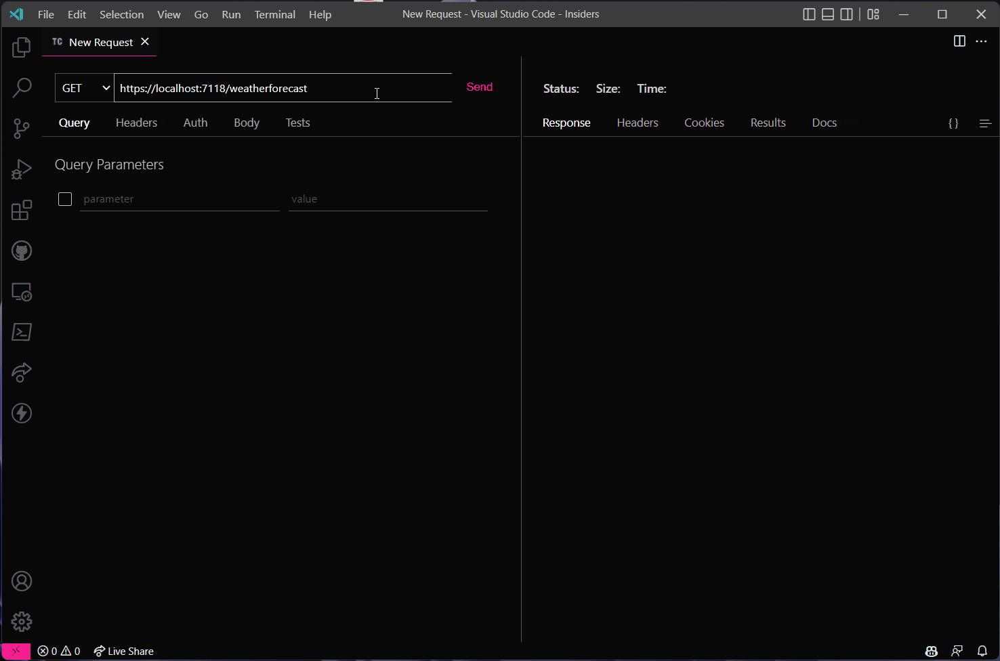
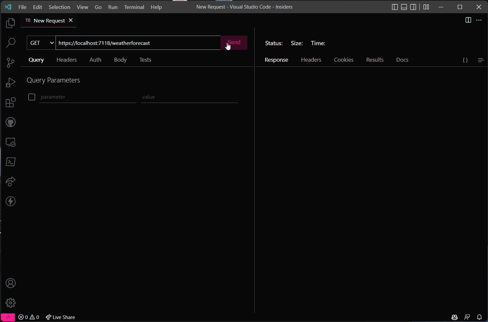

Caching in ASP.NET [hasn't been great](../prevent-a-net-api-from-adding-cache-headers-to-unsuccessful-requests/index.md)
yet, but this changes with the recent addition of the new output caching middleware that has landed
in [.NET 7 Preview 6](https://devblogs.microsoft.com/dotnet/asp-net-core-updates-in-dotnet-7-preview-6/).

In this post, we're exploring the capabilities of the new output caching middleware and how to use it.
As an example, let's create a new API and add caching to the weather forecast endpoint.

## Create a new API

Use the following command to create a new web API project.
To follow along with me, make sure you have at least
version [7.0.0-preview.6](https://dotnet.microsoft.com/en-us/download/dotnet/7.0) installed.

```bash
dotnet new webapi -minimal -o OutputCachingExample
```

## Enable Output Caching

To use the output caching middleware on top of your endpoint, you first need to register the `OutputCache` into your
application.
Do this by using the `IServiceCollection.AddOutputCache` and the `IApplicationBuilder.UseOutputCache` extension
methods while setting up the API in the `Program.cs` file.

```cs{2,6}:Program.cs
var builder = WebApplication.CreateBuilder(args);
builder.Services.AddOutputCache();

var app = builder.Build();
app.UseHttpsRedirection();
app.UseOutputCache();
```

### Add a caching layer to an endpoint

With the output caching middleware enabled we can start to add a caching layer on top of the endpoints of the API.
The most basic way to do this is by using the `CacheOutput` extension to an `IEndpointRouteBuilder` (a route).

In the following example, the `/weatherforecast` route is cached because we "marked" the route to be cached with `CacheOutput`.

```cs{26}:Program.cs
var builder = WebApplication.CreateBuilder(args);
builder.Services.AddOutputCache();

var app = builder.Build();
app.UseHttpsRedirection();
app.UseOutputCache();

var summaries = new[]
{
    "Freezing", "Bracing", "Chilly", "Cool", "Mild", "Warm", "Balmy", "Hot", "Sweltering", "Scorching"
};

app.MapGet("/weatherforecast", async () =>
{
    await Task.Delay(1000);
    var forecast = Enumerable.Range(1, 5).Select(index =>
        new WeatherForecast
        (
            DateOnly.FromDateTime(DateTime.Now.AddDays(index)),
            Random.Shared.Next(-20, 55),
            summaries[Random.Shared.Next(summaries.Length)]
        ))
        .ToArray();
    return forecast;
})
.CacheOutput();

app.Run();

internal record WeatherForecast(DateOnly Date, int TemperatureC, string? Summary)
{
    public int TemperatureF => 32 + (int)(TemperatureC / 0.5556);
}
```

The result is that the handler of the endpoint is invoked the first time it receives a request.
Then, when it receives new requests, the caching layer returns the cached response without executing the endpoint's
logic.

This is made visible in the next GIF, where a delay is added to the handler to make it clearer when the cache is empty, or when the cache is hit.


### Cache by Query Parameter

Because a weather forecast is specific to a region, using a single cache doesn't make sense.
Let's see what happens when we add a query parameter "city" to request the weather forecast for a specific city.

In the example below, the city query parameter (with Brussels as value) is added to the URL which means that the handler of the endpoint is executed.
When the city value is changed (from Brussels to Paris), the handler is also invoked again.
Lastly, a second query parameter "other" is added to the URL, this also results that the handler is run again.


By testing this out we learn that the default behavior uses the URL path with query parameters to identify unique requests, and also to read and write to the cache.
When the value of a query parameter changes or when a new query parameter is added, the cache isn't hit.
If this isn't the desired behavior, the configuration of the output cache can be fine-tuned to your needs.

To cache a request by a (or multiple) unique query parameter(s), use the overload of `CacheOutput`.
The overload gives us access to the policy builder `OutputCachePolicyBuilder` to configure the caching strategy.

One of the options is to use the `OutputCachePolicyBuilder.VaryByQuery` method to uniquely identify requests by specific query parameter(s). The method expects none, one, or multiple query parameter names to vary the cache.

Let's see what happens when we configure the policy to identify requests by the "city" query parameter.

```cs{26}:Program.cs
var builder = WebApplication.CreateBuilder(args);
builder.Services.AddOutputCache();

var app = builder.Build();
app.UseHttpsRedirection();
app.UseOutputCache();

var summaries = new[]
{
    "Freezing", "Bracing", "Chilly", "Cool", "Mild", "Warm", "Balmy", "Hot", "Sweltering", "Scorching"
};

app.MapGet("/weatherforecast", async () =>
{
    await Task.Delay(1000);
    var forecast = Enumerable.Range(1, 5).Select(index =>
        new WeatherForecast
        (
            DateOnly.FromDateTime(DateTime.Now.AddDays(index)),
            Random.Shared.Next(-20, 55),
            summaries[Random.Shared.Next(summaries.Length)]
        ))
        .ToArray();
    return forecast;
})
.CacheOutput(p => p.VaryByQuery("city"));

app.Run();

internal record WeatherForecast(DateOnly Date, int TemperatureC, string? Summary)
{
    public int TemperatureF => 32 + (int)(TemperatureC / 0.5556);
}
```


To completely ignore query parameters within the URL, use `OutputCachePolicyBuilder.VaryByQuery` but leave the query parameters empty.

```cs{5}
app.MapGet("/weatherforecast", async () =>
{
    // handler logic here
})
.CacheOutput(p => p.VaryByQuery());
```

This gives us the following result.


### Cache by Request Header

Instead of using query parameters, you can also build the cache with request headers with `OutputCachePolicyBuilder.VaryByHeader`.
In the following example, the "X-City" request header differentiates requests by city, each city has an individual cache.

```cs{26}:Program.cs
var builder = WebApplication.CreateBuilder(args);
builder.Services.AddOutputCache();

var app = builder.Build();
app.UseHttpsRedirection();
app.UseOutputCache();

var summaries = new[]
{
    "Freezing", "Bracing", "Chilly", "Cool", "Mild", "Warm", "Balmy", "Hot", "Sweltering", "Scorching"
};

app.MapGet("/weatherforecast", async () =>
{
    await Task.Delay(1000);
    var forecast = Enumerable.Range(1, 5).Select(index =>
        new WeatherForecast
        (
            DateOnly.FromDateTime(DateTime.Now.AddDays(index)),
            Random.Shared.Next(-20, 55),
            summaries[Random.Shared.Next(summaries.Length)]
        ))
        .ToArray();
    return forecast;
})
.CacheOutput(p => p.VaryByHeader("X-City"));

app.Run();

internal record WeatherForecast(DateOnly Date, int TemperatureC, string? Summary)
{
    public int TemperatureF => 32 + (int)(TemperatureC / 0.5556);
}
```


### Cache by Value

You can make use of `OutputCachePolicyBuilder.VaryByValue` to even have more fine-grained control over the cache policy.
`OutputCachePolicyBuilder.VaryByValue` is a `Func` that takes the `HttpContext` as argument and expects a `string`
or `KeyValuePair<string, string>` as result.

I haven't had the need to implement a cache using this, if you have a good use case feel free to contact me.

```cs{26-30}:Program.cs
var builder = WebApplication.CreateBuilder(args);
builder.Services.AddOutputCache();

var app = builder.Build();
app.UseHttpsRedirection();
app.UseOutputCache();

var summaries = new[]
{
    "Freezing", "Bracing", "Chilly", "Cool", "Mild", "Warm", "Balmy", "Hot", "Sweltering", "Scorching"
};

app.MapGet("/weatherforecast", async () =>
{
    await Task.Delay(1000);
    var forecast = Enumerable.Range(1, 5).Select(index =>
        new WeatherForecast
        (
            DateOnly.FromDateTime(DateTime.Now.AddDays(index)),
            Random.Shared.Next(-20, 55),
            summaries[Random.Shared.Next(summaries.Length)]
        ))
        .ToArray();
    return forecast;
})
.CacheOutput(x => x.VaryByValue(httpCtx => {
    /*
     * Implementation here
     */
}));

app.Run();

internal record WeatherForecast(DateOnly Date, int TemperatureC, string? Summary)
{
    public int TemperatureF => 32 + (int)(TemperatureC / 0.5556);
}
```

## Cache Expiration

The default implementation expires the cache after one minute (absolute duration).

To control how long a cache entry is valid, set expiration for routes by using the `OutputCachePolicyBuilder.Expire` method and pass it a `TimeSpan`.

```cs{26}:Program.cs
var builder = WebApplication.CreateBuilder(args);
builder.Services.AddOutputCache();

var app = builder.Build();
app.UseHttpsRedirection();
app.UseOutputCache();

var summaries = new[]
{
    "Freezing", "Bracing", "Chilly", "Cool", "Mild", "Warm", "Balmy", "Hot", "Sweltering", "Scorching"
};

app.MapGet("/weatherforecast", async () =>
{
    await Task.Delay(1000);
    var forecast = Enumerable.Range(1, 5).Select(index =>
        new WeatherForecast
        (
            DateOnly.FromDateTime(DateTime.Now.AddDays(index)),
            Random.Shared.Next(-20, 55),
            summaries[Random.Shared.Next(summaries.Length)]
        ))
        .ToArray();
    return forecast;
})
.CacheOutput(p => p.Expire(TimeSpan.FromSeconds(2)));

app.Run();

internal record WeatherForecast(DateOnly Date, int TemperatureC, string? Summary)
{
    public int TemperatureF => 32 + (int)(TemperatureC / 0.5556);
}
```


### Modify the default expiration time

To change the default expiration time, update the `DefaultExpirationTimeSpan` while registering the Output Cache.
For example, to use the cache for one hour:

```cs{2-5}:Program.cs
var builder = WebApplication.CreateBuilder(args);
builder.Services.AddOutputCache(options =>
{
    options.DefaultExpirationTimeSpan = TimeSpan.FromHours(1);
});

var app = builder.Build();
app.UseHttpsRedirection();
app.UseOutputCache();
```

### Cache Purge

In some cases, you might want to purge (clear) the cache when a certain event occurs.
For example, when you know that the data has been updated, and you want to provide your users the updated data.
When the cache is purged, the cache is revalidated when the next request is received.

To purge the cache, first, add a tag (which is a `string`) to the cache output with the `OutputCachePolicyBuilder.Tag` method.

```cs{26}:Program.cs
var builder = WebApplication.CreateBuilder(args);
builder.Services.AddOutputCache();

var app = builder.Build();
app.UseHttpsRedirection();
app.UseOutputCache();

var summaries = new[]
{
    "Freezing", "Bracing", "Chilly", "Cool", "Mild", "Warm", "Balmy", "Hot", "Sweltering", "Scorching"
};

app.MapGet("/weatherforecast", async () =>
{
    await Task.Delay(1000);
    var forecast = Enumerable.Range(1, 5).Select(index =>
        new WeatherForecast
        (
            DateOnly.FromDateTime(DateTime.Now.AddDays(index)),
            Random.Shared.Next(-20, 55),
            summaries[Random.Shared.Next(summaries.Length)]
        ))
        .ToArray();
    return forecast;
})
.CacheOutput(p => p.Tag("wf"));

app.Run();

internal record WeatherForecast(DateOnly Date, int TemperatureC, string? Summary)
{
    public int TemperatureF => 32 + (int)(TemperatureC / 0.5556);
}
```

Then, inject the `IOutputCacheStore` store and call the `EvictByTagAsync` method.
The method accepts the tag name that needs to be purged.

```cs{13}:SomeClass.cs
public class SomeClass
{
    private readonly IOutputCacheStore _cache;

    public SomeClass(IOutputCacheStore cache)
    {
        _cache = cache;
    }

    public  async Task SomeMethod(CancellationToken cancellationToken)
    {
        // Some logic here....
        await _cache.EvictByTagAsync("wf", cancellationToken);
    }
}
```

## RouteGroups

Now that we've seen how the basics of the `CacheOutput` middleware works, let's see how to use it in more complex scenarios.

When you have multiple endpoints that require a cache with similar policies, you don't have to add the `CacheOutput` middleware to each endpoint. This would be hard to maintain, and easy to make mistakes.
To make it better manageable, create a route group and add the middleware to the group.

In the example below we first create a route group called `wf`, and apply the output cache middleware to it.
Then, two endpoints are added to the group.

```cs{13,15,29}:Program.cs
var builder = WebApplication.CreateBuilder(args);
builder.Services.AddOutputCache();

var app = builder.Build();
app.UseHttpsRedirection();
app.UseOutputCache();

var summaries = new[]
{
    "Freezing", "Bracing", "Chilly", "Cool", "Mild", "Warm", "Balmy", "Hot", "Sweltering", "Scorching"
};

var wf = app.MapGroup("weatherforecast").CacheOutput();

wf.MapGet("", async () =>
{
    await Task.Delay(1000);
    var forecast = Enumerable.Range(1, 5).Select(index =>
        new WeatherForecast
        (
            DateOnly.FromDateTime(DateTime.Now.AddDays(index)),
            Random.Shared.Next(-20, 55),
            summaries[Random.Shared.Next(summaries.Length)]
        ))
        .ToArray();
    return forecast;
});

wf.MapGet("other", async () =>
{
    await Task.Delay(1000);
    var forecast = Enumerable.Range(1, 5).Select(index =>
        new WeatherForecast
        (
            DateOnly.FromDateTime(DateTime.Now.AddDays(index)),
            Random.Shared.Next(-20, 55),
            summaries[Random.Shared.Next(summaries.Length)]
        ))
        .ToArray();
    return forecast;
});

app.Run();

internal record WeatherForecast(DateOnly Date, int TemperatureC, string? Summary)
{
    public int TemperatureF => 32 + (int)(TemperatureC / 0.5556);
}
```



### Disable caching with NoCache

When working with groups (or policies later), the configuration that is applied on individual endpoints takes precedence over the configuration that is applied to the group.

For example, if you don't want to cache an endpoint, you can use the `OutputCachePolicyBuilder.NoCache` method.
In the example below, the `/nocache` route is added to the `wf` group that was created in the previous step.
The `NoCache` is applied to the `/nocache` route, because of this, this route won't use the cache policies that were applied on the `wf` group.

```cs{29-42}:Program.cs
var builder = WebApplication.CreateBuilder(args);
builder.Services.AddOutputCache();

var app = builder.Build();
app.UseHttpsRedirection();
app.UseOutputCache();

var summaries = new[]
{
    "Freezing", "Bracing", "Chilly", "Cool", "Mild", "Warm", "Balmy", "Hot", "Sweltering", "Scorching"
};

var wf = app.MapGroup("weatherforecast").CacheOutput();

wf.MapGet("", async () =>
{
    await Task.Delay(1000);
    var forecast = Enumerable.Range(1, 5).Select(index =>
            new WeatherForecast
            (
                DateOnly.FromDateTime(DateTime.Now.AddDays(index)),
                Random.Shared.Next(-20, 55),
                summaries[Random.Shared.Next(summaries.Length)]
            ))
        .ToArray();
    return forecast;
});

wf.MapGet("nocache", async () =>
{
    await Task.Delay(1000);
    var forecast = Enumerable.Range(1, 5).Select(index =>
            new WeatherForecast
            (
                DateOnly.FromDateTime(DateTime.Now.AddDays(index)),
                Random.Shared.Next(-20, 55),
                summaries[Random.Shared.Next(summaries.Length)]
            ))
        .ToArray();
    return forecast;
})
.CacheOutput(p => p.NoCache());

app.Run();

internal record WeatherForecast(DateOnly Date, int TemperatureC, string? Summary)
{
    public int TemperatureF => 32 + (int)(TemperatureC / 0.5556);
}
```


## Policies

When you find yourself configuring many endpoints and/or endpoint groups with the same configuration, creating your own cache policy is probably the best way to go. While creating custom policies you can choose to create a named policy or to add a default policy to the whole application.

You can include your own custom policies within the callback of `IServiceCollection.AddOutputCache`.

### Named policies

In the next example, the named cache policy `InvariantQueries` is created to ignore all query parameters.
This is done with the `AddPolicy`, which expects a policy name (a `string`), and an `Action<OutputCachePolicyBuilder>` to configure the cache policy.

```cs{2-6}:Program.cs
var builder = WebApplication.CreateBuilder(args);
builder.Services.AddOutputCache(options =>
{
    options.AddPolicy("InvariantQueries", builder =>
    {
        builder.VaryByQuery();
    });
});
```

To make use of the `InvariantQueries` policy, use another overload on the `CacheOutput` middleware and pass it the name of the policy. In our example, `InvariantQueries`.

```cs{2-6, 32}:Program.cs
var builder = WebApplication.CreateBuilder(args);
builder.Services.AddOutputCache(options =>
{
    options.AddPolicy("InvariantQueries", builder =>
    {
        builder.VaryByQuery();
    });
});

var app = builder.Build();
app.UseHttpsRedirection();
app.UseOutputCache();

var summaries = new[]
{
    "Freezing", "Bracing", "Chilly", "Cool", "Mild", "Warm", "Balmy", "Hot", "Sweltering", "Scorching"
};

app.MapGet("/weatherforecast", async () =>
{
    await Task.Delay(1000);
    var forecast = Enumerable.Range(1, 5).Select(index =>
        new WeatherForecast
        (
            DateOnly.FromDateTime(DateTime.Now.AddDays(index)),
            Random.Shared.Next(-20, 55),
            summaries[Random.Shared.Next(summaries.Length)]
        ))
        .ToArray();
    return forecast;
})
.CacheOutput("InvariantQueries");

app.Run();

internal record WeatherForecast(DateOnly Date, int TemperatureC, string? Summary)
{
    public int TemperatureF => 32 + (int)(TemperatureC / 0.5556);
}
```



### Default (or "Base") policies

To create a default policy that is used for all requests, use `AddBasePolicy`.
The difference with a named policy is that `AddBasePolicy` doesn't expect a policy name as an argument.
Just like a named policy, `AddBasePolicy` uses the `Action<OutputCachePolicyBuilder>` to configure the cache policy.

In the implementation of the example below all requests are cached if they contain the `X-Cached` header.
Notice that it isn't required to add `CacheOutput` to a route to enable this base policy.

```cs{2-8}:Program
var builder = WebApplication.CreateBuilder(args);
builder.Services.AddOutputCache(options =>
{
    options.AddBasePolicy(builder =>
    {
        builder.With(p => p.HttpContext.Request.Headers.ContainsKey("X-Cached"));
    });
});

var app = builder.Build();
app.UseHttpsRedirection();
app.UseOutputCache();

var summaries = new[]
{
    "Freezing", "Bracing", "Chilly", "Cool", "Mild", "Warm", "Balmy", "Hot", "Sweltering", "Scorching"
};

app.MapGet("/weatherforecast", () =>
{
    var forecast = Enumerable.Range(1, 5).Select(index =>
        new WeatherForecast
        (
            DateOnly.FromDateTime(DateTime.Now.AddDays(index)),
            Random.Shared.Next(-20, 55),
            summaries[Random.Shared.Next(summaries.Length)]
        ))
        .ToArray();
    return forecast;
});

app.Run();

internal record WeatherForecast(DateOnly Date, int TemperatureC, string? Summary)
{
    public int TemperatureF => 32 + (int)(TemperatureC / 0.5556);
}
```


## Cache locking

When a cache entry doesn't exist and needs to be created, but the server receives multiple requests simultaneously for that entry, then the handler is only executed once. The handler of the first request populates the cache, and the other requests wait until the first request is finished. This prevents the server from being overloaded with requests.

## The DefaultPolicy implementation

To know how the default implementation behaves, you can take a look at the [source code of `DefaultPolicy`](https://github.com/dotnet/aspnetcore/blob/main/src/Middleware/OutputCaching/src/Policies/DefaultPolicy.cs).

One detail that pops out, and which I didn't expect at first but makes sense, is the check if output caching should be used.
Here, we can see that authorized requests are ignored from being cached.

```cs{14-19}:DefaultPolicy.cs
private static bool AttemptOutputCaching(OutputCacheContext context)
{
    // Check if the current request fulfills the requirements to be cached

    var request = context.HttpContext.Request;

    // Verify the method
    if (!HttpMethods.IsGet(request.Method) && !HttpMethods.IsHead(request.Method))
    {
        context.Logger.RequestMethodNotCacheable(request.Method);
        return false;
    }

    // Verify existence of authorization headers
    if (!StringValues.IsNullOrEmpty(request.Headers.Authorization) || request.HttpContext.User?.Identity?.IsAuthenticated == true)
    {
        context.Logger.RequestWithAuthorizationNotCacheable();
        return false;
    }

    return true;
}
```

If this doesn't work for your application, you can create your own policy by implementing the `IOutputCachePolicy` interface.
The created policy then has to be provided to `AddBasePolicy`.

## Using OutputCache with Controllers

So far we've only seen how to use the `OutputCache` middleware with minimal APIs.

But, because it's just a middleware it can also be used with the traditional controllers.
As you can see in the example below, you simply have to add the `OutputCache` attribute on top of the controller's method.
Or, when you want to enable output caching for the whole controller, you can add the `OutputCache` attribute to the controller class.

```cs{8, 17}:WeatherForecastController.cs
using Microsoft.AspNetCore.Mvc;
using Microsoft.AspNetCore.OutputCaching;

namespace OutputCaching.Controllers;

[ApiController]
[Route("[controller]")]
[OutputCache] // enable caching for the whole controller
public class WeatherForecastController : ControllerBase
{
    private static readonly string[] Summaries = new[]
    {
        "Freezing", "Bracing", "Chilly", "Cool", "Mild", "Warm", "Balmy", "Hot", "Sweltering", "Scorching"
    };

    [HttpGet]
    [OutputCache] // enable caching for a specifc endpoint
    public async Task<IEnumerable<WeatherForecast>> Get()
    {
        await Task.Delay(1000);
        var forecast = Enumerable.Range(1, 5).Select(index =>
            new WeatherForecast
            (
                DateOnly.FromDateTime(DateTime.Now.AddDays(index)),
                Random.Shared.Next(-20, 55),
                Summaries[Random.Shared.Next(Summaries.Length)]
            ))
            .ToArray();
        return forecast;
    }
}
```

## Conclusion

In this post, we've covered most of the features of the new output caching middleware.
Using the middleware improves the performance of your application.
Looking at the API, we've seen that it almost requires no code to use the caching middleware, while it's flexible to be configured to your own needs.

For more context, see the [GitHub issue](https://github.com/dotnet/aspnetcore/issues/41955) that discusses the new output caching middleware. For more examples, you can also take a look at the [OutputCachingSample](https://github.com/dotnet/aspnetcore/blob/main/src/Middleware/OutputCaching/samples/OutputCachingSample/Startup.cs).
