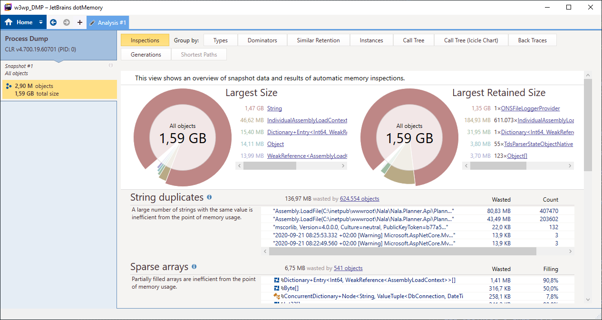
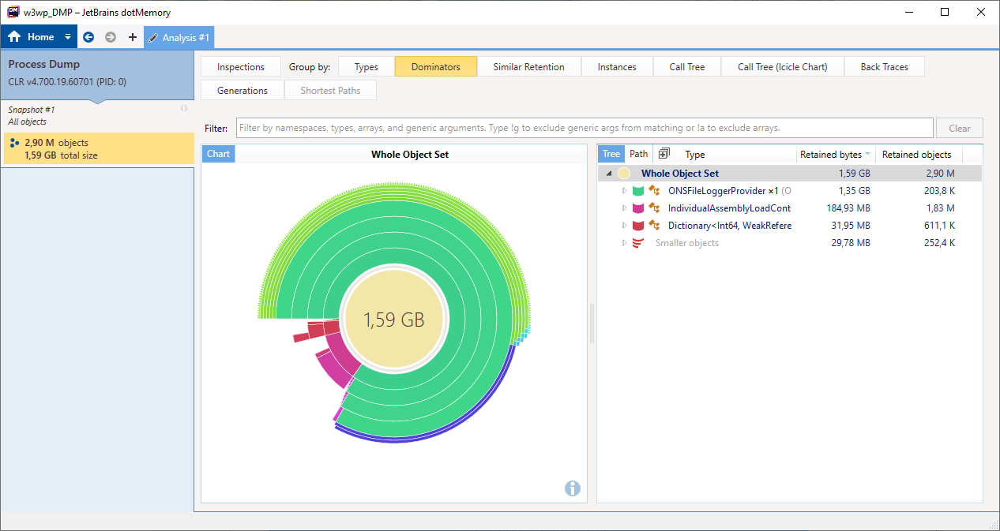

Last week it finally happened, I saw my first memory leak in production - _that I know of_ - and over time it was eating up all the memory.
Throughout my career, I've been warned, and I've warned about these leaks and why it's so important to release unmanaged resources with the `Dispose` method. Yet, we still created a memory leak.

### Knowing that you have a memory leak

We noticed that the process of a new API was consuming more memory compared to other processes.
At first, we didn't think much of it and we assumed it was normal because this API receives a lot of requests.
At the end of the day, the API almost tripled its memory consumption and at this time we started thinking that we had a memory leak.

Remember that high memory usage doesn't always mean that there's a memory leak. Some processes just use a lot of memory.
The problem is that the memory increases linearly over time, and without it dropping back to its normal consumption.

The second day, this happened again and it was worse, the API with the memory leak was almost consuming 4GB. Which is up to 5 times more resources compared to other APIs.

### Reproducing the memory leak

I think that you must be able to reproduce a problem first to solve it. This gives you some insights into the problem, and you exactly know where and when that problem occurs.

Since this was a first-timer for me, I followed the Microsoft Docs (which were well written and was exactly what I was looking for) [Debug a memory leak in .NET Core](https://docs.microsoft.com/en-us/dotnet/core/diagnostics/debug-memory-leak).

In this tutorial you use the dotnet commands, [dotnet trace](https://docs.microsoft.com/en-us/dotnet/core/diagnostics/dotnet-trace), [dotnet counters](https://docs.microsoft.com/en-us/dotnet/core/diagnostics/dotnet-counters), and [dotnet dump](https://docs.microsoft.com/en-us/dotnet/core/diagnostics/dotnet-dump) to find and troubleshoot process.

While being impressed with these tools, I wasn't able to reproduce the memory leak locally despite my effort to mimick the traffic towards the API with [Artillery](https://artillery.io/).

### Analysing a dump file

So why try to reproduce the problem when it's already occurring in a production environment?
Most of the bugs can't, or hard to, look into a production environment.
But for this case it is different.

By creating a dump file of the process, we have a way to look into the process. All of the information that we need is already there, it just needs to be collected and analyzed.

To create a dump file, use the [dotnet dump collect](https://docs.microsoft.com/en-us/dotnet/core/diagnostics/dotnet-dump) command, or if you can log in on the server by opening the task manager, right-clicking on a process, and selecting "Create a dump file".

This gives you a `*.dmp` file which you can analyze with the [dotnet dump analyze](https://docs.microsoft.com/en-us/dotnet/core/diagnostics/dotnet-dump) command.
Personally, I like it more visualized and thus I imported the file into [dotMemory](https://www.jetbrains.com/dotmemory/) to analyze it.
There's also [PerfView](https://github.com/microsoft/perfview), which is free to use.

When the dump file was imported, the first graph and data table made it very obvious that we had a memory leak.
A file logger was using 90% of the memory, equivalent to 3.5GB.

While this leak was obvious, I still felt a little bit overwhelmed with all the data.
To get a better understanding at how I should intepret the data I read through [.NET Memory Performance Analysis](https://github.com/Maoni0/mem-doc/blob/master/doc/.NETMemoryPerformanceAnalysis.md). I found it beginner friendly, while still going in-depth. It's focused on PerfView, but the gained knowledge can also be used while reading the data in other tools.

### Key takeaways

- Don't wait and guess whether there's a memory leak. The data is right in front of you, you just have to go get it. When you got a hunch about having a leak, immediately create a dump file and analyze it. While I thought this was hard and time-consuming, creating a dump file just takes a few seconds. And when you have a real problem, the analyzing part will also be quick. Better safe than sorry, right?
- The fastest way to look into a memory leak is to create a dump file of the process in production. There's no need to try to reproduce the problem because you can access all the data you need. When the cause is found, you can fix it locally and verify the fix locally.
- Monitor your system. When you're working in a .NET environment this usually means looking at the metrics in [Application Insights](https://dev.applicationinsights.io/). You can even create alerts to be notified when there are abnormalities.

### More resources

A list of resources about this topic, that I find useful and wished I had found earlier:

- [Diagnosing memory leaks in .NET apps](https://www.youtube.com/watch?v=SHGeE_PFA4s) and [Diagnosing thread pool exhaustion issues in .NET Core apps](https://www.youtube.com/watch?v=isK8Cel3HP0)
  by Mike Rousos on the [dotNET YouTube channel](https://www.youtube.com/channel/UCvtT19MZW8dq5Wwfu6B0oxw)
- [Cross-platform diagnostic tools for .NET Core](https://www.hanselman.com/blog/CrossPlatformDiagnosticToolsForNETCore.aspx) and [dotnet-trace for .NET Core tracing in PerfView, SpeedScope, Chromium Event Trace Profiling, Flame graphs and more!](https://www.hanselman.com/blog/dotnettraceForNETCoreTracingInPerfViewSpeedScopeChromiumEventTraceProfilingFlameGraphsAndMore.aspx) by [Scott Hanselman](https://twitter.com/shanselman)
