Last week I blogged about the SQL Server Profiler, which I think is [underused and undervalued](/blog/sql-server-profiler-underused-and-undervalued). While I was writing that post I discovered that the SQL Profiler was deprecated in favor of the Extended Events (XEvents). In this post, we'll take a look at how we can convert the SQL Profiler template I'm using to an XEvent template (session).

## Creating an XEvent session

Creating a new XEvent template, now called a session, can be done in different ways. One of the ways is to create the session with a SQL statement, while this has become easier than before we're going to use the GUI because this is still simplest.

To create a new session, open the `Management` folder and then `Extended Events`.
Now, right-click on `Sessions` and you'll see that you have two options to create a session, `New Session` and `New Session Wizard`.
The only difference that I can see is that the user interface is a little bit different but the end result is the same.
Just keep in mind that the user interface to edit a session is the same user interface as using the `New Session` wizard, that's why the following images are all made with the `New Session` option.

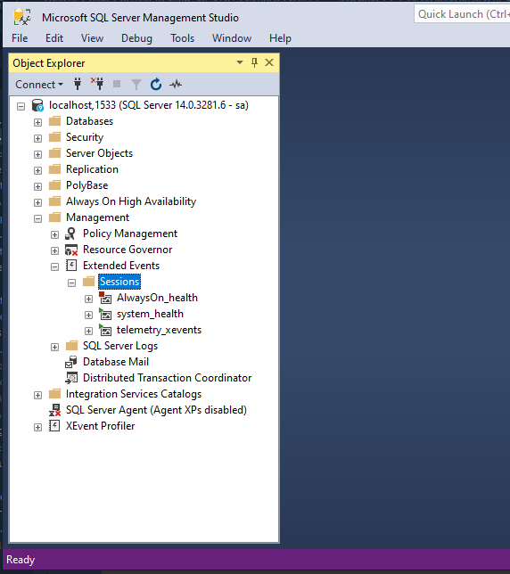

The first screen asks for general info, and you got the option to start from a predefined template.
For now, we'll stick with a blank template.

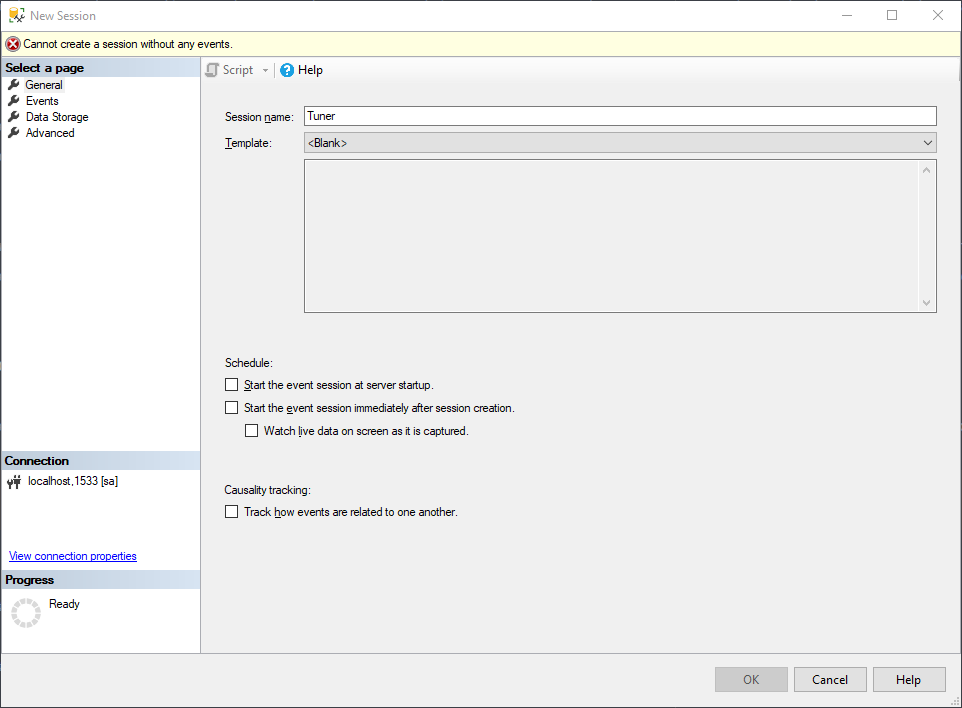

On the second screen, `Events`, we select the events that we want to capture.
Because I'm interested in the query performance, I select the `rpc_completed` and `sql_batch_completed` events.

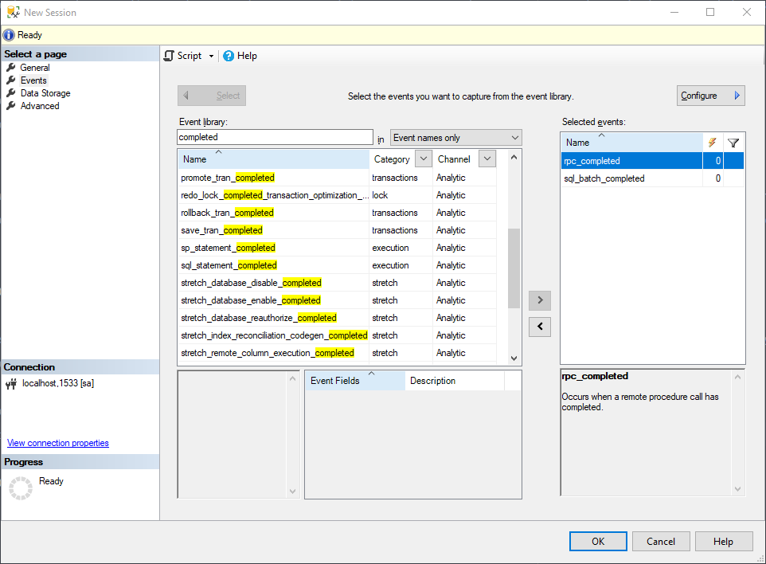

With the `Configure` button in the top right corner, we can open a new window to include the fields we want to append to the captured event.
Besides the default fields, I've also added `client_app_name`, `collect_system_time`, `database_name`, `sql_text`, and `task_time`. This has to be repeated for each event.

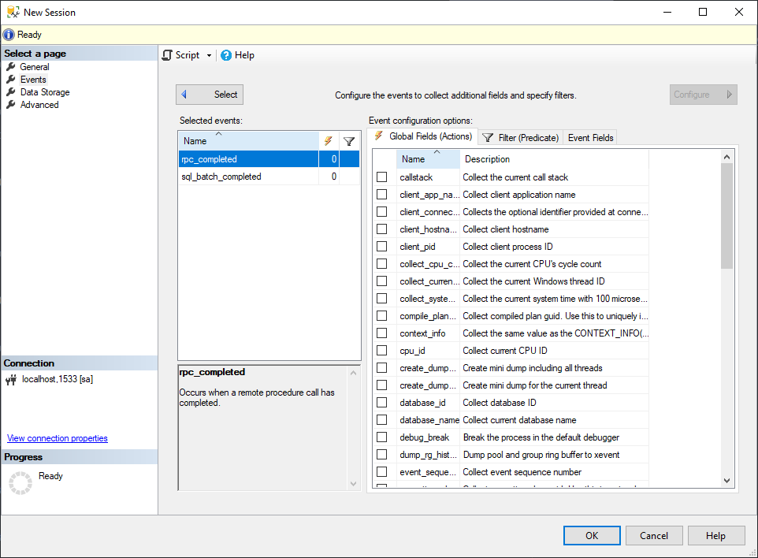

Sometimes we're only interested in a subset of the captured, for example if we only to capture queries with a high read count.
To exclude events in the event log, we can add a filter via the filter screen.

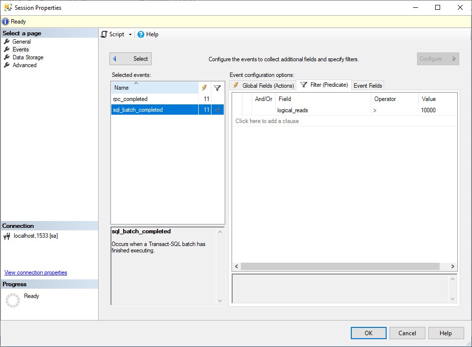

The third screen allows us to store the captured events.
This can be helpful if you want to capture events for a longer period without having the live view on.
Besides the option to save the raw event data, you also can save an aggregated view of the data, for example in the form of a histogram.

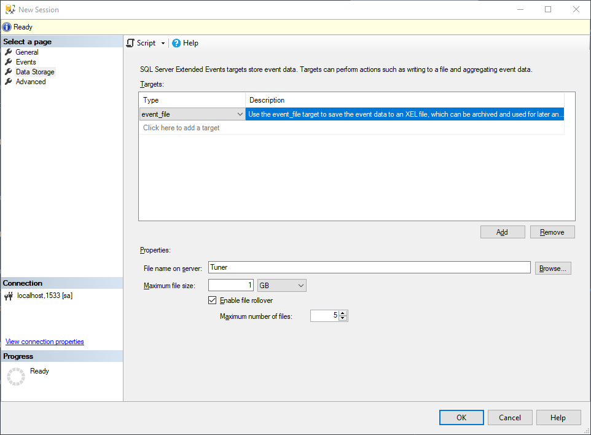

The fourth, and last, screen is the advanced screen.
For me, the defaults are fine.

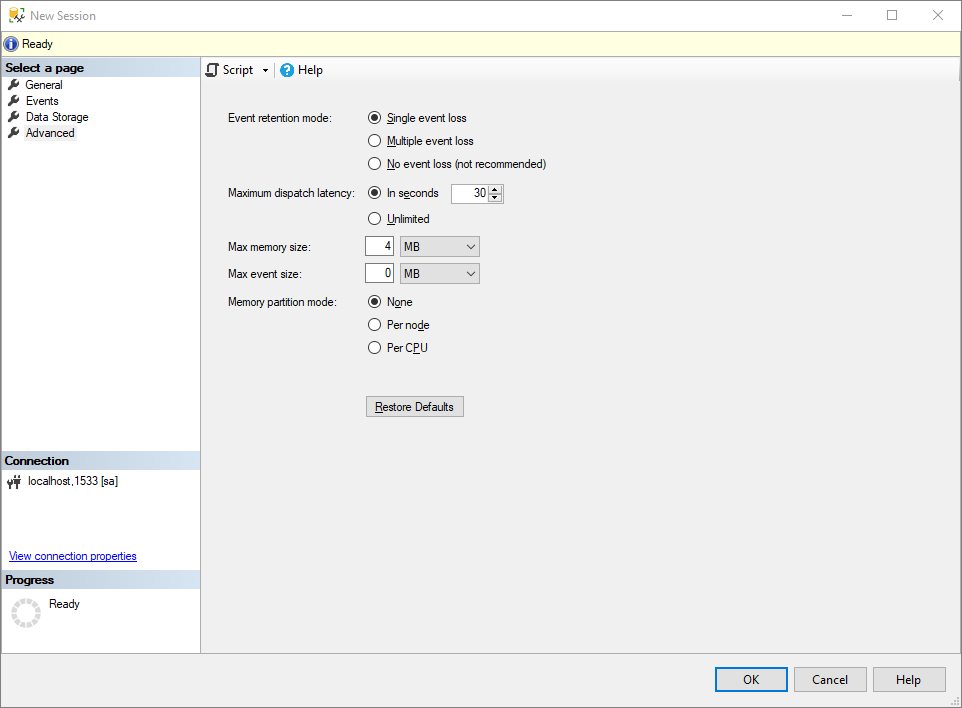

## Live view

With the session configured, we can open up the live data view by right-clicking on the created session.

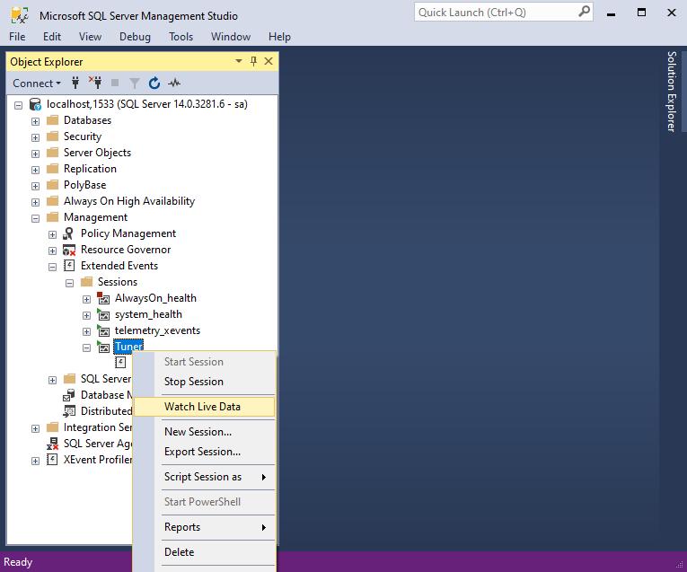

This opens up an almost identical view of the beloved SQL Profiler.
When the events have occurred, it will be shown on this screen.

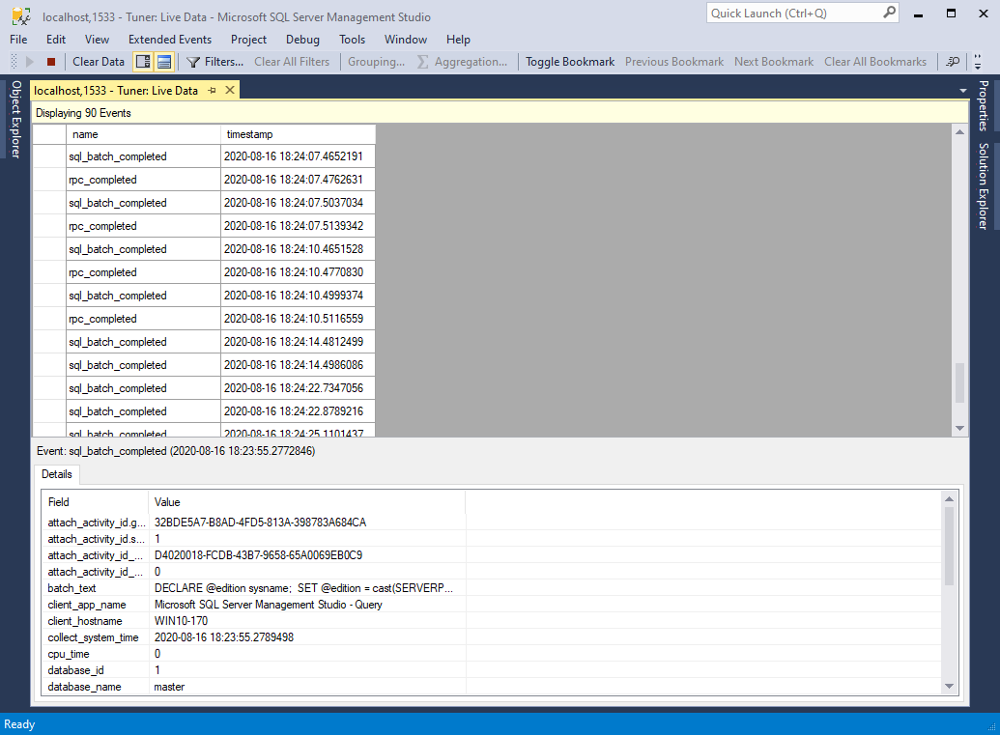

At first sight, this doesn't look as useful as the SQL Profiler.
To display more data, select an event and this will open a detailed view at the bottom.
Right-click a field row to add it to the live data view table.

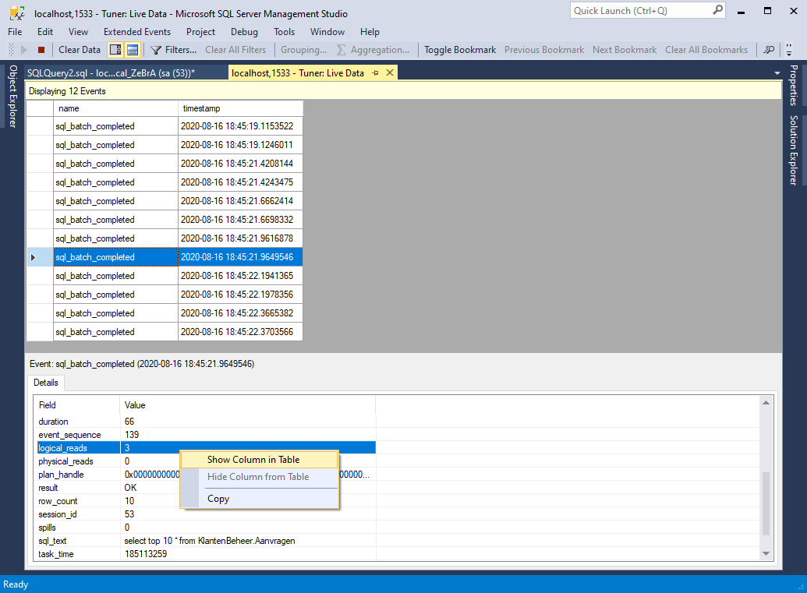

This gives us the following result, a view like we're used to with the SQL Profiler.

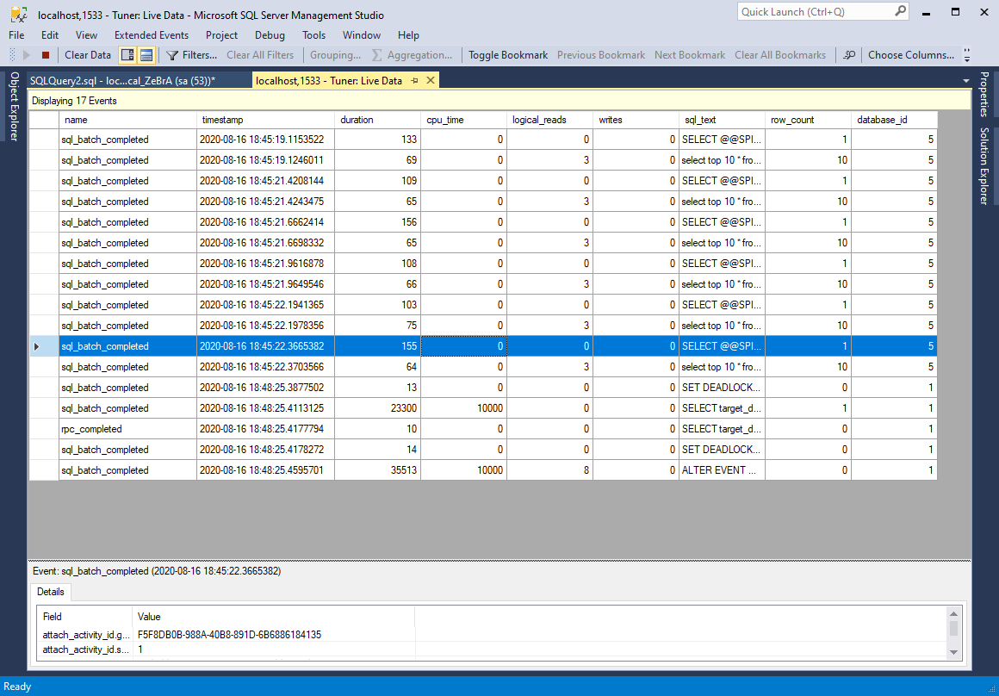

To display the same view the next time you open the data viewer, save the current display settings.

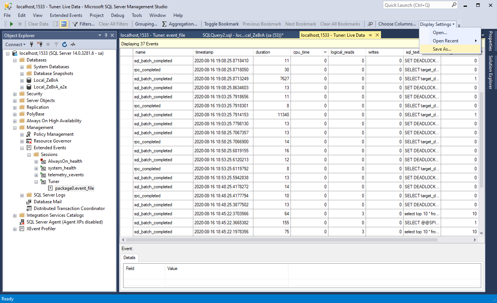

To edit the session, right-click the session and click on `Properties`.
This opens the same wizard as before, where you can make modifications to the existing session.

## Target data

It's also possible to start a session without the live view.
Because we're storing the captured events to an even file we can view and analyze these events in the Target Data view.
To open up this view, right-click the event file and select `View Target Data`.
This opens the same view as the live data view.

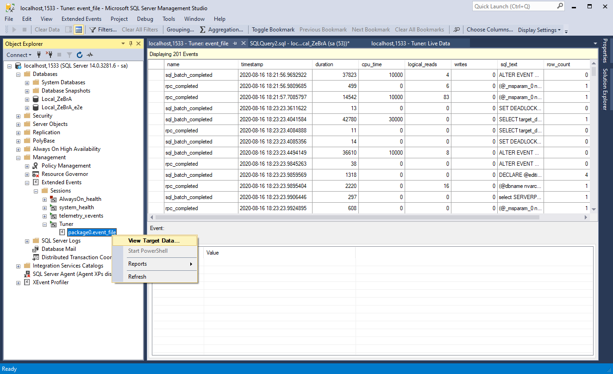

## My setup

As I said at the start of this blog, it's also possible to create a session via a SQL statement.
The SQL statement below is the exported version of the session created in this blog post.

```sql
CREATE EVENT SESSION [Tuner] ON SERVER
ADD EVENT sqlserver.rpc_completed(SET collect_statement=(1)
    ACTION(package0.collect_system_time,package0.event_sequence,sqlos.task_time,sqlserver.client_app_name,sqlserver.client_hostname,sqlserver.database_id,sqlserver.database_name,sqlserver.plan_handle,sqlserver.session_id,sqlserver.sql_text,sqlserver.transaction_id)),
ADD EVENT sqlserver.sql_batch_completed(
    ACTION(package0.collect_system_time,package0.event_sequence,sqlos.task_time,sqlserver.client_app_name,sqlserver.client_hostname,sqlserver.database_id,sqlserver.database_name,sqlserver.plan_handle,sqlserver.session_id,sqlserver.sql_text,sqlserver.transaction_id))
ADD TARGET package0.event_file(SET filename=N'Tuner')
WITH (MAX_MEMORY=4096 KB,EVENT_RETENTION_MODE=ALLOW_SINGLE_EVENT_LOSS,MAX_DISPATCH_LATENCY=30 SECONDS,MAX_EVENT_SIZE=0 KB,MEMORY_PARTITION_MODE=NONE,TRACK_CAUSALITY=ON,STARTUP_STATE=OFF)
GO
```

## Conclusion

When I read that the SQL Profiler was deprecated, I was worried because it was one of the tools that I knew I could always rely on.
I was worried that the new profiler wouldn't be as good as the old one. Now, that I've been using XEvents and the data view for a week, I feel reassured.
From now on, I will use XEvents and the data viewer instead of the SQL Profiler and I'm looking forward to the tricks that I haven't discovered yet.

It isn't a big change in terms of using the profiler. If you're used to working with the SQL Profiler, you will be able to use the new data view in just a couple of minutes. I've spent most of the time into setting up the session to replicate the setup I was using with the SQL Profiler. When I was happy with the initial setup and stared to use the data view it felt like I was using the profiler back again, but then directly in SQL Server Management Studio instead of in a separate profiler window.

For more info, see the [Extended Events docs](https://docs.microsoft.com/en-us/sql/relational-databases/extended-events/extended-events?view=sql-server-ver15), and the [official guides](https://docs.microsoft.com/en-us/sql/relational-databases/extended-events/manage-event-sessions-in-the-object-explorer?view=sql-server-ver15).

### Improvements

I'm also happy with the improvements they made to the data view, where we can do more than before. With the SQL Profiler, we had to import the collected events before we could analyze the captured data properly. Now, it's all baked into the data viewer:

- it's possible to sort the data view when we stop the live data feed

- the data view can be grouped (via `Grouping` and `Aggregation` in the toolbar at the top), this can give us a useful overview really fast.

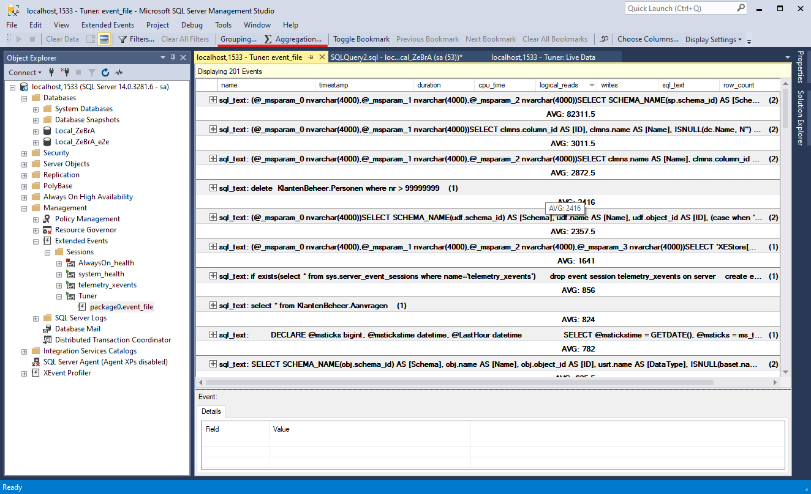

- using XEvents doesn't impact the performance of the SQL Server as much as it used to be. Personally, I never experienced hiccups when I turned on the SQL Profiler, but according to the docs, the XEvents aren't as heavy on the server.

- selecting events and fields now have a search box, making it easier to create a session

- it's easy to track events with the saved (aggregated) data from a session and gain insights of the system, for example if you want to [track deadlocks](https://www.sqlskills.com/blogs/paul/getting-historical-deadlock-info-using-extended-events/)

## More resources

- [Brent Ozar](https://www.brentozar.com/extended-events/)
- [SentryOne](https://www.sentryone.com/blog/tag/extended-events)
- For some practical use cases see the SQL Skills blog posts by [Jonathan Kehayias](https://www.sqlskills.com/blogs/jonathan/category/extended-events/) and [Paul S. Randal](https://www.sqlskills.com/blogs/paul/category/extended-events/), and [Performance Tuning Using Extended Events: Part 1
  ](https://www.sqlservercentral.com/articles/performance-tuning-using-extended-events-part-1) on SQL Server Central
