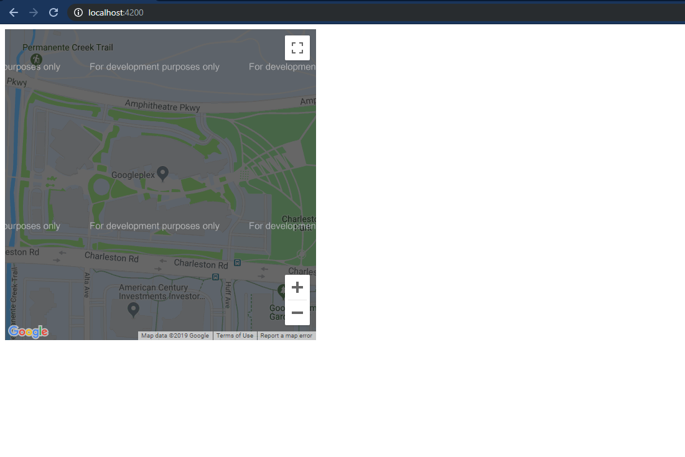
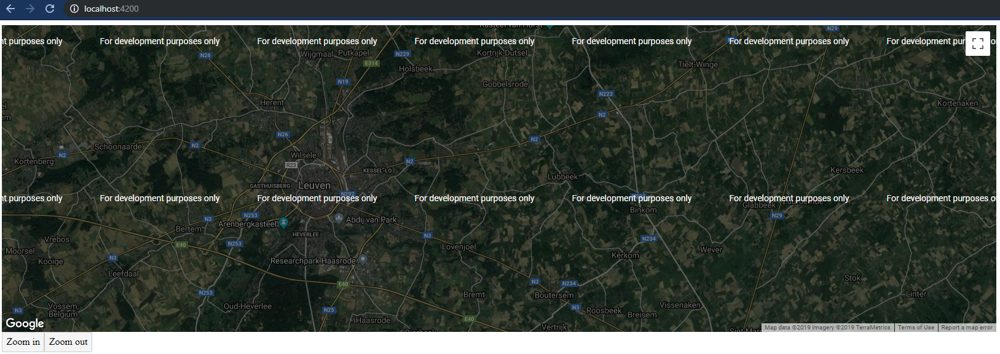
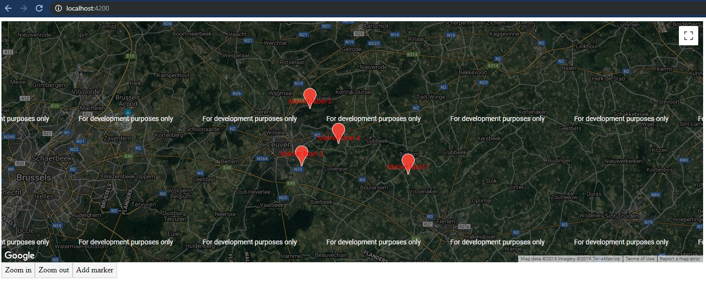

The new Angular Component [pearl-lullaby (v9.0.0-rc.0)](https://github.com/angular/components/releases/tag/9.0.0-rc.0) introduces the second official `@angular/component` component, a Google Maps component.
In this post, we take a look at getting started with the Google Maps component.

> Earlier this year, we changed the name of this repo to "angular/components" to emphasize our goal
> to provide more than Material Design components. The 9.0.0 release includes one of the next new
> features in that regard- a new package that wraps the [Google Maps JavaScript API](https://developers.google.com/maps/documentation/javascript/tutorial) in an easy-to-use Angular component.

I'm really looking forward to the team broadening up the repository to create components.
We already saw a [`YouTube Player` component](https://github.com/angular/components/tree/master/src/youtube-player) in [v8.2.0](https://github.com/angular/components/releases/tag/8.2.0), which is explored in [Craig](https://twitter.com/phenomnominal)'s [article](https://dev.to/phenomnominal/the-new-angular-youtube-player-component-2cn6).

These new integrations with existing JavaScript APIs are making it easier for us to do our jobs,
and I'm curious about the other new components that will be released in the upcoming versions!

## Setup

### Angular

The Google Maps module can be installed from `@angular/google-maps`.

```bash
npm install @angular/google-maps
```

When the installation is finished, we must add the Angular module `GoogleMapsModule` to the `import` declaration.

```ts{3,8}
import { BrowserModule } from '@angular/platform-browser'
import { NgModule } from '@angular/core'
import { GoogleMapsModule } from '@angular/google-maps'

import { AppComponent } from './app.component'

@NgModule({
  declarations: [AppComponent],
  imports: [BrowserModule, GoogleMapsModule],
  providers: [],
  bootstrap: [AppComponent],
})
export class AppModule {}
```

The `GoogleMapsModule` exports three components that we can use:

- [`GoogleMap`](#googlemap): this is the wrapper around Google Maps, available via the `google-map` selector
- [`MapMarker`](#mapmarker): used to add markers on the map, available via the `map-marker` selector
- [`MapInfoWindow`](#mapinfowindow): the info window of a marker, available via the `map-info-window` selector

### Loading the Maps JavaScript API

We also have to import the Maps API, this can be done by adding a script tag in the `index.html` file.

```html{9}
<!DOCTYPE html>
<html lang="en">
  <head>
    <meta charset="utf-8" />
    <title>Map</title>
    <base href="/" />
    <meta name="viewport" content="width=device-width, initial-scale=1" />
    <link rel="icon" type="image/x-icon" href="favicon.ico" />
    <script src="https://maps.googleapis.com/maps/api/js?key=YOUR_API_KEY"></script>
  </head>
  <body>
    <app-root></app-root>
  </body>
</html>
```

> To use the map in a production environment you will need to create a new API Key, follow the [documentation](https://developers.google.com/maps/documentation/javascript/get-api-key) to create a new key.

## Usage

### GoogleMap

By adding the Google Maps component to a template we can already see and use the Google Map.
The map will behave as a default map with the default functionality, for example, you can zoom in and out, and drag in the map.

```html
<google-map></google-map>
```



#### Input properties {#map-input-properties}

We can customize the styling of the default map by using the `@Input()` properties.
The most commonly used properties are added as `@Input` properties, we can set the size of the map, set the center, and set the zoom level.

| Property  | Description                                                                                                                          |
| --------- | ------------------------------------------------------------------------------------------------------------------------------------ |
| `height`  | Sets the initial height                                                                                                              |
| `width`   | Sets the initial width                                                                                                               |
| `center`  | Sets the initial center                                                                                                              |
| `zoom`    | Sets the initial zoom                                                                                                                |
| `options` | Sets the options, for more info see the [docs](https://developers.google.com/maps/documentation/javascript/reference/map#MapOptions) |

To make full use of the Google Maps API, we can also use the `options` property.
Using the explicit properties wins over using the `options` property.
The `options` property has the same has the interface as the [`Map Options interface`](https://developers.google.com/maps/documentation/javascript/reference/map#MapOptions).

```html
<google-map
  height="500px"
  width="100%"
  [zoom]="zoom"
  [center]="center"
  [options]="options"
></google-map>

<!-- Use custom zoom buttons -->
<button (click)="zoomIn()">Zoom in</button>
<button (click)="zoomOut()">Zoom out</button>
```

```ts
export class AppComponent implements OnInit {
  zoom = 12
  center: google.maps.LatLngLiteral
  options: google.maps.MapOptions = {
    mapTypeId: 'hybrid',
    zoomControl: false,
    scrollwheel: false,
    disableDoubleClickZoom: true,
    maxZoom: 15,
    minZoom: 8,
  }

  ngOnInit() {
    navigator.geolocation.getCurrentPosition((position) => {
      this.center = {
        lat: position.coords.latitude,
        lng: position.coords.longitude,
      }
    })
  }

  zoomIn() {
    if (this.zoom < this.options.maxZoom) this.zoom++
  }

  zoomOut() {
    if (this.zoom > this.options.minZoom) this.zoom--
  }
}
```



#### Output properties {#map-output-properties}

The `GoogleMap` component exposes all the Google Maps API events as `@Output()` properties:

| Property            | JavaScript API Method | Description                                                                                                                 |
| ------------------- | --------------------- | --------------------------------------------------------------------------------------------------------------------------- |
| `boundsChanged`     | `bounds_changed`      | This event is fired when the viewport bounds have changed                                                                   |
| `centerChanged`     | `center_changed`      | This event is fired when the map center property changes                                                                    |
| `mapClick`          | `click`               | This event is fired when the user clicks on the map                                                                         |
| `mapDblclick`       | `dblclick`            | This event is fired when the user double-clicks on the map. Note that the click event will also fire, right before this one |
| `mapDrag`           | `drag`                | This event is repeatedly fired while the user drags the map                                                                 |
| `mapDragend`        | `dragend`             | This event is fired when the user stops dragging the map                                                                    |
| `mapDragstart`      | `dragstart`           | This event is fired when the user starts dragging the map                                                                   |
| `headingChanged`    | `heading_changed`     | This event is fired when the map heading property changes                                                                   |
| `idle`              | `idle`                | This event is fired when the map becomes idle after panning or zooming                                                      |
| `maptypeidChanged`  | `maptypeid_changed`   | This event is fired when the mapTypeId property changes                                                                     |
| `mapMousemove`      | `mousemove`           | This event is fired whenever the user's mouse moves over the map container                                                  |
| `mapMouseout`       | `mouseout`            | This event is fired when the user's mouse exits the map container                                                           |
| `mapMouseover`      | `mouseover`           | This event is fired when the user's mouse enters the map container                                                          |
| `projectionChanged` | `projection_changed`  | This event is fired when the projection has changed                                                                         |
| `mapRightclick`     | `rightclick`          | This event is fired when the DOM contextmenu event is fired on the map container                                            |
| `tilesloaded`       | `tilesloaded`         | This event is fired when the visible tiles have finished loading                                                            |
| `tiltChanged`       | `tilt_changed`        | This event is fired when the map tilt property changes                                                                      |
| `zoomChanged`       | `zoom_changed`        | This event is fired when the map zoom property changes                                                                      |

Covering all of these events would be a lot for one post, in this post we'll go over the `click()` event.
If you're interested in all the events I refer you to the [Google Maps API Docs](https://developers.google.com/maps/documentation/javascript/reference/map) for the complete list, and the Angular implementation in the [source code](https://github.com/angular/components/blob/master/src/google-maps/google-map/google-map.ts#L81-L187).

```html
<google-map (mapClick)="click($event)"></google-map>
```

```ts
export class AppComponent implements OnInit {
  click(event: google.maps.MouseEvent) {
    console.log(event)
  }
}
```

#### Methods and getters

If we keep a reference to the map component, by using the [`@ViewChild`](https://angular.io/api/core/ViewChild) decorator, we can also use the following methods and getters.

| Function            | Description                                                                                                      |
| ------------------- | ---------------------------------------------------------------------------------------------------------------- |
| `fitBounds`         | Sets the viewport to contain the given bounds                                                                    |
| `panBy`             | Changes the center of the map by the given distance in pixels                                                    |
| `panTo`             | Changes the center of the map to the given LatLng                                                                |
| `panToBounds`       | Pans the map by the minimum amount necessary to contain the given LatLngBounds                                   |
| `getBounds`         | Returns the lat/lng bounds of the current viewport                                                               |
| `getCenter`         | Returns the position displayed at the center of the map                                                          |
| `getClickableIcons` | Returns the clickability of the map icons                                                                        |
| `getHeading`        | Returns the compass heading of aerial imagery                                                                    |
| `getMapTypeId`      | Returns the map type id                                                                                          |
| `getProjection`     | Returns the current Projection                                                                                   |
| `getStreetView`     | Returns the default StreetViewPanorama bound to the map, which may be a default panorama embedded within the map |
| `getTilt`           | Returns the current angle of incidence of the map, in degrees from the viewport plane to the map plane           |
| `getZoom`           | Returns the current zoom                                                                                         |
| `controls`          | Additional controls to attach to the map                                                                         |
| `data`              | An instance of Data, bound to the map                                                                            |
| `mapTypes`          | A registry of MapType instances by string ID                                                                     |
| `overlayMapTypes`   | Additional map types to overlay                                                                                  |

As an example, we can log the current center of the map.

```ts{2, 5}
export class AppComponent implements OnInit {
  @ViewChild(MapInfoWindow, { static: false }) info: MapInfoWindow

  logCenter() {
    console.log(JSON.stringify(this.map.getCenter()))
  }
}
```

### MapMarker

#### Input properties {#marker-input-properties}

With the map in place, we can start adding markers.
This is done by using the `MapMarker` component.
To add a marker, make sure the marker is added inside the `google-map` tag otherwise it will not be displayed.

Just like the `MapControl`, the most frequently used options can be set directly with `@Input()` properties, but it's also possible to make use of the full options set of the [`MapMarker`](https://developers.google.com/maps/documentation/javascript/reference/marker).

```html
<google-map>
  <map-marker
    *ngFor="let marker of markers"
    [position]="marker.position"
    [label]="marker.label"
    [title]="marker.title"
    [options]="marker.options"
  >
  </map-marker>
</google-map>
```

```ts
export class AppComponent implements OnInit {
  addMarker() {
    this.markers.push({
      position: {
        lat: this.center.lat + ((Math.random() - 0.5) * 2) / 10,
        lng: this.center.lng + ((Math.random() - 0.5) * 2) / 10,
      },
      label: {
        color: 'red',
        text: 'Marker label ' + (this.markers.length + 1),
      },
      title: 'Marker title ' + (this.markers.length + 1),
      options: { animation: google.maps.Animation.BOUNCE },
    })
  }
}
```



The full specification of the marker:

| Property    | Description                                                                                                                                |
| ----------- | ------------------------------------------------------------------------------------------------------------------------------------------ |
| `title`     | Sets the title, visible on hover                                                                                                           |
| `position`  | Sets the position                                                                                                                          |
| `label`     | Sets the label                                                                                                                             |
| `clickable` | If the marker should listen to mouse and touch events, default is `true`                                                                   |
| `options`   | Sets the options, for more info see the [docs](https://developers.google.com/maps/documentation/javascript/reference/marker#MarkerOptions) |

### Output properties {#map-marker-output-properties}

The `MapMarker` component also exposes the Google Maps API events as `@Output()` properties:

| Property           | JavaScript API Method | Description                                                           |
| ------------------ | --------------------- | --------------------------------------------------------------------- |
| `animationChanged` | `animation_changed`   | This event is fired when the marker's animation property changes      |
| `mapClick`         | `click`               | This event is fired when the marker icon was clicked                  |
| `clickableChanged` | `clickable_changed`   | This event is fired when the marker's cursor property changes         |
| `cursorChanged`    | `cursor_changed`      | This event is fired when the marker's cursor property changes         |
| `mapDblclick`      | `dblclick`            | This event is fired when the marker icon was double clicked           |
| `mapDrag`          | `drag`                | This event is repeatedly fired while the user drags the marker        |
| `mapDragend`       | `dragend`             | This event is fired when the user stops dragging the marker           |
| `draggableChanged` | `draggable_changed`   | This event is fired when the marker's draggable property changes      |
| `mapDragstart`     | `dragstart`           | This event is fired when the user starts dragging the marker          |
| `flatChanged`      | `flat_changed`        | This event is fired when the marker's flat property changes           |
| `iconChanged`      | `icon_changed`        | This event is fired when the marker icon property changes             |
| `mapMousedown`     | `mousedown`           | This event is fired for a mousedown on the marker                     |
| `mapMouseout`      | `mouseout`            | This event is fired when the mouse leaves the area of the marker icon |
| `mapMouseover`     | `mouseover`           | This event is fired when the mouse enters the area of the marker icon |
| `mapMouseup`       | `mouseup`             | This event is fired for a mouseup on the marker                       |
| `positionChanged`  | `position_changed`    | This event is fired when the marker position property changes         |
| `mapRightclick`    | `rightclick`          | This event is fired for a rightclick on the marker                    |
| `shapeChanged`     | `shape_changed`       | This event is fired when the marker's shape property changes          |
| `titleChanged`     | `title_changed`       | This event is fired when the marker title property changes            |
| `visibleChanged`   | `visible_changed`     | This event is fired when the marker's visible property changes        |
| `zindexChanged`    | `zindex_changed`      | This event is fired when the marker's zIndex property changes         |

> The full reference to the API can be found at the [Google Maps API Docs](https://developers.google.com/maps/documentation/javascript/reference/marker), and the Angular implementation in the [source code](https://github.com/angular/components/blob/master/src/google-maps/map-marker/map-marker.ts#L46).

### MapInfoWindow

The last component is `MapInfoWindow`, it can be used to open a pop-up window of a marker.
To show the pop-up we have to add the component inside the `google-map` template.

```html
<map-info-window>Hello Google Maps</map-info-window>
```

The above does nothing, to make it appear we have to open the info window when we click on a marker.
We bind the `mapClick()` method to the marker and pass the marker reference to the `openInfo` method to open the info window.

```html{2,8}
<map-marker
  #markerElem
  *ngFor="let marker of markers"
  [position]="marker.position"
  [label]="marker.label"
  [title]="marker.title"
  [options]="marker.options"
  (mapClick)="openInfo(markerElem)"
>
</map-marker>
```

Finally, we also have to add a reference to the `MapInfoWindow` component inside our component,
we can do this by using the [`@ViewChild`](https://angular.io/api/core/ViewChild) decorator.
By having the reference to the info window and the marker, we can open the info window by using the `infoWindow.open()` method.

```ts{2, 5}
export class AppComponent implements OnInit {
  @ViewChild(MapInfoWindow, { static: false }) infoWindow: MapInfoWindow

  openInfo(marker: MapMarker, content) {
    this.infoWindow.open(marker)
  }
}
```

#### Input properties {#info-window-input-properties}

| Property  | Description                                                                                                                                         |
| --------- | --------------------------------------------------------------------------------------------------------------------------------------------------- |
| `options` | Sets the options, for more info see the [docs](https://developers.google.com/maps/documentation/javascript/reference/info-window#InfoWindowOptions) |

#### Output properties {#info-window-output-properties}

| Property          | JavaScript API Method | Description                                                                                     |
| ----------------- | --------------------- | ----------------------------------------------------------------------------------------------- |
| `closeclick`      | `closeclick`          | This event is fired when the close button was clicked                                           |
| `contentChanged`  | `content_changed`     | This event is fired when the content property changes                                           |
| `domready`        | `domready`            | This event is fired when the `<div>` containing the InfoWindow's content is attached to the DOM |
| `positionChanged` | `position_changed`    | This event is fired when the position property changes                                          |
| `zindexChanged`   | `zindex_changed`      | This event is fired when the InfoWindow's zIndex changes                                        |

### Methods and getters {#info-window-mehods}

By using the `infoWindow` property, that has a reference to the `MapInfoWindow` component we can make use of its following methods and getters:

| Property      | Description                                                                                                                                                    |
| ------------- | -------------------------------------------------------------------------------------------------------------------------------------------------------------- |
| `close`       | Closes this InfoWindow by removing it from the DOM structure                                                                                                   |
| `getContent`  | Returns the content of the InfoWindow                                                                                                                          |
| `getPosition` | Returns the position of the InfoWindow                                                                                                                         |
| `getZIndex`   | Returns the z-index of the InfoWindow                                                                                                                          |
| `open`        | Opens the MapInfoWindow using the provided MapMarker as the anchor. If the anchor is not set, then the position property of the options input is used instead. |

#### Dynamic content

Having static content inside the info window is a bit dull.
To provide dynamic content inside the info window, we can create a string property within the component, this looks as follows.

```html
<map-info-window>{{ infoContent }}</map-info-window>
```

```ts{3, 6}
export class AppComponent implements OnInit {
  @ViewChild(MapInfoWindow, { static: false }) infoWindow: MapInfoWindow
  infoContent = ''

  openInfo(marker: MapMarker, content) {
    this.infoContent = content
    this.infoWindow.open(marker)
  }
}
```

> The full reference to the API can be found at the [Google Maps API Docs](https://developers.google.com/maps/documentation/javascript/reference/info-window), and the Angular implementation in the [source code](https://github.com/angular/components/blob/master/src/google-maps/map-info-window/map-info-window.ts#L35).

## Putting it all together

The upcoming version of Angular brings us a whole range of positive changes and new possibilities.
We were already looking forward to the Ivy release in Angular v9, but now we'll also look forward to the new release of `@angular/components`.

Besides the new `MapComponent` there will also be an integration with the Clipboard API within the Angular CDK, as explored in [Use the new Angular Clipboard CDK to interact with the clipboard](/blog/use-the-new-angular-clipboard-cdk-to-interact-with-the-clipboard).

The Angular component is very new, that's why the documentation and example code is minimal.
Because the Angular implementation follows the Google Maps API specs, we can take a look at the [rich documentation](https://developers.google.com/maps/documentation/javascript/tutorial) from the JavaScript API.

See the code below for the full explored example of this post.

```html
<google-map
  height="500px"
  width="100%"
  [zoom]="zoom"
  [center]="center"
  [options]="options"
  (mapClick)="click($event)"
>
  <map-marker
    #markerElem
    *ngFor="let marker of markers"
    [position]="marker.position"
    [label]="marker.label"
    [title]="marker.title"
    [options]="marker.options"
    (mapClick)="openInfo(markerElem, marker.info)"
  >
  </map-marker>

  <map-info-window>{{ infoContent }}</map-info-window>
</google-map>

<button (click)="zoomIn()">Zoom in</button>
<button (click)="zoomOut()">Zoom out</button>
<button (click)="logCenter()">Log center</button>
<button (click)="addMarker()">Add marker</button>
```

```ts
import { Component, OnInit, ViewChild } from '@angular/core'
import { MapInfoWindow, MapMarker, GoogleMap } from '@angular/google-maps'

@Component({
  selector: 'app-root',
  templateUrl: './app.component.html',
  styleUrls: ['./app.component.css'],
})
export class AppComponent implements OnInit {
  @ViewChild(GoogleMap, { static: false }) map: GoogleMap
  @ViewChild(MapInfoWindow, { static: false }) info: MapInfoWindow

  zoom = 12
  center: google.maps.LatLngLiteral
  options: google.maps.MapOptions = {
    zoomControl: false,
    scrollwheel: false,
    disableDoubleClickZoom: true,
    mapTypeId: 'hybrid',
    maxZoom: 15,
    minZoom: 8,
  }
  markers = []
  infoContent = ''

  ngOnInit() {
    navigator.geolocation.getCurrentPosition((position) => {
      this.center = {
        lat: position.coords.latitude,
        lng: position.coords.longitude,
      }
    })
  }

  zoomIn() {
    if (this.zoom < this.options.maxZoom) this.zoom++
  }

  zoomOut() {
    if (this.zoom > this.options.minZoom) this.zoom--
  }

  click(event: google.maps.MouseEvent) {
    console.log(event)
  }

  logCenter() {
    console.log(JSON.stringify(this.map.getCenter()))
  }

  addMarker() {
    this.markers.push({
      position: {
        lat: this.center.lat + ((Math.random() - 0.5) * 2) / 10,
        lng: this.center.lng + ((Math.random() - 0.5) * 2) / 10,
      },
      label: {
        color: 'red',
        text: 'Marker label ' + (this.markers.length + 1),
      },
      title: 'Marker title ' + (this.markers.length + 1),
      info: 'Marker info ' + (this.markers.length + 1),
      options: {
        animation: google.maps.Animation.BOUNCE,
      },
    })
  }

  openInfo(marker: MapMarker, content) {
    this.infoContent = content
    this.info.open(marker)
  }
}
```
