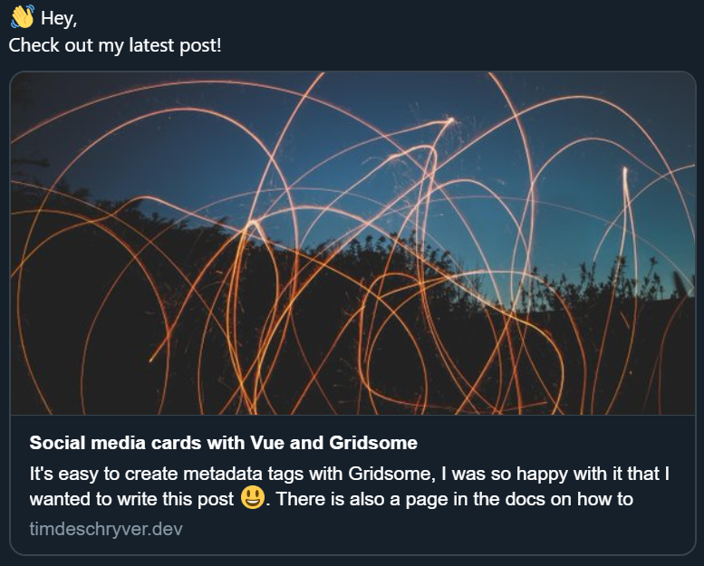
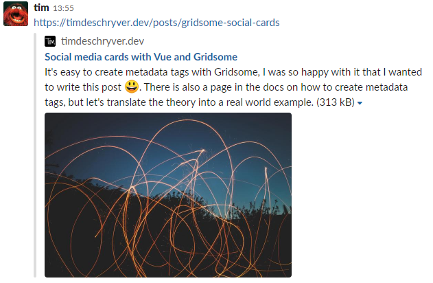

### Social media cards

With a social media card it is possible to transform a simple (and boring) link when you share it on different platforms, like Twitter or Slack, to an eye-catching message. The message contains a title, a description and an image if provided. To create social media cards for a website we have to add a couple of metadata tags inside the `header` tag of the page. When we're promoting our website, let's take a blog for example, we could provide the metadata tags. We could even take it a step further and create these metadata tags for specific pages. If we want to distinguish a post from our blog and from the other posts within it, we must have a custom card for the said post. Therefor we must override the global metadata tags with metadata tags for the specific post.

The snippet below shows an example on how this looks like, as you can see, there are two different sets of metadata we have to provide. The first one prefixed by `og:` is the Open Graph standard and is used by Facebook, the second set of tags are prefixed with `twitter:` and these are the tags that Twitter uses.

```html
<head>
  <!-- Open Graph -->
  <meta name="og:title" content="Social media cards with Vue and Gridsome" />
  <meta
    name="og:url"
    content="https://timdeschryver.dev/posts/gridsome-social-cards"
  />
  <meta
    name="og:description"
    content="It's easy to create metadata tags with Gridsome, I was so happy with it that I wanted to write this post 😃. There is also a page in the docs on how to create metadata tags, but let's translate the theory into a real world example."
  />
  <meta name="og:type" content="article" />
  <meta
    name="og:image"
    content="https://timdeschryver.dev/assets/static/gridsome-social-cards-banner.jpg"
  />

  <!-- Twitter -->
  <meta name="twitter:card" content="summary_large_image" />
  <meta name="twitter:creator" content="@tim_deschryver" />
  <meta
    name="twitter:title"
    content="Social media cards with Vue and Gridsome"
  />
  <meta
    name="twitter:description"
    content="It's easy to create metadata tags with Gridsome, I was so happy with it that I wanted to write this post 😃. There is also a page in the docs on how to create metadata tags, but let's translate the theory into a real world example."
  />
  <meta
    name="twitter:image"
    content="https://timdeschryver.dev/assets/static/gridsome-social-cards-banner.jpg"
  />
</head>
```

You can read more about the usage of the above tags on the [Open Graph protocol](http://ogp.me/) page and in the [Twitter docs](https://developer.twitter.com/en/docs/tweets/optimize-with-cards/guides/getting-started.html). It's also possible to validate the cards on [Facebook](https://developers.facebook.com/tools/debug/sharing/) and [Twitter](https://cards-dev.twitter.com/validator).

### Metadata tags with Gridsome

#### Global tags

To define global metadata tags that are added on every page, use the default function inside `src/main`. To add a tag we must provide the tag's `name` and `content`, the `key` is optional but is needed if we want to have the option to override the tag later on on the other pages. If we don't add the `key` property and provide the same tag later, the tag will be added again for every time that the same tag is added. For keeping the next snippets small, I will only add one tag instead of all of them.

```js
export default function(Vue, { router, head, isClient }) {
  head.meta.push({
    key: 'og:description',
    name: 'og:description',
    content: `Tim Deschryver's experiences and thoughts on programming`,
  })

  head.meta.push({
    key: 'twitter:description',
    name: 'twitter:description',
    content: `Tim Deschryver's experiences and thoughts on programming`,
  })
}
```

The tags being provided here will be all static content and in most of the cases they will use the `key` property. At this point we can also use the Vue router to create the `og:url` tag because we want this tag to point to the current URL and because we're lazy we don't want to add it manually for each page.

```js
router.beforeEach((to, _from, next) => {
  head.meta.push({
    key: 'og:url',
    name: 'og:url',
    content: process.env.GRIDSOME_BASE_PATH + to.path,
  })
  next()
})
```

#### Page specific tags

Gridsome works with pages, the docs defines a page as a static page with a static URL. For example `/posts` qualifies as a page.

> Pages are used for normal pages and for listing & paginate GraphQL collections. Like for example a Blog page. The URL path of a page is always static.

To add or override metadata tags use the `meta` property on `metaInfo`. Here again we provide a `key` when we define the metadata tags because we want to override the tags defined at the global level.

```js
export default {
  metaInfo: {
    title: 'Posts',
    meta: [
      {
        key: 'og:title',
        name: 'og:title',
        content: 'timdeschryver.dev - posts',
      },
      {
        key: 'twitter:title',
        name: 'twitter:title',
        content: 'timdeschryver.dev - posts',
      },
    ]
  }
```

#### Dynamic tags in Templates

A template in Gridsome is the same as a page but unlike a page it's dynamic. For example `/posts/slug` qualifies as a template.

> Templates are used for single post views to GraphQL collections.

The usage of metadata tags together with dynamic templates can be a powerful combination. In my opinion, this is where Gridsome makes it easy and pleasant to work with.

```js
export default {
  metaInfo() {
    return {
      title: this.$page.post.title,
      meta: [
        {
          name: 'og:description',
          name: 'og:description',
          content: this.$page.post.description,
        },

        {
          key: 'twitter:description',
          name: 'twitter:description',
          content: this.$page.post.description,
        },
      ],
    }
  },
}
```

The post's data comes from a GraphQL query and will be different for each post.

```graphql
query Post($path: String!) {
  post: post(path: $path) {
    title
    banner
    description
  }
}
```

> For more information see the [Gridsome blog](https://gridsome.org/docs/head)

### The end result

This is how it will look like if you tweet this post on Twitter 

And if you share it on Slack, this is how it looks like 
