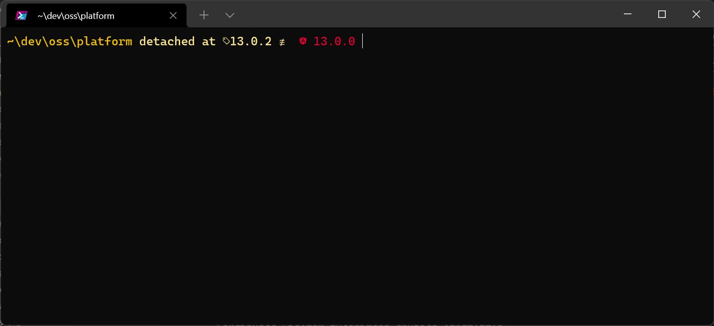
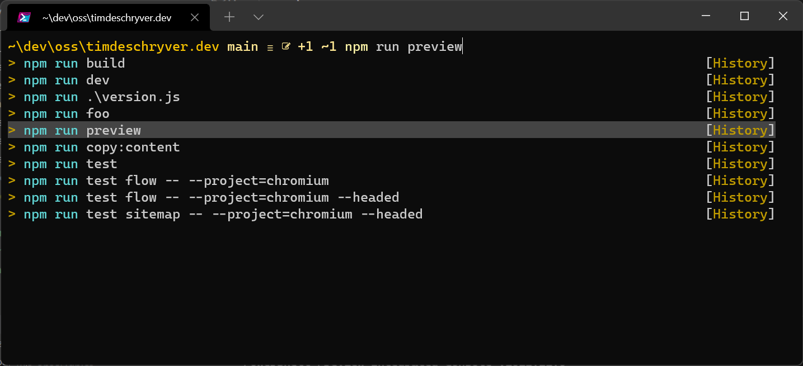
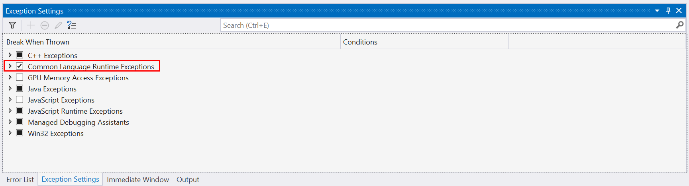

In the first week of 2022, I had the joy to receive a new machine from my new employer [dotNET lab](https://www.dotnetlab.eu/). In just a few hours I was up and running, let's take a look at my setup as a full-stack .NET and Angular developer.

Getting a new "toy" is always exciting but it's a double feeling because a new development environment involves manual work (remember what software to download, browse to the download page, step-through the install wizard), which is time-consuming. The last time that I configured my machine is a couple of years ago, and I remember that there were lots of sighs involved.
This time, a lot in the Windows eco-system has changed. In comparison to the previous time, it was a breeze, making this a fun experience!

## Install Software with `winget`

After the initial installation (and updates), the first step is to make sure that `winget` is installed, and that it's updated to the latest version. You can do this by going to the Microsoft Store and searching for `winget` (in the store it's listed as "App Installer").


`winget` has two important commands `winget search` to search for software, and `winget install` to install the software. When using the `install` command, note that you can pass it the `interactive` flag to intervene with the installation details by changing the defaults.

Once `winget` is installed, open a new command prompt and copy-paste the next script.
This script installs all of the software that I've used throughout the last month in a single command.

```bash
# Browser
winget install Microsoft.Edge.Beta
winget install Google.Chrome.Beta
winget install Mozilla.Firefox.DeveloperEdition

# Chat
winget install Microsoft.Teams
winget install Discord.Discord.Canary

# Windows and CLI
winget install Microsoft.PowerToys # https://github.com/microsoft/PowerToys
winget install Microsoft.WindowsTerminal.Preview
winget install Microsoft.PowerShell.Preview
winget install JanDeDobbeleer.OhMyPosh

# Git
winget install Git.Git
winget install GitHub.cli

# Development Enviroment
winget install Microsoft.dotnet
winget install Yarn.Yarn
# Not needed because I use fnm (see the next section for more info)
# winget install OpenJS.NodeJS

# IDE
winget install Microsoft.VisualStudio.2022.Enterprise-Preview
winget install Microsoft.VisualStudioCode.Insiders
winget install Microsoft.SQLServer.2019.Developer
winget install Microsoft.SQLServerManagementStudio
winget install Microsoft.AzureDataStudio.Insiders

winget install JetBrains.ReSharper
winget install JetBrains.Rider
winget install JetBrains.WebStorm
winget install JetBrains.DataGrip

# Miscellaneous
winget install 7zip.7zip
```

The above script installs the majority, but there are a few programs that need to be installed manually because they aren't available on `winget`.

- [fnm](https://github.com/Schniz/fnm), fast and simple Node.js version manager
- [Gpg4win](https://www.gpg4win.org/download.html), sign git commits to make them "verified"

## Different Node.JS versions with `fnm`

I use `fnm` because I need to work within multiple Node.JS versions.
With the `fnm` CLI I'm able to easily install Node.JS version and cycle between them, depending on the project's configuration.

The best part is that `fnm` automatically uses the correct version.
The only requirement is that a `.node-version` or `.nvm` file exists in the root directory.

```txt:.node-version
14.16
```

When the specified Node.JS version isn't installed, `fnm` prompts a install command.

```bash
cd my-awesome-project
> Can't find an installed Node version matching v14.16.x.
> Do you want to install it? answer [y/n]: y
> Installing Node v14.16.1 (x64)
> Using Node v14.16.1
cd ../second-great-project
> Using Node v16.13.2
```

Other helpful commands are `install`, `use`, `default`, and `current`:

```bash
fnm install 16
fnm default 16
fnm use 16
fnm current
> v16.13.2
```

## dotNET Tools

[Tye](https://github.com/dotnet/tye) has been indispensable in my toolkit for the past year.
I was immediately hooked from the first time when I heard about this tool.

Tye makes the development experience a lot smoother when it's required to run more than one application at once.
With a single command, all of the development instances (services, applications) are spawned locally (and can be debugged), making it effortless to run a development environment. For example, a .NET Web API and an Angular frontend.

For more info, read my blog [Tye, starting and running multiple APIs with a single command](../tye-starting-and-running-multiple-apis-with-a-single-command/index.md).

## Enhancing the Terminal

To make the terminal awesome, I'm using the [Windows Terminal](https://docs.microsoft.com/en-us/windows/terminal/) together with [Oh My Posh](https://ohmyposh.dev/).

I compare the Windows Terminal as the default Command Prompt on steroids that has built-in tabs, and it can be tweaked to my preferences. This makes me feel happy, resulting in an increased productivity.

Via the settings of the Windows Terminal, I set the default font and the default profile, which uses PowershellCore.
I've also added a few shortcuts to open (ctrl+t) and close (ctrl+w) tabs.

I've set the font to a font family from [Nerd Fonts](https://www.nerdfonts.com/) to display the beautiful icons (glyphs) that are used with Oh My Posh. Go to the [download page](https://www.nerdfonts.com/font-downloads) to find your preferred Nerd Font.

```json:windows-terminal-settings.json
{
  "$help": "https://aka.ms/terminal-documentation",
  "$schema": "https://aka.ms/terminal-profiles-schema",
  "actions": [
    {
      "command": {
        "action": "copy",
        "singleLine": false
      },
      "keys": "ctrl+c"
    },
    {
      "command": "paste",
      "keys": "ctrl+v"
    },
    {
      "command": {
        "action": "newTab"
      },
      "keys": "ctrl+t"
    },
    {
      "command": "find",
      "keys": "ctrl+shift+f"
    },
    {
      "command": {
        "action": "splitPane",
        "split": "auto",
        "splitMode": "duplicate"
      },
      "keys": "alt+shift+d"
    },
    {
      "command": {
        "action": "closeTab"
      },
      "keys": "ctrl+w"
    }
  ],
  "copyFormatting": "none",
  "copyOnSelect": false,
  "defaultProfile": "{574e775e-4f2a-5b96-ac1e-a2962a402336}",
  "profiles": {
    "defaults": {
      "colorScheme": "Horizon",
      "font": {
        "face": "CaskaydiaCove Nerd Font Mono",
        "size": 13
      },
      "opacity": 80,
      "startingDirectory": "%USERPROFILE%/dev"
    },
    "list": [
      {
        "elevate": true,
        "guid": "{574e775e-4f2a-5b96-ac1e-a2962a402336}",
        "hidden": false,
        "name": "PowerShell",
        "source": "Windows.Terminal.PowershellCore"
      }
    ]
  },
  "schemes": [
    {
      "name": "Horizon",
      "black": "#0a0a0d",
      "red": "#E95678",
      "green": "#29D398",
      "yellow": "#FAB795",
      "blue": "#26BBD9",
      "purple": "#EE64AC",
      "cyan": "#59E1E3",
      "white": "#e5e5e5",
      "brightBlack": "#848484",
      "brightRed": "#EC6A88",
      "brightGreen": "#3FDAA4",
      "brightYellow": "#FBC3A7",
      "brightBlue": "#3FC4DE",
      "brightPurple": "#F075B5",
      "brightCyan": "#6BE4E6",
      "brightWhite": "#e5e5e5",
      "background": "#1c1e26",
      "foreground": "#bdc0c2"
    }
  ],
  "theme": "system",
  "useAcrylicInTabRow": true
}
```

To make the terminal cozy and pretty, I'm using [Oh My Posh](https://ohmyposh.dev/).
Oh My Posh also allows me to add key information to my prompt, making it more useful than the normal prompt. For example, a Oh My Posh theme can show the git status, the .NET version, the Angular version, and [much more](https://ohmyposh.dev/docs/segments/git).

For some inspiration, take a look at the [default themes](https://ohmyposh.dev/docs/themes).
You can even create your own custom theme for your own likings.
But for me, I like to change things, so every time that I open a new tab, I'm using a different theme that's randomly chosen.

To also render the icons Visual Studio Code, set the terminal's font of Visual Studio Code (via `terminal.integrated.fontFamily`) to the same font from the Windows Terminal config. By doing this, you'll get the same experience no matter where you are.

For example, the experience within an Angular repository looks as follows.



For more details and options about the terminal, I highly recommend [My Ultimate PowerShell prompt with Oh My Posh and the Windows Terminal](https://www.hanselman.com/blog/my-ultimate-powershell-prompt-with-oh-my-posh-and-the-windows-terminal) by [Scott Hanselman](https://twitter.com/shanselman), or the recorded version [How to make the ultimate Terminal Prompt on Windows 11](https://www.youtube.com/watch?v=VT2L1SXFq9U).

## Powershell Profile

Here's where things get interesting, and this part often raises eyebrows while I'm pair programming.

Because the default terminal uses Powershell a lot of tasks can be scripted. To reduce my keystrokes, I like to create aliases and shortcuts to quickly get done what I want to do. The best part is that these tasks are at my disposal when I'm in the terminal.

The Powershell scripts are created in a [Powershell profile](<(https://docs.microsoft.com/en-us/powershell/module/microsoft.powershell.core/about/about_profiles?view=powershell-7.2#the-profile-variable)>), accessible via the `$PROFILE` variable.
To create the profile, either manually create the file at `"C:\Users\USER\Documents\PowerShell\Microsoft.PowerShell_profile.ps1"`, or use a command to create and open the file, e.g. `code-insiders $PROFILE` (if you're using the normal Visual Studio Code, use `code $PROFILE`).

My profile, which can be found below, creates a couple of functions and aliases to:

- navigate to frequent folders
- add a wrapper and some templates to the most common git commands
- keep a history for used commands
- register shortcuts so I don't have to type the whole command

```ps:Microsoft.PowerShell_profile.ps1
# The first time the Terminal-Icons module needs to be installed:
# Install-Module -Name Terminal-Icons -Repository PSGallery
Import-Module Terminal-Icons

# Startup

function changeTheme {
    $Themes = "C:\Users\timde\AppData\Local\Programs\oh-my-posh\themes\"
    $Theme = $args[0]
    if($null -eq $Theme) {
        $Theme = Get-ChildItem $Themes -name | Select-Object -index $(Random $((Get-ChildItem $Themes).Count))
    } else {
        $Theme = $Theme + ".omp.json"
    }
    Write-Output "Using $Theme"
    oh-my-posh init pwsh --config "$Themes$Theme" | Invoke-Expression
}

# Always use a random theme
changeTheme

fnm env --use-on-cd | Out-String | Invoke-Expression

# History

Set-PSReadLineOption -PredictionSource History
Set-PSReadLineOption -PredictionViewStyle ListView
Set-PSReadLineOption -EditMode Windows

# Alias

Set-Alias -Name code -Value code-insiders

function .. {
    cd ..
}

function .... {
    cd ../../
}

function ...... {
    cd ../../../
}

function oss {
    cd "~/dev/oss/$args"
}

function work {
    cd "~/dev/work/$args"
}

# Git

function gb {
    git checkout -b $args
}

function gbt ([string] $taskid) {
    git checkout -b "task/$taskid"
}

function gs {
    git checkout $args
    git pull
}

function gmaster {
    gs 'master'
}

function gmain {
    gs 'main'
}

function gdev {
    gs 'develop'
}

function grb {
    git fetch
    git rebase origin/$args
}

function gco {
    git add .
    git commit -m $args
}

function gfeat {
    if($null -eq $args[1]) {
        gco "feat: $($args[0])"
    }else {
        gco "feat($($args[0])): $($args[1])"
    }
}

function gfix {
    if($null -eq $args[1]) {
        gco "fix: $($args[0])"
    }else {
        gco "fix($($args[0])): $($args[1])"
    }
}

function gtest {
    if($null -eq $args[1]) {
        gco "test: $($args[0])"
    }else {
        gco "test($($args[0])): $($args[1])"
    }
}

function gdocs {
    if($null -eq $args[1]) {
        gco "docs: $($args[0])"
    }else {
        gco "docs($($args[0])): $($args[1])"
    }
}

function gstyle {
    if($null -eq $args[1]) {
        gco "style: $($args[0])"
    }else {
        gco "style($($args[0])): $($args[1])"
    }
}

function grefactor {
    if($null -eq $args[1]) {
        gco "refactor: $($args[0])"
    }else {
        gco "refactor($($args[0])): $($args[1])"
    }
}

function gperf {
    if($null -eq $args[1]) {
        gco "perf: $($args[0])"
    }else {
        gco "perf($($args[0])): $($args[1])"
    }
}

function gchore {
    if($null -eq $args[1]) {
        gco "chore: $($args[0])"
    }else {
        gco "chore($($args[0])): $($args[1])"
    }
}

function gpu {
    git pull
}

function goops {
    git add .
    git commit --amend --no-edit
}

function gfp {
    git push --force-with-lease
}

function gr {
    git reset --hard
    git clean -f -d
}

# Macros

# Inspired by Scott's profile https://gist.github.com/shanselman/25f5550ad186189e0e68916c6d7f44c3
Set-PSReadLineKeyHandler -Key Ctrl+Shift+b `
    -BriefDescription BuildCurrentDirectory `
    -LongDescription "Build the current directory" `
    -ScriptBlock {
        [Microsoft.PowerShell.PSConsoleReadLine]::RevertLine()
        if(Test-Path -Path ".\package.json") {
            [Microsoft.PowerShell.PSConsoleReadLine]::Insert("npm run build")
        }else {
            [Microsoft.PowerShell.PSConsoleReadLine]::Insert("dotnet build")
        }
        [Microsoft.PowerShell.PSConsoleReadLine]::AcceptLine()
    }

Set-PSReadLineKeyHandler -Key Ctrl+Shift+t `
    -BriefDescription BuildCurrentDirectory `
    -LongDescription "Build the current directory" `
    -ScriptBlock {
        [Microsoft.PowerShell.PSConsoleReadLine]::RevertLine()
        if(Test-Path -Path ".\package.json") {
            [Microsoft.PowerShell.PSConsoleReadLine]::Insert("npm run test")
        }else {
            [Microsoft.PowerShell.PSConsoleReadLine]::Insert("dotnet test")
        }
        [Microsoft.PowerShell.PSConsoleReadLine]::AcceptLine()
    }

Set-PSReadLineKeyHandler -Key Ctrl+Shift+s `
    -BriefDescription StartCurrentDirectory `
    -LongDescription "Start the current directory" `
    -ScriptBlock {
        [Microsoft.PowerShell.PSConsoleReadLine]::RevertLine()
        if(Test-Path -Path ".\package.json") {
            [Microsoft.PowerShell.PSConsoleReadLine]::Insert("npm start")
        }else {
            [Microsoft.PowerShell.PSConsoleReadLine]::Insert("dotnet run")
        }
        [Microsoft.PowerShell.PSConsoleReadLine]::AcceptLine()
    }
```



## Git Defaults

The following script sets a git identity and configures git to behave the way that I want.

```bash
git config --global user.name "first last"
git config --global user.email "name@example.com"
git config --global push.default current
git config --global push.autoSetupRemote true
git config --global pull.rebase true
git config --global core.editor code-insiders -w
git config --global init.defaultBranch main
# sign commits
git config --global gpg.program "C:/Program Files (x86)/GnuPG/bin/gpg.exe"
git config --global commit.gpgsign true
```

To sign commits I've followed the blogpost [A guide to securing git commits from tricking you on Windows](https://www.ankursheel.com/blog/securing-git-commits-windows) by [Ankur Sheel](https://twitter.com/ankur_sheel).

### Work/OSS Git

To set a different git value depending on the environment, use [includeIf](https://git-scm.com/docs/git-config#_includes) to override some variables.

```bash
[includeIf "gitdir:~/work/"]
	path=~/work/.gitconfig

[includeIf "gitdir:~/oss/"]
	path=~/oss/.gitconfig
```

## Visual Studio Code Plugins and Settings

If you know me, you already know that I like to customize my Visual Studio Code setup.
The following scripts don't include (color or icon) themes because I like to frequently rotate between them, depending on my mood.

However, the next script installs all of the mandatory extensions to be productive.
Because I'm using the Insiders version of Visual Studio Code, I'm using `code-insiders` instead of `code`.

```bash
# Formatting and Rules
code-insiders --install-extension dbaeumer.vscode-eslint --force
code-insiders --install-extension esbenp.prettier-vscode --force
code-insiders --install-extension aaron-bond.better-comments --force

# HTML and CSS
code-insiders --install-extension formulahendry.auto-rename-tag --force
code-insiders --install-extension naumovs.color-highlight --force
code-insiders --install-extension anteprimorac.html-end-tag-labels --force

# Git
code-insiders --install-extension github.vscode-pull-request-github --force
code-insiders --install-extension eamodio.gitlens-insiders --force

# Angular
code-insiders --install-extension angular.ng-template --force

# .NET
code-insiders --install-extension ms-dotnettools.csharp --force
code-insiders --install-extension visualstudioexptteam.vscodeintellicode --force

# Test Runners
code-insiders --install-extension ms-playwright.playwright --force

# Markdown
code-insiders --install-extension yzhang.markdown-all-in-one --force
code-insiders --install-extension davidanson.vscode-markdownlint --force

# Rest Client
code-insiders --install-extension rangav.vscode-thunder-client --force

# Miscellaneous
code-insiders --install-extension github.copilot --force
```

For the completion, here's my entire `settings.json` file.

```json:settings.json
{
    "editor.fontFamily": "Cascadia Code, Dank Monk",
    "editor.fontSize": 18,
    "editor.lineHeight": 2,
    "editor.fontLigatures": true,
    "editor.dragAndDrop": false,
    "editor.cursorSmoothCaretAnimation": true,
    "editor.smoothScrolling": true,
    "editor.wordWrap": "on",
    "editor.formatOnSave": true,
    "editor.defaultFormatter": "esbenp.prettier-vscode",
    "editor.guides.bracketPairs": true,
    "explorer.experimental.fileNesting.enabled": true,
    "files.defaultLanguage": "markdown",
    "files.associations": {
        "*.mdx": "markdown"
    },
    "terminal.integrated.fontFamily": "CaskaydiaCove NF",
    "workbench.list.smoothScrolling": true,
    "workbench.editor.wrapTabs": true,
    "javascript.inlayHints.parameterNames.enabled": "all",
    "typescript.inlayHints.parameterNames.enabled": "all",
    "typescript.inlayHints.functionLikeReturnTypes.enabled": true,
    "scm.defaultViewMode": "tree",
    "search.exclude": {
        "package-lock.json": true,
        "yarn.lock": true,
    },
    // https://github.com/angular-eslint/angular-eslint#linting-html-files-and-inline-templates-with-the-vscode-extension-for-eslint
    "eslint.options": {
        "extensions": [".ts", ".html"]
    },
    "eslint.validate": [
        "javascript",
        "javascriptreact",
        "typescript",
        "typescriptreact",
        "html"
    ],
}
```

## Visual Studio Exceptions Settings

A setting that has saved me a lot of time is the "Common Language Runtime Exceptions" setting.
By default, the setting is partially enabled but I always enable it because it immediately points me to the source of the exception rather than I have to debug the entire stack to find the exception. When the setting is enabled, the debugger breaks on all exceptions and it navigates to the source. This makes it straightforward to find and fix bugs.

To enable the setting, use the `ctrl+alt+e` shortcut and tick the "Common Language Runtime Exceptions" checkbox.



For Visual Studio Code, check the breakpoint checkboxes in the "Run and Debug" sidebar.

## File Explorer Options

As a software developer, seeing hidden files and more importantly, the file extension is a must. Via the "File Explorer Options" window these two options can be enabled.


## Allow Insecure Localhost

To run an Angular application on HTTPS locally you can [create a self-signed certificate](https://medium.com/@richardr39/using-angular-cli-to-serve-over-https-locally-70dab07417c8), but I find it easier to allow invalid certificates on localhost. This is a flag that can be enabled via the browser.

- Edge: [edge://flags/#allow-insecure-localhost](edge://flags/#allow-insecure-localhost)
- Chrome: [chrome://flags/#allow-insecure-localhost](chrome://flags/#allow-insecure-localhost)
- Firefox: [about:config](about:config) and then search for "allowInsecureFromHTTPS"


## Conclusion

From my recent experience, it's painless and swift to set up a new Windows machine anno 2022.
To make our daily work more enjoyable, the Terminal and the IDE are configured to our needs and preferences.
I've created PowerShell profile to script frequent tasks, making them easy and fast to run, often with only a few keystrokes. While these seem small, it definitely is a productivity boost.

The last step is to clone your Git repository and start working.

Enjoy your new device!
