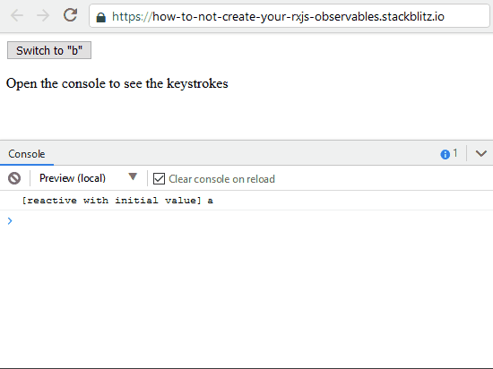
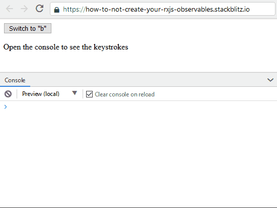
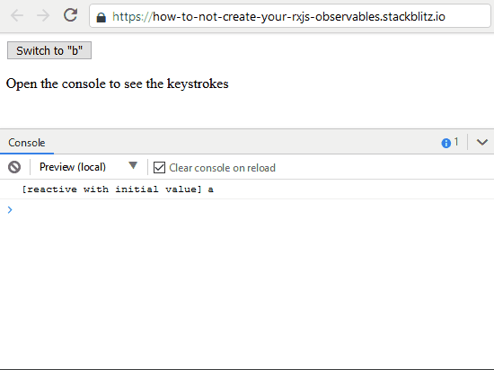

Last week a friend and college of mine was stuck with a problem.
An NgRx effect was subscribed to a stream of WebSocket messages, but the effect didn't receive any messages.
Though, we saw that the server was sending them and that they reached the client.

The problem wasn't the Effect, but the WebSocket stream that was wrongfully initialized.

The use case was to only establish the WebSocket connection for the users that had enough permissions to start a process.
The WebSocket was created to report the progress of this process to the rest of the users.

The simplified version looks like this:

```ts
stream$ = of({ status: 'idle' })

// and later...

if (userCanEstablishConnection()) {
  this.stream$ = fromEvent(this.hub, 'ReportProgress')
}
```

This doesn't work because the `steam$` is reassignment to the "real" WebSocket stream after the Effect was initialized.
When the WebSocket stream emits a new progress value, the Effect doesn't receive the update because it is listening to `of({ status: 'idle' })`

So how do we solve this?
Mostly, the answer to that question when it comes to RxJS is to wrap the Observable inside another Observable.

## Simplified reproduction

To reproduce this in a simple way, I created 2 streams.
One stream is listening for "a" keydown events, the second stream is listening to "b" keydown events.
At first we're interested in the "a" events, and when the button (toggle) is clicked, we only want to receive the "b" events.

```ts
// a helper to listen to keystrokes by key
// will be used in all of the examples
const fromKeydown = (filterKey: string) =>
  fromEvent<KeyboardEvent>(document, 'keydown').pipe(
    map((e) => e.key),
    filter((key) => key === filterKey),
    scan((acc, key) => acc + ' ' + key, ''),
  )

// a toggle to switch between the two streams
// will be used in all of the examples
let toggle$ = fromEvent(document.querySelector('button'), 'click')

// start listening to "a" keydowns
let source = fromKeydown('a')

// log keydown strokes
source.subscribe((key) => console.log('[wrong]', key))

// switch the stream on click
toggle$.subscribe(() => {
  console.log('[wrong]', 'listening to b')
  source = fromKeydown('b')
})
```



## Implementation One: The Imperative Way

To stay in the imperative world we can re-create this `if` statement inside an outer Observable.
So, we start off by using the "a"-events and when the button is clicked, we switch the inner Observable to return the "b"-event stream.
In the code below we use a [RxJS `Subject`](https://rxjs.dev/guide/subject) to recreate the toggle.

```ts
// create the toggle
const toggleSubject = new Subject<boolean>()

// create an outer Observable based on toggleSubject
let source2 = toggleSubject.pipe(
  // switch the inner stream based on the toggle
  switchMap((toggle) => (toggle ? fromKeydown('b') : fromKeydown('a'))),
)

// flip the toggle on button click
toggle$.subscribe(() => {
  console.log('[imperative]', 'listening to b')
  toggleSubject.next(true)
})

// log keydown strokes
source2.subscribe((key) => console.log('[imperative]', key))

// start the strean
toggleSubject.next(false)
```



While this works, we can do better.

## Implementation Two: Let's Think In Streams

Instead of re-creating a new stream with a `Subject`, why not re-use a stream?
The `toggle$` stream is exactly what we need to switch between the two streams, and it's already there!

```ts
// when toggle$ receives a new value (on click)
// switch to the "b"-stream
let source3 = toggle$.pipe(switchMap(() => fromKeydown('b')))

// log keydown strokes
source3.subscribe((key) => console.log('[reactive]', key))
```


The above doesn't take the "a"-stream into account, it just creates the "b"-stream when the toggle emits a value.
For our use-case this was perfect, but if needed we can provide an initial value.

### With an initial value

By using the [`startWith` operator](https://rxjs.dev/api/operators/startWith), we can start-off the stream with a single "a" value.

```ts
let source4 = toggle$.pipe(
  switchMap(() => fromKeydown('b')),
  startWith('a'),
)

source4.subscribe((key) => console.log('[reactive with initial value]', key))
```



### With an initial stream

Or, if you're interested in the "a"-stream you can use the [`concat` method](https://rxjs.dev/api/index/function/concat)
in combination with the [`takeUntil` operator](https://rxjs.dev/api/operators/takeUntil).
This will handle all streams sequentially.

For our code this means that it will first emit all the "a" events, and when the toggle is clicked it switches to the "b" events.

```ts
let source5 = concat(
  fromKeydown('a').pipe(takeUntil(toggle$)),
  fromKeydown('b'),
)

source5.subscribe((key) => console.log('[reactive with initial steam]', key))
```


### Conclusion

By wrapping the Observable (the inner-Observable) in an other Observable (the outer-Observable), the reference to the Observable remains the same. In the Observable we forsee a way to switch between the two Observables.
This way, in our case, the NgRx Effect works as intended.

> There are multiple operators that provide a solution to different use case, try the [RxJS Operator Decision Tree](https://rxjs.dev/operator-decision-tree) to find your solution

You can play around with the code in this Blitz.

<iframe src="https://stackblitz.com/edit/how-to-not-create-your-rxjs-observables?ctl=1&embed=1&file=index.ts" title="How to not create your RxJS observables demo"></iframe>
