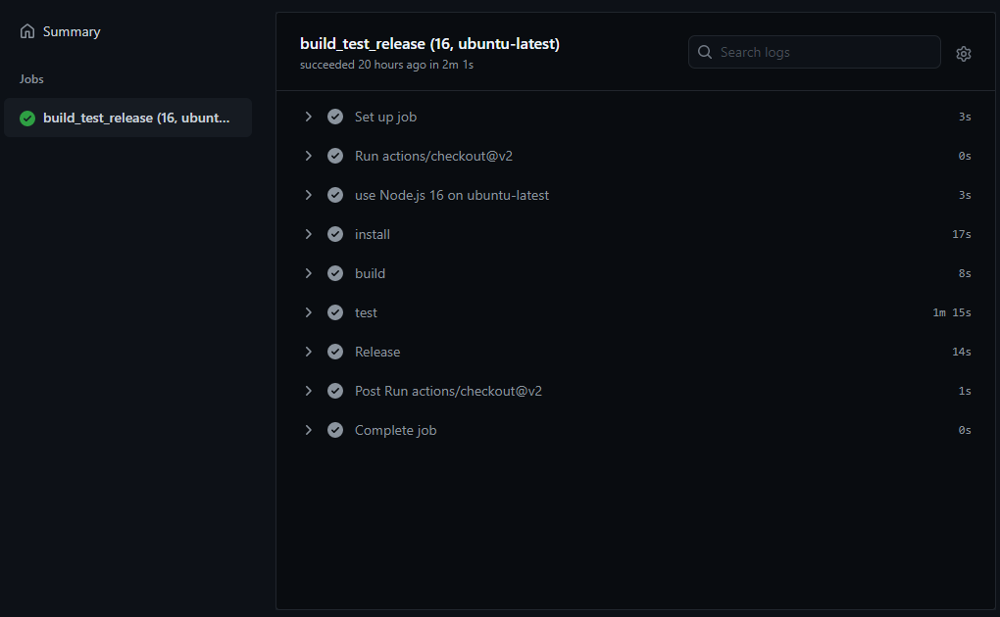

When Github released [Github Actions](https://docs.github.com/en/actions) I moved most of my CI/CD pipelines to use a Github workflow. Each project had two workflows, one workflow that ran on Pull Requests, and a second workflow that was triggered when someone pushed a commit to the `main` branch. These two workflows were almost identical copies, except for the part that the `main` branch workflow included a release step.

Now, after a big year, I noticed that several workflows of projects that I'm working on have conditionally configured some steps in their workflow. I'm not sure, but I think that this wasn't always the case... or I completely missed that this was a possibility in the documentation when I initially set up my workflow pipelines.

So why do I think that this important?
Because having a single workflow avoids duplication and thus makes it easier to make a change to the workflow, for example, to use a new version of Node.js, or to add an additional step.

So I took some time to merge the two workflows into a single workflow.
To get this right, I needed a couple of iterations and a lot of failing builds, and that's why I decided to write a small post about it. The workflow that we'll end up with will run in multiple environments during a Pull Request and will include a conditional release step when the Pull Request is merged to the `main` branch.

Let's dive in!

## Decide when the workflow is run

To run the workflow, the triggers need to be defined.
In my case, I want the workflow to run when a `push` happens to the `main` branch, and also when a pull request is opened or changed.

```yml{3-7}
name: ci

on:
  push:
    branches:
      - 'main'
  pull_request: {}
```

## The tasks of a workflow

Next, we need to define the tasks of the workflow.
This is done by adding one or more `jobs`, which includes the `steps` that are executed.

For a simple CI/CD pipeline, I prefer to just stick to one job because it's simpler.
If you're working on a project that includes multiple tasks, it might be better to define multiple jobs as these are being run in parallel and thus will take less time to run.

A job needs an environment to run on (`runs-on`), and it includes the `steps` that need to be carried out.
A workflow of a Node.js project might look like the following workflow, that builds, tests, and releases the project.

```yml{9-27}
name: ci

on:
  push:
    branches:
      - 'main'
  pull_request: {}

jobs:
  build_test_release:
    runs-on: 'ubuntu-latest'

    steps:
      - uses: actions/checkout@v2
      - name: use Node.js
        uses: actions/setup-node@v2
      - name: install
        run: npm install
      - name: build
        run: npm run build
      - name: test
        run: npm run test
      - name: Release
        run: npx semantic-release
        env:
          GITHUB_TOKEN: ${{ secrets.GITHUB_TOKEN }}
          NPM_TOKEN: ${{ secrets.NPM_TOKEN }}
```

But there's one problem with the above workflow, which is the `Release` step.
The code will be released every time the workflow runs. Because this workflow also runs on pull requests, this means that we'll release undesired versions.

## A conditional step

As a fix, we can conditionally run the release step by using the [`if` expression](https://docs.github.com/en/actions/reference/context-and-expression-syntax-for-github-actions).
The fix ensures that the release step is only invoked on the `main` branch, and only when it is run from our repository.
The second check is a safety precaution to prevent a forked repository to accidentally release a version.

```yml{25}
name: ci

on:
  push:
    branches:
      - 'main'
  pull_request: {}

jobs:
  build_test_release:
    runs-on: 'ubuntu-latest'

    steps:
      - uses: actions/checkout@v2
      - name: use Node.js
        uses: actions/setup-node@v2
      - name: install
        run: npm install
      - name: build
        run: npm run build
      - name: test
        run: npm run test
      - name: Release
        run: npx semantic-release
        if: github.ref == 'refs/heads/main' && github.repository == 'REPO_OWNER/REPO_NAME'
        env:
          GITHUB_TOKEN: ${{ secrets.GITHUB_TOKEN }}
          NPM_TOKEN: ${{ secrets.NPM_TOKEN }}
```

So far so good, and this workflow can be all you need.

## Running on multiple environments

If you want to take things to a next level, the workflow can be tweaked to run on multiple environments and multiple Node.js versions.
This is where things get interested in my opinion because it makes sure that other contributors and users don't run into environment-specific issues.

To define the different environments we use the [strategy `matrix` syntax](https://docs.github.com/en/actions/reference/workflow-syntax-for-github-actions#jobsjob_idstrategymatrix) and specify the different versions as an array. This array is assigned to a custom variable, which can be used in the workflow.

All the steps in the job are run for every possible combination of the matrix. In the example below this means that every step is run six times in total, for example once on ubuntu and Node.js version 12, and another time on windows and Node.js version 12.

```yml{11-16, 21-23}
name: ci

on:
  push:
    branches:
      - 'main'
  pull_request: {}

jobs:
  build_test_release:
    strategy:
      matrix:
        node-version: [12, 14, 16]
        os: ['ubuntu-latest', 'windows-latest']
    runs-on: ${{ matrix.os }}

    steps:
      - uses: actions/checkout@v2
      - name: use Node.js ${{ matrix.node-version }} on ${{ matrix.os }}
        uses: actions/setup-node@v2
        with:
          node-version: ${{ matrix.node-version }}
      - name: install
        run: npm install
      - name: build
        run: npm run build
      - name: test
        run: npm run test
      - name: Release
        run: npx semantic-release
        if: github.ref == 'refs/heads/main' && github.repository == 'REPO_OWNER/REPO_NAME'
        env:
          GITHUB_TOKEN: ${{ secrets.GITHUB_TOKEN }}
          NPM_TOKEN: ${{ secrets.NPM_TOKEN }}
```

But just like before, there's a catch.
If there's a push to the `main` branch, the release will also be triggered six times. Resulting in six releases.
We could extend the `if` expression to include the Node.js version and the os version, but there's a better way.

## Dynamic versions

Running a workflow more than once takes up some time, and I think that it's unnecessary to re-run the whole build process again after a pull request is merged. If the pull request is green, we can assume that the code is ready to be released. In other words, we don't need the matrix when the `main` branch's workflow is triggered.

To reduce the time it takes for a workflow to complete on the `main` branch we can only add a single version to the matrix.
This change to the workflow also eliminates the problem with the multiple releases.

To implement this, we can dynamically build the matrix.
By adding a check on the context of the current branch with `github.ref` we can conditionally define the array.
The trick here is to define the array as a string and use the [`fromJSON` method](https://docs.github.com/en/actions/reference/context-and-expression-syntax-for-github-actions#fromjson) to cast it to an actual array that we can use in the workflow.

```yml{13-14}
name: ci

on:
  push:
    branches:
      - 'main'
  pull_request: {}

jobs:
  build_test_release:
    strategy:
      matrix:
        node-version: ${{ fromJSON(github.ref == 'refs/heads/main' && '[16]' || '[12,14,16]') }}
        os: ${{ fromJSON(github.ref == 'refs/heads/main' && '["ubuntu-latest"]' || '["ubuntu-latest", "windows-latest"]') }}
    runs-on: ${{ matrix.os }}

    steps:
      - uses: actions/checkout@v2
      - name: use Node.js ${{ matrix.node-version }} on ${{ matrix.os }}
        uses: actions/setup-node@v2
        with:
          node-version: ${{ matrix.node-version }}
      - name: install
        run: npm install
      - name: build
        run: npm run build
      - name: test
        run: npm run test
      - name: Release
        run: npx semantic-release
        if: github.ref == 'refs/heads/main' && github.repository == 'REPO_OWNER/REPO_NAME'
        env:
          GITHUB_TOKEN: ${{ secrets.GITHUB_TOKEN }}
          NPM_TOKEN: ${{ secrets.NPM_TOKEN }}
```

## The end result

And voila, we now have a single workflow that takes the context into account to kick off the correct steps in the workflow.
On a Pull Request, the code is tested on multiple environments to give us all the confidence we need to ship a release.
While a push to the `main` branch only runs the workflow on one specific environment and also includes a conditional release step.




## Conclusion

I'm excited to see what the future brings with dynamic workflows because the code can be tested with multiple versions of a library to ensure backward compatibility. Having to do that manually requires a lot of work and might even not be possible.
Examples of this are the [eslint-plugin-testing-library pipeline](https://github.com/testing-library/eslint-plugin-testing-library/blob/main/.github/workflows/pipeline.yml#L49) which tests the different ESLint rules with different ESLint versions, and [angular-versions-action](https://github.com/ngworker/angular-versions-action) which is a GitHub Action to run a workflow on multiple Angular versions. How neat is that!
