## Why Jest

- Sensible faster; parallelized test runs
- Snapshot testing; to make sure your UI does not change unexpectedly
- Rich CLI options; only run failed tests, filter on filename and/or test name, only run related tests since the latest commit
- Readable and useful tests reports
- Sandboxed tests; which means automatic global state resets
- Built in code coverage
- Personally I also like that I don’t need a browser in order to run my tests

## What is Jest

> Zero configuration testing platform

- [Jest](https://facebook.github.io/jest/) is a test framework created by Facebook
- The number one test framework in React applications
- A testing framework for big and small teams

## Creating an Angular application

The first thing to do is to create an application. Using the Angular CLI, we can use the following command to generate our project.

ng new my-awesome-app

> If you don’t got the Angular CLI installed, you can install it globally with `npm install @angular/cli -g`.

After the Angular CLI has scaffolded our project let’s make sure everything works.

cd my-awesome-app npm start

When we navigate to [http://localhost:4200](http://localhost:4200) we should see our application.

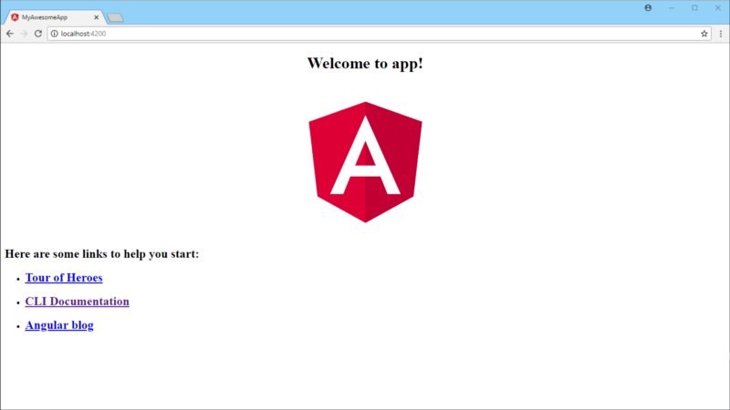

the default Angular startup screen

So far so good, let’s also run the tests

npm test

This should open a new browser window and our tests should run. Don’t worry if one test is failing, this is working as intended.

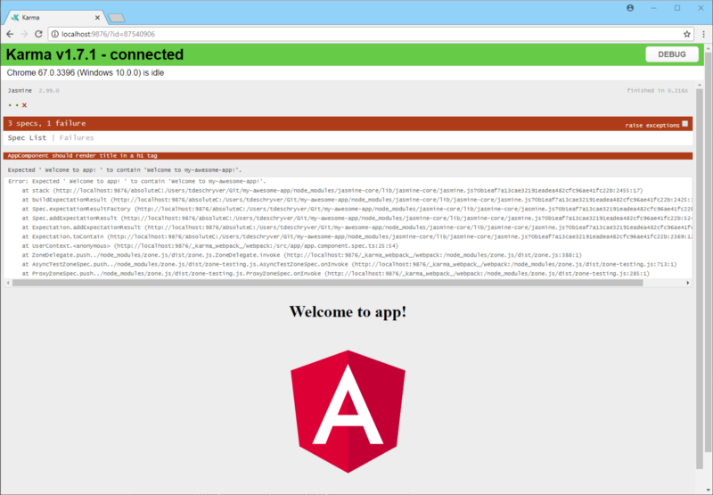

two tests are succeeding and one is failing from the startup template

Before we’re going to use Jest as our test runner, let’s fix this failing test so we can start with a clean slate. To fix the failing test, change the `title` inside the `AppComponent` to “my-awesome-app”. Because we’ve changed our title we should also change the corresponding test, this means changing the “should have as title ‘app’” test description to “should have as title ‘my-awesome-app’” and change the assertion that our title should be “app”, to be “my-awesome-app”. If we did everything right, all tests should pass.


all 3 tests are succeeding

## Adding Jest

To use Jest as our test runner we’re going to use [jest-preset-angular](https://github.com/thymikee/jest-preset-angular). To get it up and running we simply have to follow the instructions in the [README](https://github.com/thymikee/jest-preset-angular/blob/master/README.md), so let’s go over the steps.

> The jest-preset-angular library will [configure](https://github.com/thymikee/jest-preset-angular#exposed-configuration) Jest and it will also [configure](https://github.com/thymikee/jest-preset-angular/blob/master/setupJest.js#L17) the Angular TestBed for you.

First, we have to install all the dependencies we need.

npm install jest jest-preset-angular --save-dev

Secondly, we create a `setupJest.ts` file in the root and import `jest-preset-angular` inside of it.

import 'jest-preset-angular';

The last step is to add the Jest configuration in the `package.json`.

```json
{
  "jest": {
    "preset": "jest-preset-angular",
    "setupTestFrameworkScriptFile": "<rootDir>/setupJest.ts"
  }
}
```

To run our tests with Jest we can now modify the test script to use Jest instead of `ng test`.

```json
"test": "jest",
```

If we now run `npm test`, our tests are using the Jest runner and better yet everything is still green (and we don’t need a browser)!

> With minimal effort we can integrate Jest within our Angular project!

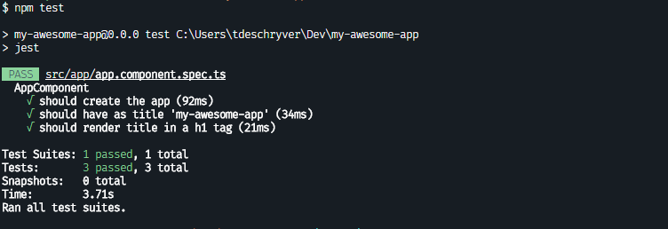

all 3 tests are still succeeding

I think now would be the perfect time to remove all the [Karma](https://github.com/karma-runner/karma) dependencies and configuration files, just to have our project cleaner. We can remove all the Karma dependencies with the following command

```bash
npm uninstall karma karma-chrome-launcher karma-coverage-istanbul-reporter karma-jasmine karma-jasmine-html-reporter
```

We also have to delete the `karma.config.js` and `test.ts` files in the `src` directory and we also have to remove the `test` entry inside the `angular.json` file.

Our tests are still using Jasmine and while Jasmine is mostly compatible with Jest, let’s rewrite our tests to use the Jest syntax. In our little application it’s sufficient to change the Jasmine’s `it` method to Jest’s `test` method. While we’re there we should also modify our test description from a Behaviour Driven Development (BDD) style to a more Test Driven Development (TDD)style. This might look like:

```ts
test(`the title is 'my-awesome-app'`, async(() => {
  const fixture = TestBed.createComponent(AppComponent)
  const app = fixture.debugElement.componentInstance
  expect(app.title).toEqual('my-awesome-app')
}))
```

Because we’ve refactored our tests by using the Jest syntax, we could also remove the [Jasmine](https://github.com/jasmine/jasmine) dependencies. If and only if you’re not using [Protractor](https://github.com/angular/protractor) (you could be using [Cypress](https://github.com/cypress-io/cypress) for example) for your end to end tests. This is because Protractor is using Jasmine for its end to end tests.

If we re-run the tests, everything should still turn up green.

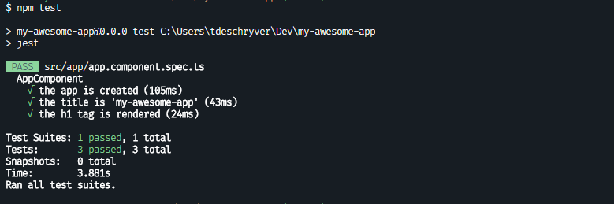

all 3 tests are still succeeding

> After this post was written, someone pointed me to [briebug/jest-schematics](https://github.com/briebug/jest-schematic), which is an schematic that does all these steps above for your. If you run `` `ng add @briebug/jest``` it adds and configures jest-preset-angular and removes the karma dependencies and files. This means you don’t have to do a single thing!

> As of 2018–08–30, Nrwl Nx 6.3 provides the option to use Jest for unit testing. For more info see [Nrwl Nx 6.3: Faster Testing with Jest](https://blog.nrwl.io/nrwl-nx-6-3-faster-testing-with-jest-20a8ddb5064).

## Creating the library

With our application and Jest ready, let’s tackle the second part and create a library using the Angular CLI.

ng generate library my-awesome-lib

> The Angular CLI will prefix your library components automatically with `lib`. In order to prevent this, you can use the `--prefix` flag.

This will generate our library `my-awesome-lib` inside the `projects` folder and it also adds a couple of configurations inside `angular.json`. It will also add the paths to our freshly created library inside `tsconfig.json`, this to import the library in our application like a module.

We can see that the command also generates the default test files. Just like before we’ll delete the `karma.config.js` and `test.ts` files and we’ll also edit the test inside the generated spec file to look like this:

```ts
test(’it creates my component’, () => {
  expect(component).toBeTruthy();
});
```

With this change we can test our library with the same script as our application, which is `npm test`. If we run this script we can see that both of our spec files are being picked up by Jest, and that the tests are passing.

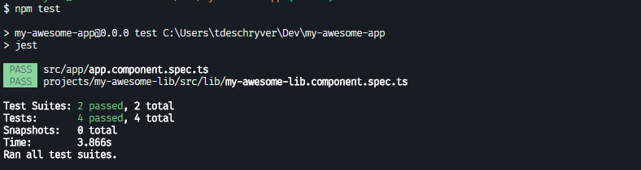

the tests from the application as well as the library are succeeding

Before we can use our library inside of our application we have to build it first. This can be done by adding a build script inside the `package.json` from our application. I would also suggest to rename the default build script from `build` to `build:app`, so it is always clear what you’re building.

```json
"build:app": "ng build --prod",
"build:lib": "ng build my-awesome-lib --prod"
```

By using the created script `npm run build:lib`, we can build the library.

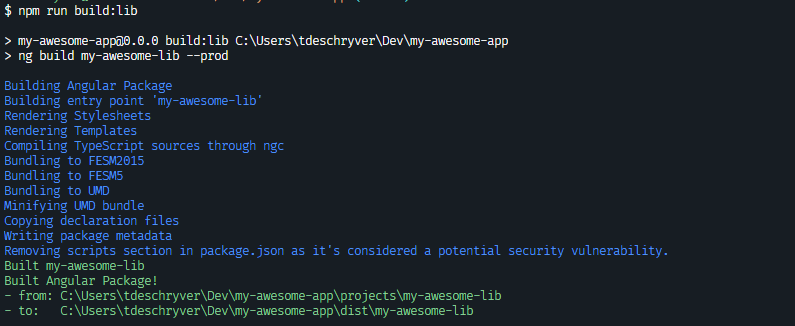

the library is being build

> As we can see, it builds our library inside the dist folder. This is also the folder where the `paths` created by the Angular CLI inside `tsconfig.json` are pointing at.

Finally! With our library built, we can use our library inside our application. Therefor we have to import our library, this can be done by adding the library’s module to the `imports` of our `AppModule`.

```ts
import { BrowserModule } from '@angular/platform-browser'
import { NgModule } from '@angular/core'

import { MyAwesomeLibModule } from 'my-awesome-lib'

import { AppComponent } from './app.component'

@NgModule({
  declarations: [AppComponent],
  imports: [BrowserModule, MyAwesomeLibModule],
  providers: [],
  bootstrap: [AppComponent],
})
export class AppModule {}
```

And now we can use our library’s component inside our `AppComponent` template by adding `<lib-my-awesome-lib></lib-my-awesome-lib>` in the html markup. If we start our application we can see our library component.

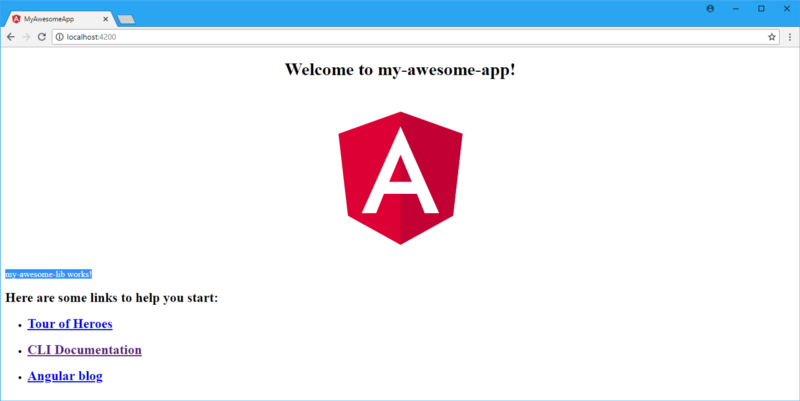

the library component is being rendered inside our application

With our application working let’s re-run our tests to make sure we didn’t break anything. And of course… our application tests are failing because we didn’t import our `MyAwesomeLibModule` into the `TestBed`. So just like in our `AppModule` we can add `MyAwesomeLibModule` as an import.

```ts
TestBed.configureTestingModule({
  declarations: [AppComponent],
  imports: [MyAwesomeLibModule],
}).compileComponents()
```

> HINT: in a “real world scenario” you would probably want to run the tests first before running your application.

With this in place our tests will be green again, right? Well not exactly, when we run our tests we get the following error

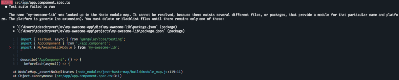

the application tests are failing because there exists several different files, or packages with the name my-awesome-lib

## Splitting up Jest

Let’s take a couple of steps back, and ask ourselves if we want to test our library and our application at the same time? I don’t think this is what we want, right? We rather want to:

1. test our library
2. build our library; when all the library tests are successful
3. test our application; when the library is built

In order to do this we have to configure Jest a little bit different.

Instead of configuring Jest in the `package.json` we’ll create a new file `jest.base.config.js` in the root of our project and move the configuration to this file.

```ts
module.exports = {
  preset: 'jest-preset-angular',
  setupTestFrameworkScriptFile: '<rootDir>/setupJest.ts',
}
```

With our base config ready, the next step is to create two config files, one for our library `jest.lib.config.js` and the other one for our application `jest.app.config.js`.

```ts
// `jest.lib.config.js`
const baseConfig = require('./jest.base.config')

module.exports = {
  ...baseConfig,
  roots: ['<rootDir>/projects'],
}

// `jest.app.config.js`
const baseConfig = require('./jest.base.config')

module.exports = {
  ...baseConfig,
  roots: ['<rootDir>/src'],
}
```

As you can see we’re importing the base configuration from `jest.base.config.js`. We’re also extending the configuration with the `roots` property to specify the directory that Jest should use to search for its files.

With the Jest config files created we can use the `—-config` flag to let Jest know which config to use in order to run the tests. We’ll remove the existing test script and add the following scripts to the application’s `package.json`.

```json
"test:lib": "jest --config ./jest.lib.config.js",
"test:app": "jest --config ./jest.app.config.js",
```

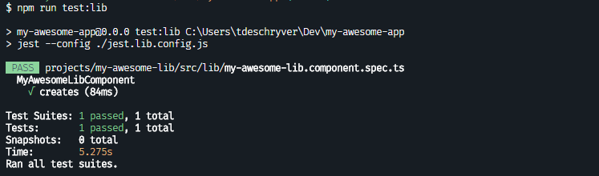

with the command npm run test:lib, only the library tests ran and are succeeding,

But we’re not there yet. While our library tests are succeeding, our application tests are still failing.

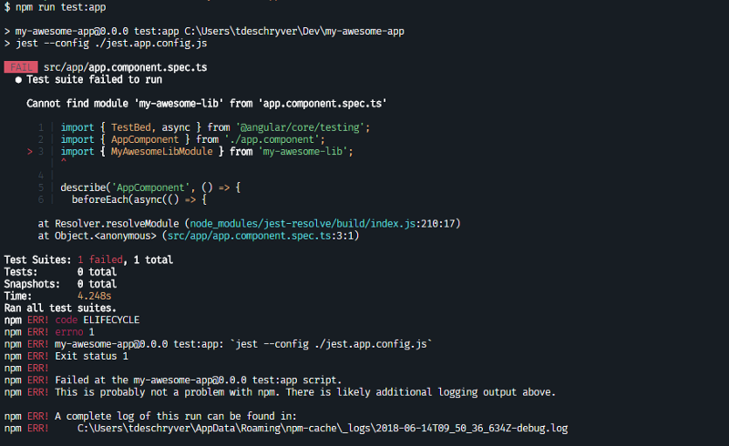

with the command: npm run test:app, only the application tests ran but are failing,

If we take a look at the error message, we can see that Jest is having some troubles to find our library. In order to fix this we’ll have to re-open the Jest configuration `jest.app.config`, and we have to let Jest know where it can find our library by using the `modulePaths` property.

```ts
// `jest.app.config.js`
const baseConfig = require('./jest.base.config')

module.exports = {
  ...baseConfig,
  roots: ['<rootDir>/src'],
  modulePaths: ['<rootDir>/dist'],
}
```

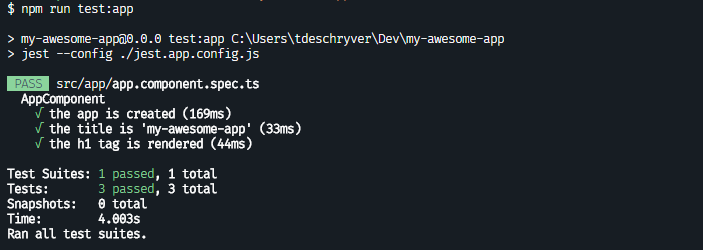

with the command: npm run test:app, only the applications tests ran and are succeeding this time

And voila, our tests finally show up green.

## Wrapping up

To make it ourselves easy we can create a command that test both our library and application. This command can come in handy before you commit to make sure everything works as expected, or during your Continuous Integration (CI) build.

```json
"test": "npm run test:lib && npm run build:lib && npm run test:app",
"test:lib": "jest --config ./jest.lib.config.js",
"test:app": "jest --config ./jest.app.config.js",
```

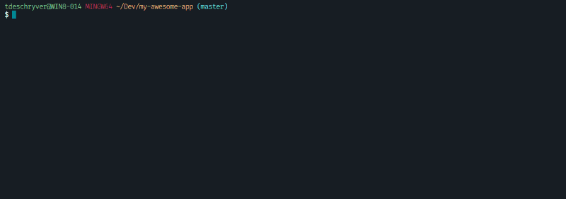

As last note I want to quickly mention that it’s also a possibility to use Jest and Jasmine side-by-side. For example you can keep using Jasmine for your existing code base and use Jest when you create a new library.

To see this in action you can always take a peek at [ngx-testing-library,](https://github.com/timdeschryver/ngx-testing-library) and while you’re there you might as well give it as⭐️.

A big thank you to [Adrian Fâciu](https://twitter.com/adrianfaciu) for taking the time to review this post! 🙌

_This play-by-play was written based on the following specifications:_

```bash
Angular CLI: 6.0.8
Node: 9.4.0
OS: win32 x64
Angular: 6.0.4
... animations, common, compiler, compiler-cli, core, forms
... http, language-service, platform-browser
... platform-browser-dynamic, router

Package                           Version
-----------------------------------------------------------
@angular-devkit/architect         0.6.8
@angular-devkit/build-angular     0.6.8
@angular-devkit/build-optimizer   0.6.8
@angular-devkit/core              0.6.8
@angular-devkit/schematics        0.6.8
@angular/cli                      6.0.8
@ngtools/webpack                  6.0.8
@schematics/angular               0.6.8
@schematics/update                0.6.8
rxjs                              6.2.0
typescript                        2.7.2
webpack                           4.8.3
```

## Not to miss

You can take a look the [angular-ngrx-material-starter](https://github.com/tomastrajan/angular-ngrx-material-starter) to get your feet wet with [Angular](https://angular.io/), [NgRx](https://github.com/ngrx/platform/) and [Material](https://material.angular.io/). It’s created and maintained by [Tomas Trajan](https://twitter.com/tomastrajan) , who recently became a Google Developer Expert, and since short I’m helping him out with this project (there are a couple of [issues](https://github.com/tomastrajan/angular-ngrx-material-starter/issues?q=is%3Aissue+is%3Aopen+label%3A%22help+wanted%22) that are up for grabs).

[Angular NgRx Material Starter Project by @tomastrajan](https://tomastrajan.github.io/angular-ngrx-material-starter#/about)
