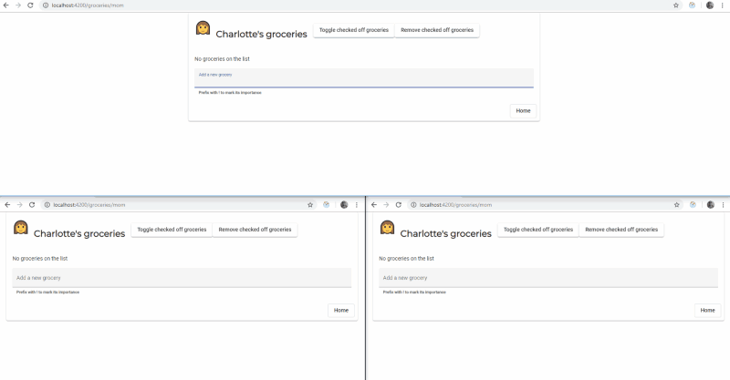
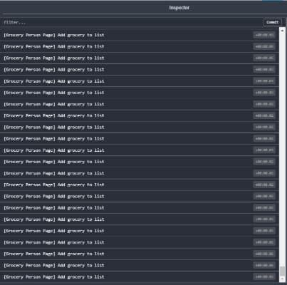
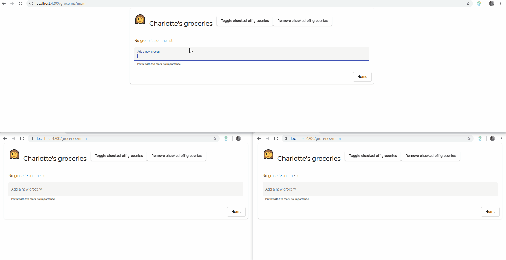
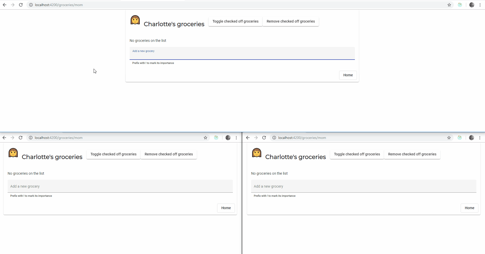

In this post, we’re going to take a look at how we can keep our application state in sync when a user has multiple tabs open. We’re going to make this happen by using the [Web Storage API](https://developer.mozilla.org/en-US/docs/Web/API/Web_Storage_API), [NgRx](https://ngrx.io/) (Store and Effects), and [RxJS](http://rxjsdocs.com/). A basic knowledge of NgRx is needed to follow the examples.

There are two ways of syncing state that I know of. One of them is to send the actions from one tab to another tab, the other is to send the (partial) state from one tab to another tab. While both of these ways have very similar implementations, they both shine in their own way.

As a starting point, we’re going to pick up where we left off in a previous post [Let’s have a chat about Actions and Action Creators within NgRx](/blog/lets-have-a-chat-about-actions-and-action-creators-within-ngrx) where we created a simple grocery list.

## Syncing state by sending actions from one tab to another tab

Knowing that our state is predictable because we’re using NgRx to manage the state of our application, we can leverage its power to rebuild the state. Thus if we store every dispatched action into the local storage and we dispatch them again in the same order, we know that we will have the same outcome, i.e. the same state. If you’re familiar with the [Redux DevTools Extension](https://github.com/zalmoxisus/redux-devtools-extension), you have probably already used or at least seen this concept by rewinding and replaying actions.

The first step to the solution is to store actions to the local storage.

> We’re using local storage because this means that every tab with the same origin can access it; as opposed to session storage, which creates a new storage for every tab.

### Storing actions to local storage

To store the actions we’ll be using an effect, listening to a certain set of actions because (in most of the cases) we only want to store actions not triggering a side effect. We can take a look at a simple example of fetching a list of items from a back-end. In this case, we don’t want to store the `LOAD_ITEMS` action because this would mean that we’ll also fetch the items again from a back-end. This action of fetching items isn’t pure, because in the worst case we could end up with a different set of items every time we make a new HTTP request. What we (usually) want is to store the `LOAD_ITEMS_SUCCESS` action, because this action contains meaningful data as its payload, to share across tabs and is pure.

In our grocery list, these meaningful actions are when a grocery has been added, checked off, or removed from the list. The implementation to intercept actions and store them to local storage looks like the following snippet:

```ts
@Effect({ dispatch: false })
storeActions = this.actions.pipe(
  // intercepts actions for adding, checking off, or removing items
  ofType(
    ADD_GROCERY,
    CHECK_OFF_GROCERY_PERSON_PAGE,
    CHECK_OFF_GROCERY_FAMILY_PAGE,
    REMOVE_CHECKED_OFF_GROCERIES,
  ),
  tap(action => {
    // get the current actions from local storage
    const storedActions = window.localStorage.getItem('__bus');
    // parse the actions as an array
    const actions = storedActions ? JSON.parse(storedActions) : [];
    // add the new action as first item to the actions array
    const newActions = [action, ...actions];
    // serialize the new array and update local storage
    window.localStorage.setItem(
      '__bus',
      JSON.stringify(newActions)
    );
  }),
);
```

If you’re not familiar with the storage API, you can compare it to a key (string) value (string) collection. It has a `getItem` method to retrieve the stored item (actions in our case) and a `setItem` to insert or update a value (actions in our case), based on the key. To know more about the API you can take a look at the [MDN web docs](https://developer.mozilla.org/en-US/docs/Web/API/Storage).

Note that we can’t just simply store and retrieve the actions from the local storage. We have to serialize each action with `JSON.stringify`, and then deserialize the value with `JSON.parse` to recreate the action. In an application using NgRx, we can assume that actions are serializable.

### Retrieving actions from local storage and dispatching them

Now that we’ve stored the actions inside our local storage, the next step is to notify the other tabs and dispatch the same actions there. Here again, we’re also going to use an effect. We use the RxJS function [`fromEvent`](https://rxjs.dev/api/index/function/fromEvent) to listen to the browser event [`window.storage`](https://developer.mozilla.org/en-US/docs/Web/API/Web_Storage_API/Using_the_Web_Storage_API#Responding_to_storage_changes_with_the_StorageEvent) and get notified when the local storage changes in another tab.

> The [`StorageEvent`](https://developer.mozilla.org/en-US/docs/Web/API/StorageEvent 'A StorageEvent is sent to a window when a storage area it has access to is changed within the context of another document.') is fired whenever a change is made to the [`Storage`](https://developer.mozilla.org/en-US/docs/Web/API/Storage "The Storage interface of the Web Storage API provides access to a particular domain's session or local storage. It allows, for example, the addition, modification, or deletion of stored data items.") object (note that this event is not fired for sessionStorage changes). This won't work on the same page that is making the changes — it is really a way for other pages on the domain using the storage to sync any changes that are made. Pages on other domains can't access the same storage objects. — MDN web docs

```ts
@Effect()
onChange = fromEvent<StorageEvent>(window, 'storage').pipe(
  // listen to our storage key
  filter(evt => evt.key === '__bus'),
  filter(evt => evt.newValue !== null),
  // deserialize the stored actions
  // get the last stored action from the actions array
  map(evt => JSON.parse(evt.newValue)[0]),
);
```

These two snippets should be enough to show a small demo on how the grocery list behaves:



As you can see in the GIF above, when we add a grocery in the top page, the two pages at the bottom also get updated. But if you take a closer look, you can also see that after the first action is dispatched (when we add apples to the list) the application gets a bit stuck. After the second action (when we added pears) the application more or less froze. What could be the cause here? Well, if we take a look at the Redux DevTools we can have a better understanding of what causes this behavior.



We’re stuck in an infinite loop. Because we’re storing an action and re-dispatching it in another tab and then also storing the dispatched action, another tab will pick this change up which restarts the whole flow all over again. The first solution that comes to mind is to add an extra property to the action to let the effect know whether it needs to store the action or not. The re-dispatched action could, for example, have the property `storeToStorage: false`. This solution violates [Good Action Hygiene](https://www.youtube.com/watch?v=JmnsEvoy-gY). To solve it in a more readable way and follow the good action hygiene practice, we’ll create new actions for every stored action. These new actions won’t get stored to the local storage because they aren’t added inside the `filter`, thus not restarting the whole flow. To re-dispatch the stored action we have to convert it to a new event. We do this inside the effect, using a `switch` case:

```ts
@Effect()
onChange = fromEvent<StorageEvent>(window, 'storage').pipe(
  // listen to our storage key
  filter(evt => evt.key === '__bus'),
  filter(evt => evt.newValue !== null),
  map(evt => {
    // deserialize the stored actions
    // get the last stored action from the actions array
    const [{ type, payload }] = JSON.parse(evt.newValue);

    // map the stored action to a 'storage' action
    switch (type) {
      case ADD_GROCERY:
        return {
          type: ADD_GROCERY_STORAGE,
          payload
        };
      case CHECK_OFF_GROCERY_PERSON_PAGE:
      case CHECK_OFF_GROCERY_FAMILY_PAGE:
        return {
          type: CHECK_OFF_GROCERY_STORAGE,
          payload
        };
      case REMOVE_CHECKED_OFF_GROCERIES:
        return {
          type: REMOVE_CHECKED_OFF_GROCERIES_STORAGE, payload
        };
      default:
        return EMPTY;
    }
  }),
);
```



Et voila, we’ve got a working demo. As you can see in the GIF above the “Toggle checked off groceries” isn’t synced to the other tabs, this is because we don’t store this action in the local storage.

## Syncing state by sending the state from one tab to another

This way of syncing state across tabs uses the same techniques as the first one. But the difference is that we store the whole state in the local storage.

### Storing state to local storage

In the grocery list application we already have a meta-reducer which does exactly this. The `persistStateReducer` reducer persists the state to the local storage in order to reload the state when we reopen the grocery list. Therefore, we don’t have to change anything for this step.

```ts
export function persistStateReducer(reducer: ActionReducer<State>) {
  const localStorageKey = '__groceries'
  return (state: State | undefined, action: Action) => {
    // on state initialization the state is undefined
    // we want to retrieve the state from local storage now
    if (state === undefined) {
      const persisted = localStorage.getItem(localStorageKey)

      // if we got something in local storage return it
      // otherwise use the reducer to instantiate the state
      return persisted ? JSON.parse(persisted) : reducer(state, action)
    }

    // on every action we call the "normal" reducer
    const newState = reducer(state, action)

    // update local storage with the new state
    localStorage.setItem(localStorageKey, JSON.stringify(nextState))
    return newState
  }
}
```

> It’s also possible to persist state to local storage by using an effect, take a look at the [angular-ngrx-material-starter project](https://github.com/tomastrajan/angular-ngrx-material-starter/) by [Tomas Trajan](https://twitter.com/tomastrajan) for an example.

### Updating the state tree

To read the state in another tab we’re going to use the same method as we did before. The big difference here is that we don’t dispatch actions to rebuild the state. We’re going to dispatch an action containing the whole state or a partial state as its payload.

```ts
@Effect()
updateState = fromEvent<StorageEvent>(window, 'storage').pipe(
  // listen for state changes
  filter(evt => evt.key === '__groceries'),
  filter(evt => evt.newValue !== null),
  map(evt => {
    // deserialize the new state from local storage
    const newState = JSON.parse(evt.newValue);

    // dispatch an update state action
    // with the new state as payload
    return { type: 'UPDATE_GROCERIES_STATE', payload: { newState }};
  }),
);
```

Now the only thing left to do is to update the state. We can do this by adding a case statement in the reducer or creating a second meta-reducer. Personally, I prefer to create a meta-reducer because it lives a bit “outside” of the application itself and doesn’t really contain any logic. We simply replace the current state with the new state. Another point is that we already have the `persistStateReducer` meta-reducer to store state to local storage.

```ts
export function updateStateReducer(reducer: ActionReducer<State>) {
  return (state: State | undefined, action: Action) => {
    if (action.type === 'UPDATE_GROCERIES_STATE') {
      // replace the current state with the new state
      return action.payload.newState
    }
    return reducer(state, action)
  }
}
```

This gives us the same result as before, but in a slightly different way:



## Conclusion

In a redux based system, like NgRx, I find it simple and straightforward to handle different event sources, just to name a few: user interaction, browser events, communication with a web API, and so forth.

By using @ngrx/effects in combination with RxJS it’s possible to write the stream of these events in just a few lines of codes, while not decreasing the readability of our code.

Both approaches do have their pros and cons. With the action based approach you have more control over the flow. But, the downside is that you have to maintain more code. The action based approach also gives you the opportunity to invoke side effects. The state based approach is the opposite. With just a couple of lines, you can start syncing state but you pay a price in controllability.

The examples from this post can be found on [GitHub](https://github.com/timdeschryver/ngrx-family-grocery-list/).
