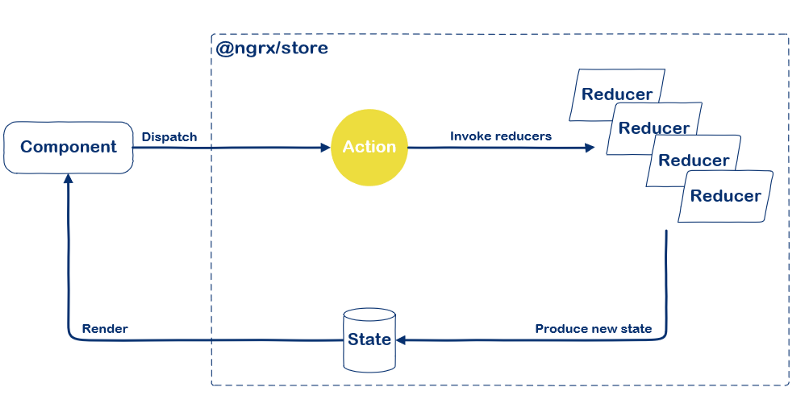

I think it’s time you and I talk a bit about action creators. But before we get into action creators let’s first start with actions, define what they are and why they are needed.

In a NgRx (and Redux) application one of the first rules you learn is that the store state is read only. But how does one modify the state, you may ask. The answer to that question is through **actions** and reducers.

In order to update to the store state we have to send messages from the application to the store. These messages are called actions, you can compare an action as a transaction record. It represents something that took place in the application and can be considered a statement of fact. The reducers in the store are eagerly waiting for an action to pass through so it can create the new store state.



## Actions

An action is a Plain Old JavaScript Object (POJO), it defines its intention with the `type` property and it has an optional payload. In fact you can define the shape of the action yourself, the only enforcement is that it must have a `type` property and its value must be a string. Other than that the structure of the action can be shaped to your needs, although, I would encourage you to use a `payload` property to add extra data to the action.

With these type values [Redux Devtools](https://github.com/reduxjs/redux-devtools) provides an event log of everything that has happened inside your application.

An example of an action with and without payload looks as follows:

```ts
{ type: '[Order Page] ORDER_FOOD' }

{
  type: '[Order Page] ORDER_FOOD',
  payload: { dish: 'spaghetti carbonara' }
}
```

> Update 2019–04–05: Action Creators NgRx introduced Action Creators in version 7.4.0, allowing us to create a typed action by using createAction.
>
> ```ts
> export const orderFood = createAction(
>   '[Order Page] ORDER FOOD',
>   props<{ dish: string }>(),
> )
> ```

````

> To create the action creator, we define the action’s type as the first parameter and use the second parameter to define additional action properties. We don’t need to define an action’s enum as this is accessible via the type property, for example `orderFood.type`. For more info about this change see [Alex Okrushko's](https://twitter.com/AlexOkrushko) post [NgRx: Action creators redesigned](https://blog.angularindepth.com/ngrx-action-creators-redesigned-d396960e46da).

In a typical NgRx application you will probably see these action types defined as `enums`. Doing this has the benefit to typecheck the action types, this is done because a typo is always one keystroke away and can be the cause of frustration for several minutes.
The refactored version of the actions above would be:

```ts
const enum OrderActionTypes {
  ORDER_FOOD = '[Order Page] ORDER FOOD'
}

{ type: OrderActionTypes.ORDER_FOOD }

{
  type: OrderActionTypes.ORDER_FOOD,
  payload: { dish: 'spaghetti carbonara' }
}
````

> SIDE NOTE: Instead of using an ActionTypes `enum` it’s also a possibility to use constants to define the actions, as in `const ORDER_FOOD = ‘[Order Page] ORDER FOOD’`. The behavior will be the same, so feel free to use your preferred way.

Now that we know what an action is, we have to send it to the store. To do this we use the `dispatch` function which exists on the store.

```ts
this.store.dispatch({
  type: OrderActionTypes.ORDER_FOOD,
  payload: { dish: 'spaghetti carbonara' },
})
```

Dispatching an action like this may seem OK at first sight but has the downside that you have to type out the action every time. You have to define the type, you have to import the `ActionType` enum, and you have to define the payload. Speaking of the payload, you have to remember the structure of the payload and if it changes in the future you’ll have to modify it throughout your whole codebase.

Here is where action creators come into play.

## Action creators

Like the name already gives away, an action creator creates an action. This can be done in multiple ways, in this post we’ll cover the two most frequently used ones.

### Creating an action via a class

The class has a `readonly` type property and via its constructor it gets the payload of the action, which can (and must) be typed.

```ts
class OrderFood implements Action {
  readonly type = OrderActionTypes.ORDER_FOOD
  readonly payload: { dish: string }

  constructor(dish: string) {
    this.payload = { dish }
  }
}
```

If we just create the action object from the constructor’s input, we can shorten this as:

```ts
class OrderFood implements Action {
  readonly type = OrderActionTypes.ORDER_FOOD
  constructor(readonly payload: { dish: string }) {}
}
```

Notice that the payload is set as a readonly property in the constructor.

In order to dispatch the action we have to create a new instance of the class:

this.store.dispatch(new OrderFood({ dish: 'spaghetti carbonara' }));

### Creating an action via a factory function

The function returns the action object based on the function’s input and sets the type.

```ts
const orderFood = ({ dish }: { dish: string }) => ({
  type: OrderActionTypes.ORDER_FOOD,
  payload: { dish },
})
```

To dispatch the action we call the function:

```ts
this.store.dispatch(orderFood({ dish: 'spaghetti carbonara' }))
```

Personally, while this may not be the de facto way, this is my preferred way. Because using a factory function prevents common or easily made mistakes, especially if you’re new to NgRx or Redux in general.

One of these mistakes is that the action must be serializable. While a factory function doesn’t fully prevent this, it’s preventing some constructs which can be created or are even encouraged with classes.

## Benefits of using Action Creators

If you think this is the only reason to use action creators, well… you’re wrong. An action creator also has some extra benefits.

The view layers of the application don’t need to know about action types, these are **encapsulated** inside the action creators. The only places where you would use action types are in the action creators (to create the action object), inside the reducer functions (to know when and how to modify the state) and inside the effects (to invoke side effects).

Unlike reducers, an action creator doesn’t need to be pure. The inside of an action creator is the place where you could add **impure logic**, e.g. adding the current time to the action with `Date.now()`, generating a UUID, etc. A small tip that I would give here, is to make these properties overridable which would help you out when you’re writing tests, for example:

```ts
const orderFood = ({ dish = '', timestamp = Date.now() } = {}) => ({
  type: OrderActionTypes.ORDER_FOOD,
  payload: { dish, timestamp },
})
```

Which is used in the application as follows:

```ts
orderFood({ dish: 'spaghetti carbonara' })
```

And in the tests where you need more control, you can override these values:

```ts
orderFood({ dish: 'spaghetti carbonara', timestamp: 47 })
```

Inside action creators you can make **calculations on the input** instead of just returning the action object.

```ts
const orderFood = ({ dish = '', extraProp = 1 } = {}) => ({
  type: OrderActionTypes.ORDER_FOOD,
  payload: {
    dish,
    extraProp: difficultCalculation(extraProp),
  },
})
```

An action creator helps you and your team to **remember the data which is needed to create an action** via its input. This input can be transformed into the payload property of the action.

Creating the “right” payload structure has the advantage of tightening up your reducer. If we play it smart we can handle several actions at once by using the fall-through functionality of a switch statement:

```ts
function reducer(state, action) {
  switch (action.type) {
    case OrderActionTypes.ORDER_FOOD:
    case OrderActionTypes.PREPARE_FOOD:
    case OrderActionTypes.SERVE_FOOD:
      return { ...state, ...action.payload }

    default:
      return state
  }
}
```

In comparison to:

```ts
function reducer(state, action) {
  switch (action.type) {
    case OrderActionTypes.ORDER_FOOD:
      return { ...state, ...action.payload }

    case OrderActionTypes.PREPARE_FOOD:
      return { ...state, ...action.payload }

    case OrderActionTypes.SERVE_FOOD:
      return { ...state, ...action.payload }

    default:
      return state
  }
}
```

You only need to **write the action creator unit test(s) once**, in contrast to testing the action in every component where it would be used. A unit test can be as simple as:

```ts
it('should create an ORDER_FOOD action', () => {
  const actual = orderFood({ dish: 'spaghetti carbonara' })
  const expected = jasmine.objectContaining({
    type: OrderActionTypes.ORDER_FOOD,
    payload: jasmine.objectContaining({
      dish: 'spaghetti carbonara',
    }),
  })

  expect(actual).toEqual(expected)
  expect(actual.payload.timestamp).toBeTruthy()
})
```

## Conclusion

By adding a small (but well known) abstraction layer into the NgRx flow, we end up with cleaner code suited for reusability. With the result of making it ourselves and our team easier to scale and maintain an application.

This is because:

- We remove boilerplate, although this may not seem like it
- We create a place for impure logic and calculations
- We make our tests less prone to break due to changes

A big thank you to [Nicholas Jamieson](https://twitter.com/ncjamieson) and [Alex Okrushko](https://twitter.com/AlexOkrushko) for taking the time to review this post! 🙌
