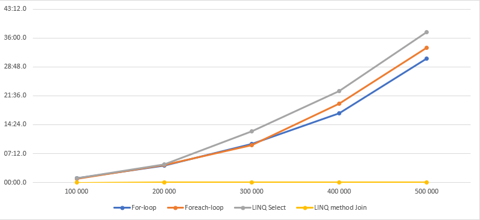

I've experienced a handful of times that an application has slowed down sufficiently without a code change.
So, what could (change to) make an application slower over time?
Mostly, the answer to this question is **data**.
To be more specific, the amount of data that an application has to process.

During development, we as developers, often develop against a small subset of the data.
This has as outcome, that parts of an application seem fast during this stage.
And when it reaches the production environment it still is fast.
But after a while, when the application is in use, the data starts to accumulate and it might suddenly be the cause of performance issues.

From my experience, most of these performance problems are caused while combining two lists in order to manipulate the data.
And don't get me wrong, it's an easy mistake.

## The slow approach

As an example, let's take two lists, one with the customers, the second one with the customer preferences.
We want to merge the two lists into a single list, representing the customer data with their preference.

How many times did you write or encounter the following code?

```cs
var customersWithPreference = new List<CustomerAggregate>();
foreach (var customer in customers)
{
  var preference = customersPreference.SingleOrDefault(preference => preference.CustomerId == customer.Id);
  customersWithPreference.Add(new CustomerAggregate
  {
    CustomerId = customer.Id,
    Name = customer.Name,
    Preference = preference
  });
}
```

Another commonly approach is to write it with the [LINQ `Select` method](https://docs.microsoft.com/en-us/dotnet/api/system.linq.enumerable.select?view=netstandard-2.1).

```cs
var customersWithPreference = customers.Select(customer => {
  var preference = customersPreference.SingleOrDefault(preference => preference.CustomerId == customer.Id);
  return new CustomerAggregate {
    CustomerId = customer.Id,
    Name = customer.Name,
    Preference = preference
  };
});
```

Well... then I got bad news for you because this isn't fast for larger lists.

## The faster approach

But how should this be written then?
A better approach with performance in mind is to use the [LINQ `Join` method](https://docs.microsoft.com/en-us/dotnet/api/system.linq.enumerable.join?view=netstandard-2.1).

```cs
var customersWithPreference = customers.Join(
  customersPreference,
  customer => customer.Id,
  preference => preference.CustomerId,
  (customer, preference) => new CustomerAggregate
  {
    CustomerId = customer.Id,
    Name = customer.Name,
    Preference = preference
  });
```

If you're more a fan of the LINQ query syntax, then the above snippet can be rewritten to:

```cs
var customersWithPreference =
  from customer in customers
  join preference in customersPreference on customer.Id equals preference.CustomerId
  select new CustomerAggregate
  {
    CustomerId = customer.Id,
    Name = customer.Name,
    Preference = preference
  };
```

Both of the LINQ examples don't only perform better, but they also make the **intentions more clear** in my opinion.

You don't have to take my word for it, here's a comparison of all the methods that are described in this post.

## Benchmarks

On my machine, this gives us the following result.

| List size |      For-loop |  Foreach-loop |   LINQ Select | LINQ method Join | LINQ query Join |    Dictionary | Prefilled Dictionary |
| --------: | ------------: | ------------: | ------------: | ---------------: | --------------: | ------------: | -------------------: |
|         1 | 00:00.0056705 | 00:00.0004749 | 00:00.0005044 |    00:00.0031932 |   00:00.0003097 | 00:00.0005084 |        00:00.0001750 |
|        10 | 00:00.0055548 | 00:00.0004490 | 00:00.0005076 |    00:00.0034938 |   00:00.0002472 | 00:00.0004444 |        00:00.0001647 |
|       100 | 00:00.0060491 | 00:00.0007347 | 00:00.0006980 |    00:00.0035554 |   00:00.0010058 | 00:00.0004902 |        00:00.0001806 |
|     1 000 | 00:00.0216990 | 00:00.0170807 | 00:00.0169829 |    00:00.0041184 |   00:00.0010638 | 00:00.0006651 |        00:00.0002220 |
|    10 000 | 00:00.7261891 | 00:00.6516171 | 00:00.7047633 |    00:00.0059576 |   00:00.0017884 | 00:00.0010040 |        00:00.0008011 |
|   100 000 | 01:02.0488321 | 00:57.5521209 | 01:05.2631133 |    00:00.0451954 |   00:00.0366773 | 00:00.0091225 |        00:00.0079996 |
|   200 000 | 04:09.4021135 | 04:21.7946002 | 04:25.9571240 |    00:00.0577996 |   00:00.0551096 | 00:00.0221926 |        00:00.0217287 |
|   300 000 | 09:36.8749546 | 09:15.5743423 | 12:40.2008206 |    00:00.1337581 |   00:00.1380703 | 00:00.0269653 |        00:00.0286574 |
|   400 000 | 17:14.1396757 | 19:35.5088802 | 22:50.3364594 |    00:00.1900785 |   00:00.1508965 | 00:00.0426907 |        00:00.0424060 |
|   500 000 | 30:50.6746922 | 33:33.2734761 | 37:25.6146064 |    00:00.1524784 |   00:00.1470995 | 00:00.0586161 |        00:00.0571202 |



> Benchmarks are created with [Simple microbenchmarking in C#](https://jonskeet.uk/csharp/benchmark.html)

I expected the LINQ examples to be faster, but I was still surprised by the margins of these results.

## Conclusion

The reason why the numbers ramp up is that at its worst-case scenario, it has to traverse through the whole list until the predicate finds a match.
The larger the list gets, the slower the code will run.
We can express this algorithm with the (Big O Notation)[https://en.wikipedia.org/wiki/Big_O_notation] as `O(N)`, which describes a linear growth in proportion to the size of the list.

To do better we can make rewrite this to an `O(1)` algorithm, to make this lookup a single operation. Regardless of the size of the list.
To do so, we have the convert the customers' preferences list into a dictionary.

```cs
var customersPreferenceDict = customersPreferences.ToDictionary(k => k.CustomerId);
var customersWithPreference = customers.Select(customer =>
{
  var preference = customersPreferenceDict[customer.Id];
  return new CustomerAggregate
  {
    CustomerId = customer.Id,
    Name = customer.Name,
    Preference = preference
  };
})
```

The benchmarks of the dictionary are also added to the [benchmarks](#benchmarks).
