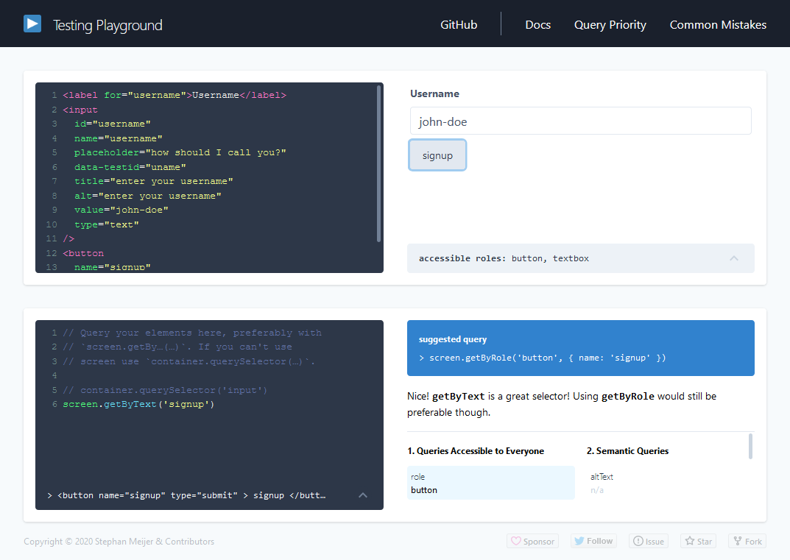

One of the main focus points of Testing Library is accessibility.
We want to make sure tests are easy to write while keeping the user's experience in the first place.
Instead of selecting DOM elements via their id attributes or classes, Testing Library is using user-friendly queries.

In the latest versions of the Dom Testing Library, and thus also the [Angular Testing Library](https://github.com/testing-library/angular-testing-library) (version 9), there have been improvements to these queries. One query in particular pops out, the `(get|find|query)ByRole` query.

From the docs:

> This can be used to query every element that is exposed in the [accessibility tree](https://developer.mozilla.org/en-US/docs/Glossary/AOM). With the `name` option you can filter the returned elements by their [accessible name](https://www.w3.org/TR/accname-1.1/). This should be your top preference for just about everything. There's not much you can't get with this (if you can't, it's possible your UI is inaccessible). Most often, this will be used with the `name` option like so: `getByRole('button', {name: /submit/i})`. Check the [list of roles](https://developer.mozilla.org/en-US/docs/Web/Accessibility/ARIA/ARIA_Techniques#Roles).

The short answer to "which query should I use", is most of the time the `*ByRole` query. There are some cases that this query will not be able to find the element, luckily Testing Library provides a couple of ways to find the best "fallback" query to use.
Before we take a look at how to find alternatives, let's take a look at other benefits, besides accessibility, that `*ByRole` solves.

### `*ByRole` provides a solution to

#### Querying broken text

The `*ByText` and `*ByLabelText` can't find elements that are broken into multiple elements.
For example, given the following HTML, it wasn't possible to query for the text "Hello World".

```html
<h3>Hello <span>World</span></h3>
```

This can now be solved with the `*ByRole` query as:

```ts
// Before
screen.getByText(/hello world/i)
// |>Error: TestingLibraryElementError: Unable to find an element with the text: /hello world/i. This could be because the text is broken up by multiple elements. In this case, you can provide a function for your text matcher to make your matcher more flexible.

// In version 9
screen.getByRole('heading', { name: /hello world/i })
// |> HTMLHeadingElement
```

#### Finding multiple elements

There were times that the query I used (mostly `GetByText`) resulted in more than one element.
This was causing some of our tests to be brittle, which is what we want to prevent.

```html
<h3>Login now</h3>
<button>Login</button>
```

For example, to find the login button in the above HTML I would mainly see the following.

```ts
const logins = screen.getAllByText(/login/i)
const loginButton = logins[1]
```

This test would fail when a new "login" text would be added to the screen. Not good, as Testing Library aims to write maintainable tests.

A better approach to this problem was to use the selector option.

```ts
const loginButton = screen.getByText(/login/i, { selector: 'button' })
```

For this simple case, this approach is OK. But this could cause problems if CSS classes are used as the selector.
Because the `*ByRole` query is more explicit, it reduces the chance of finding multiple elements.  
Also, if we take a look at the selector option it resembles the `*ByRole` query, it's just a poor man's implementation of it. The `*ByRole` query is also more robust as it isn't too specific, e.g. it's possible to find heading tags with `'heading'` instead of the `h1` to `h6` tags.

### Tips to find the correct query

Sadly the `*ByRole` isn't a silver bullet.
There are scenarios where the `*ByRole` query cannot be used. An example of this is query elements without a role, e.g. a password field. But you don't have to worry, the original queries can still be used and these are also making sure the application is accessible.

To find the query you need, there are several resources to use.

#### The docs

The Testing Library website has its [own page](https://testing-library.com/docs/guide-which-query) to guide you which query to use. If you haven't read this, I would recommend it to read it. It's a short summary, but it will definitely help you to write better tests.

#### Testing Library Playground

Last week, [Stephan Meijer](https://twitter.com/meijer_s) created [testing-playground](https://testing-playground.com/) in order to help finding the "best" available query. To use it, copy and paste the markup into the editor and click on the rendered elements or write the queries yourself.



You can also use the browser extension for [Chrome](https://chrome.google.com/webstore/detail/testing-playground/hejbmebodbijjdhflfknehhcgaklhano) or [Firefox](https://addons.mozilla.org/en-US/firefox/addon/testing-playground).


#### Testing Library `configure` method

I [recently refactored](https://github.com/testing-library/angular-testing-library/pull/101/commits/8acaebb51ac2093768fad058fc150d63ca667e34) the examples of Angular Testing Library to make use of the `*ByRole` query.
I did this by using the newly added option `throwSuggestions` to the `configure` method.
By default this is turned off and it's possible to turn it on on a global level, or on a per-query level.
As the name implies, it will throw an error if there's a better/safer query is available.

As an example, we can take the following HTML and as a test, a click on the increment button.

```html:counter.component.html
<button (click)="value = value - 1">Decrement</button>
<span data-testid="value">{{ value }}</span>
<button (click)="value = value + 1">Increment</button>
```

```ts:counter.component.spec.ts
import { render, screen, fireEvent, configure } from '@testing-library/angular'
import { CounterComponent } from './counter.component'

beforeEach(() => {
  configure({
    throwSuggestions: true,
  })
})

test('renders the current value and can increment', async () => {
  await render(CounterComponent)

  const incrementControl = screen.getByText('Increment')
  fireEvent.click(incrementControl)
})
```

Because the `throwSuggestions` flag is turned on, we get the following error while we run the test.

```bash
TestingLibraryElementError: A better query is available, try this:
getByRole("button", {name: /increment/i})
```

Testing Library gives us a better query that we can copy and paste in the test to replace the "bad" query usage.

```ts{4}:counter.component.spec.ts
test('renders the current value and can increment', async () => {
  await render(CounterComponent)

  const incrementControl = screen.getByRole('button', { name: /increment/i })
  fireEvent.click(incrementControl)
})
```

Simple right?
To turn it on or off for a specific query we can do the following, which will have the same result.

```ts{4}:counter.component.spec.ts
test('renders the current value and can increment', async () => {
  await render(CounterComponent)

  const incrementControl = screen.getByText('Increment', { suggest: true })
  fireEvent.click(incrementControl)
})
```

#### Testing Library Messages

Testing Library provides a useful message when it doesn't find an element for the given `*ByRole` query.
See the example below, where every accessible element is logged with its corresponding selector.

```bash
TestingLibraryElementError: Unable to find an accessible element with the role "textbox" and name `/increment/i`
Here are the accessible roles:

    button:

    Name "Decrement":
    <button />

    Name "Increment":
    <button />

    Name "Login":
    <button />

    --------------------------------------------------
    heading:

    Name "Login now":
    <h3 />

    --------------------------------------------------
```

### More tips for Angular Testing Library

#### `screen`

In previous versions of Angular Testing Library, it was only possible to query elements via the queries returned by the `render` method. In version 9 of Angular Testing Library, it exports a `screen` object which has all the queries available.
This has as benefit that your tests will become less bloated. A second benefit is that it also looks elements outside the component's HTML, this can in particular be helpful if you're using Angular Material because they will add overlays to the body of the document and outside the component tree.

```diff
import { screen } from '@testing-library/angular'

test('renders the current value and can increment', async () => {
-  const { getByRole } = await render(CounterComponent)
+  await render(CounterComponent)

-  const incrementControl = getByRole('button', { name: /increment/i })
+  const incrementControl = screen.getByRole('button', { name: /increment/i })
})
```

#### `fireEvent`

Just like `screen`, to fire events it's recommended to use the newly added `fireEvent` object instead of using the events returned by the `render` method. The events fired by `fireEvent` will also run a change detection cycle, just like before.

```diff
import { fireEvent } from '@testing-library/angular'

test('renders the current value and can increment', async () => {
-  const { click } = await render(CounterComponent)
+  await render(CounterComponent)

-  click(incrementControl)
+  fireEvent.click(incrementControl)
})
```

#### Using `find` queries

Angular Testing Library version 9, also patches the `find` queries and will invoke a change detection cycle before invoking the query. This can be helpful for asynchronous code that impacts the DOM. For example, if a text input is debounced and will render something afterward. Whereas before you had to manually call `detectChanges` after a given time.

```diff
- test('shows the load button after text input', fakeAsync(async () => {
+ test('shows the load button after text input', async () => {
  const { detectChanges } = await render(FixtureComponent, {
    imports: [ReactiveFormsModule],
  });

  userEvent.type(screen.getByRole('textbox'), 'What a great day!');

-  tick(200);
-  detectChanges();

-  screen.getByRole('button');
+  screen.findByRole('button');
-}));
+});
```

### More tips

[Kent C. Dodds](https://twitter.com/kentcdodds) wrote [Common mistakes with React Testing Library](https://kentcdodds.com/blog/common-mistakes-with-react-testing-library) a couple of weeks ago. Because the tests written for any popular framework or library resemble each other with Testing Library, most of the tips also apply to Angular Testing Library. So, give it a read for more useful tips for writing your tests with Testing Library!
