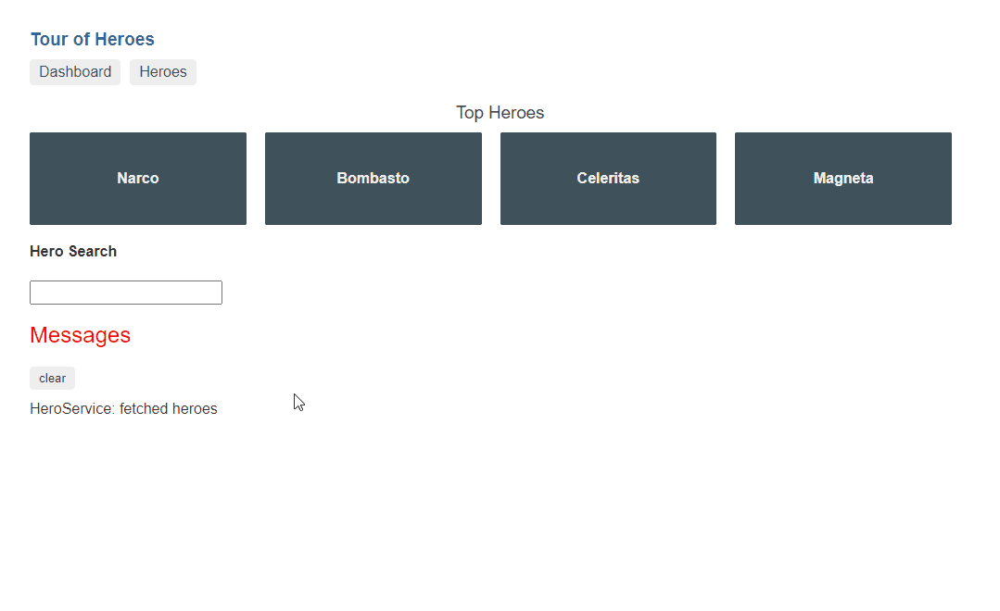

NgRx helps to make your application feel faster. As [Alex Okrushko](https://twitter.com/AlexOkrushko) pointed out in "5 Tips to improve User Experience of your Angular app with NgRx", is that you can [use the NgRx Global Store as a cache](https://medium.com/angular-in-depth/5-tips-to-improve-user-experience-of-your-angular-app-with-ngrx-6e849ca99529#f7bd) to display requested (cached) data instantly instead of waiting on a server response.

Instead of presenting your users a blank screen while an HTTP request is pending, another (better) option is to show the data that is already available in the global Store (a cache). If it's necessary, you can refetch the data in the background to refresh the cached data.

But what if it's the first time that the user navigates to the page? No data will be available, and the application would still feel sluggish.
To guarantee a smooth user experience, we can prefetch the data before a navigation happens.

## The initial experience

As a starting point, we use the Tour of Heroes as an example.
The example contains a dashboard with heroes, and it has a detail page for each hero.
Without the global Store, navigating between both views feels slow and thus it doesn't provide a good experience.
This is because the data is (re)fetched on every navigation.
We can do better for our users.



## Cached data

When we store the data inside the global Store, we can use that data when the page loads.
But when it's the first time that the user navigates to a page, the user still has to stare at a blank screen because the data isn't available yet until the HTTP request resolves.
This is an improvement, but this has to be improved for our users.


## Prefetching

This is where prefetching data comes into play.
Prefetching data means that the cache is build up in the background before the user navigates to a page.
This technique ensures a smooth transition between pages and a better experience for the user.

If you're already using NgRx, prefetching is easy to implement because the global Store serves as a cache.
Like most things within an application that is using NgRx, it all starts with an action.
To initiate the prefetch process, all we have to do is dispatch an action.

Depending on the use case, you might want to prefetch the data as soon as possible or when you're almost certain that the user needs the data.
I've abstracted this logic away into a directive, it emits a signal to the consumer when it wants to prefetch data.

To cover both of the cases, the directive emits a signal when:

- it's loaded / it's visible
- the user hovers over it

```ts:prefetch.directive.ts
@Directive({
  selector: '[prefetch]',
})
export class PrefetchDirective implements OnInit, AfterViewInit, OnDestroy {
  @Input()
  prefetchMode: ('load' | 'hover' | 'visible')[] = ['visible']
  @Output()
  prefetch = new EventEmitter<void>()

  observer: IntersectionObserver
  loaded = false

  constructor(private elemRef: ElementRef) {}

  ngOnInit() {
    if (this.prefetchMode.includes('load')) {
      this.prefetchData()
    }
  }

  ngAfterViewInit() {
    this.observer = new IntersectionObserver((entries) => {
      entries.forEach((entry) => {
        if (entry.isIntersecting) {
          this.prefetchData()
          this.observer.disconnect()
        }
      })
    })
    this.observer.observe(this.elemRef.nativeElement)
  }

  ngOnDestroy() {
    if (this.observer) {
      this.observer.disconnect()
    }
  }

  @HostListener('mouseenter')
  onMouseEnter() {
    if (!this.loaded && this.prefetchMode.includes('hover')) {
      this.loaded = true
      this.prefetchData()
    }
  }

  prefetchData() {
    if (navigator.connection.saveData) {
      return undefined
    }
    this.prefetch.next()
  }
}
```

The first use case, to prefetch the data as soon as possible, is demonstrated in the snippet below.
We're on the dashboard view where the most popular items are shown.
Because the number of items is limited and because we have a certainty that the user will navigate to one of the dashboard items, we choose to load all of the hero details in the background.

```ts{9-10, 24-26}:dashboard.component.ts
@Component({
  selector: 'app-dashboard',
  template: `
    <h3>Top Heroes</h3>
    <div class="grid grid-pad">
      <a
        *ngFor="let hero of heroes$ | async"
        class="col-1-4"
        routerLink="/detail/{{ hero.id }}"
        (prefetch)="prefetch(hero.id)"
        [prefetchMode]="['visible']"
      >
        <div class="module hero">
          <h4>{{ hero.name }}</h4>
        </div>
      </a>
    </div>
  `,
})
export class DashboardComponent {
  heroes$ = this.store.select(selectHeroesDashboard)
  constructor(private store: Store) {}

  prefetch(id) {
    this.store.dispatch(heroDetailLoaded({ id }))
  }
}
```

If you take a look at the network tab in the GIF below, you can see that the details are loaded once the heroes' dashboard list is rendered.


The second use case is the overview page where all of the heroes are listed.
Because this can be a big list and we don't know which hero will be clicked, we chose to load the hero detail once it's hovered on.
This isn't as fast as the previous example but it's faster than before, the other plus-side is that we don't over-fetch data.

> Note: This is a popular approach that is used for static site generators.

```ts{7, 18-20}:heroes.component.ts
@Component({
  selector: 'app-heroes',
  template: `
    <h2>My Heroes</h2>
    <ul class="heroes">
      <li *ngFor="let hero of heroes$ | async">
        <a routerLink="/detail/{{ hero.id }}" (prefetch)="prefetch(hero.id)">
          <span class="badge">{{ hero.id }}</span> {{ hero.name }}
        </a>
      </li>
    </ul>
  `,
})
export class HeroesComponent {
  heroes$ = this.store.select(selectHeroes)
  constructor(private store: Store) {}

  prefetch(id: number) {
    this.store.dispatch(heroDetailHovered({ id }))
  }
}
```

If you pay attention to the network tab in the GIF below, you can see that the hero details are requested when you hover over a hero.


The Effect to fetch the details listens to the `heroDetailLoaded` action and the `heroDetailHovered` action, this looks as follows:

```ts{3-14}:heroes.effects.ts
@Injectable()
export class HeroesEffects {
  detail$ = createEffect(() => {
    return this.actions$.pipe(
      // 👂 listen to both actions
      ofType(heroDetailLoaded, heroDetailHovered),
      // ⚙ fetch all in parallel
      // @link https://rxjs.dev/api/operators/mergeMap
      mergeMap(({ id: heroId }) =>
        this.heroesService
          .getHero(heroId)
          .pipe(map((hero) => heroDetailFetchSuccess({ hero }))),
      ),
    )
  })

  constructor(private actions$: Actions, private heroesService: HeroService) {}
}
```

As you might have noticed in the examples above, the hero details are fetched every single time, even when the details are already persisted in the global Store.
This isn't always ideal.
We can tweak the Effect so that we only fetch the hero details that aren't stored in the Store, as discussed in ["Start using Effects for this"](https://timdeschryver.dev/blog/start-using-ngrx-effects-for-this).

```ts{6-11}:heroes.effects.ts
@Injectable()
export class HeroesEffects {
  detail$ = createEffect(() => {
    return this.actions$.pipe(
      ofType(heroDetailLoaded, heroDetailHovered),
      concatMap((action) =>
        of(action).pipe(
          withLatestFrom(this.store.select(selectHeroDetail(action.id))),
        ),
      ),
      filter(([_action, detail]) => Boolean(detail) === false),
      mergeMap(([{ id: heroId }]) =>
        this.heroesService
          .getHero(heroId)
          .pipe(map((hero) => heroDetailFetchSuccess({ hero }))),
      ),
    )
  })

  constructor(
    private actions$: Actions,
    private store: Store,
    private heroesService: HeroService,
  ) {}
}
```

## Conclusion

Prefetching can be used to make your application feel faster. As long as you have a cache to persist the data, you can use this technique to improve the user experience.
This is trivial within an application that is using the global NgRx Store, as the global Store is just a cache object.
By just creating an action and listening to that action inside an Effect, we can preload the cache.
