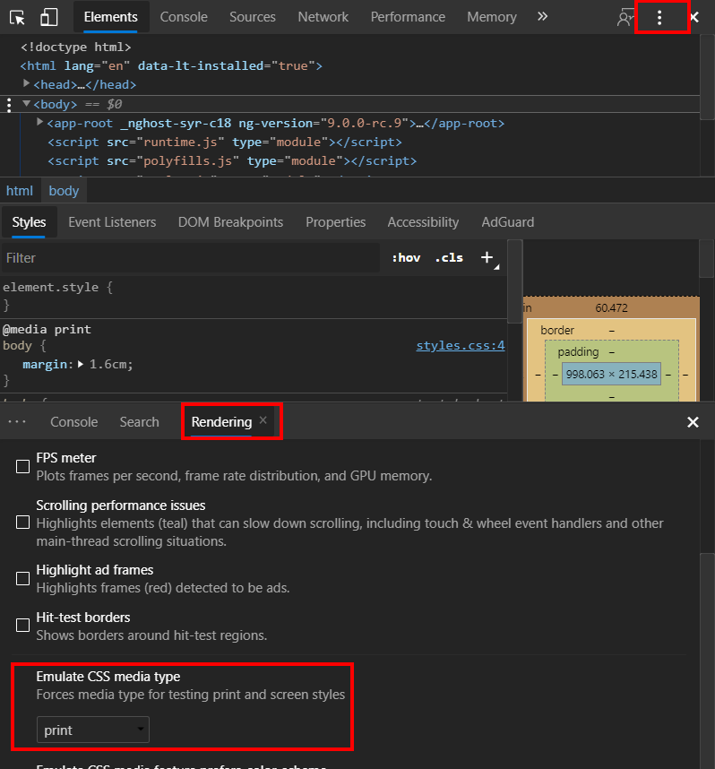
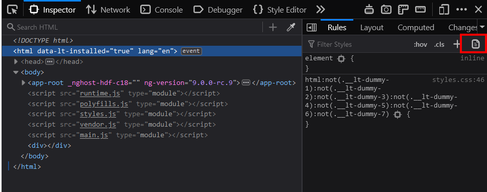

Recently, I had my first experience with the need to print out a webpage.
I knew that this was possible by using a combination of the [`@page`](https://developer.mozilla.org/en-US/docs/Web/CSS/@page) and the [`@media print`](https://developer.mozilla.org/en-US/docs/Web/CSS/@media) CSS selectors.

But how can Angular help with this task, we asked ourselves.
In this article, we'll take a look at the observations we made.

> To get started with the print CSS, I found these two articles by Smashing Magazine helpful:
>
> - [How To Set Up A Print Style Sheet](https://www.smashingmagazine.com/2011/11/how-to-set-up-a-print-style-sheet/)
> - [A Guide To The State Of Print Stylesheets In 2018](https://www.smashingmagazine.com/2018/05/print-stylesheets-in-2018/)

### How can Angular help

If you're using Angular, there's a good chance that you're using a component-based architecture.
We can use this architecture to our advantage. Instead of creating one big print stylesheet with some selectors, which becomes unmanageable complex when you have to support multiple printable pages. We can move some of the layout back to the components.

Adding print CSS to components has the same benefits as the styles to the component:

- the CSS is isolated to the component
- we keep it [DRY](https://en.wikipedia.org/wiki/Don%27t_repeat_yourself)
- it's still possible to use globally-scoped styles

### Adding a print CSS to a component

To change a component's look when printing a page, wrap the styles inside the `@media print` selector.
Just like Angular's default styles, these styles are scoped to the current component.

```css
@media print {
  h1 {
    color: blue;
  }
}
```

This also means that child-component styles will overrule parent styles.
In the below example, `h1`s from the parent component will be red, while the `h1`s from the child component will have the color blue.

```css:parent.component.CSS
@media print {
  h1 {
    color: red;
  }
}
```

```css:child.component.CSS
@media print {
  h1 {
    color: blue;
  }
}
```

### Hiding entire components

Most of the specific print CSS we wrote was to hide components.
To hide an entire Angular component, we can use the [`:host` selector](https://angular.io/guide/component-styles#host).

```css
@media print {
  :host {
    display: none;
  }
}
```

### A separate print component

When the print version has a different layout, an option is to create a second component.
This is especially useful if the printable component needs different data.
This component will only be used for the print version.

```html
<app-results [results]="results"></app-results>

<app-results-print [results]="results"></app-results-print>
```

```css
app-results-print {
  display: none;
}

@media print {
  app-results {
    display: none;
  }

  app-results-print {
    display: block;
  }
}
```

### A separate print stylesheet

Create a separate stylesheet where the print styles live.
This leads to a clear separation, to clearly distinguish the application's layout and the print layout,

```ts
@Component({
  selector: 'overview-component',
  templateUrl: 'overview.component.html',
  styleUrls: ['overview.component.css', 'print-overview.component.css'],
})
export class OverviewComponent {}
```

### Adding a print button

It's possible to print a page with JavaScript, for users this is easier compared to printing out the page via the browser's interface or via a shortcut.

```ts
@Component({
  selector: 'app-print-button',
  template: `
    <button (click)="printPage()">Print</button>
  `,
  styles: [
    `
      @media print {
        :host {
          display: none;
        }
      }
    `,
  ],
})
export class PrintButtonComponent {
  printPage() {
    window.print()
  }
}
```

### DevTools print media type

The developer experience while testing out the prints, was not so enjoyable because we had to manually trigger a print to see the page.
That was until we found out that browsers can emulate the print view. The feedback loop was shorter as the page would just refresh when we made a change, just like we're used to.

In Chrome via `More Tools > Rendering > Emulate CSS media type`



In Firefox this view can be toggled the Rules pane in the DevTools


