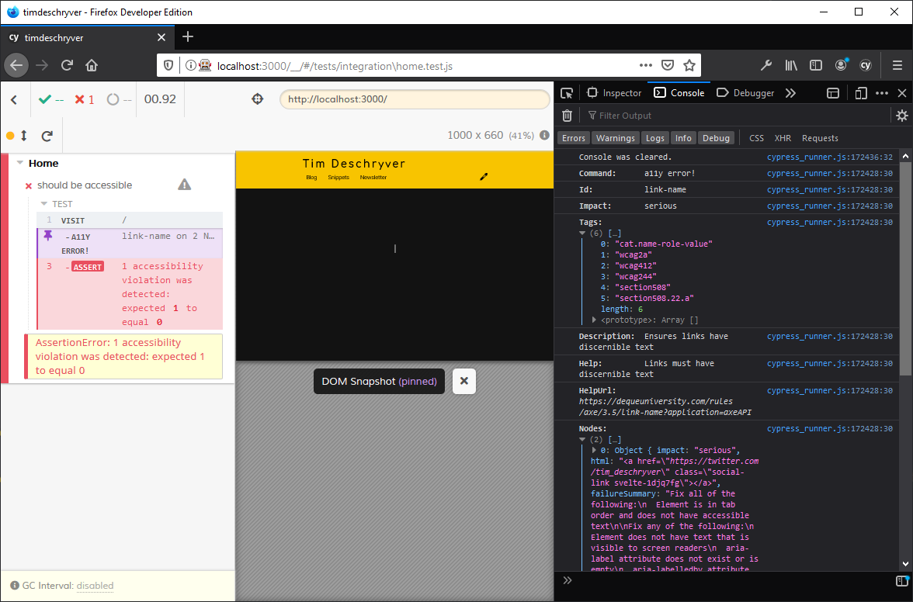
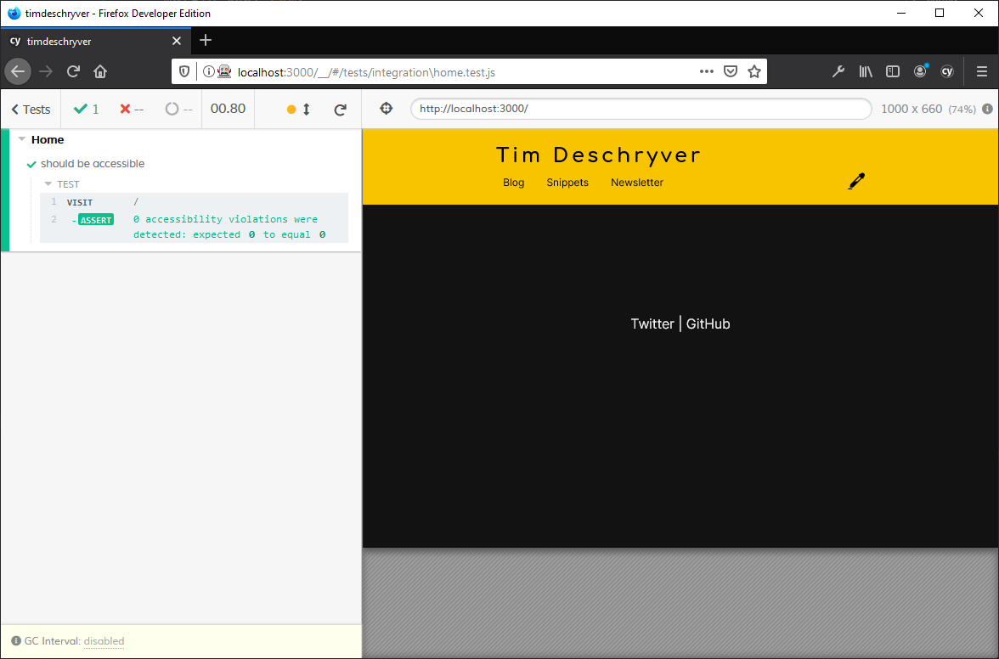
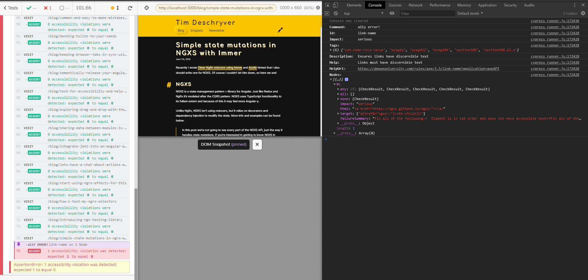
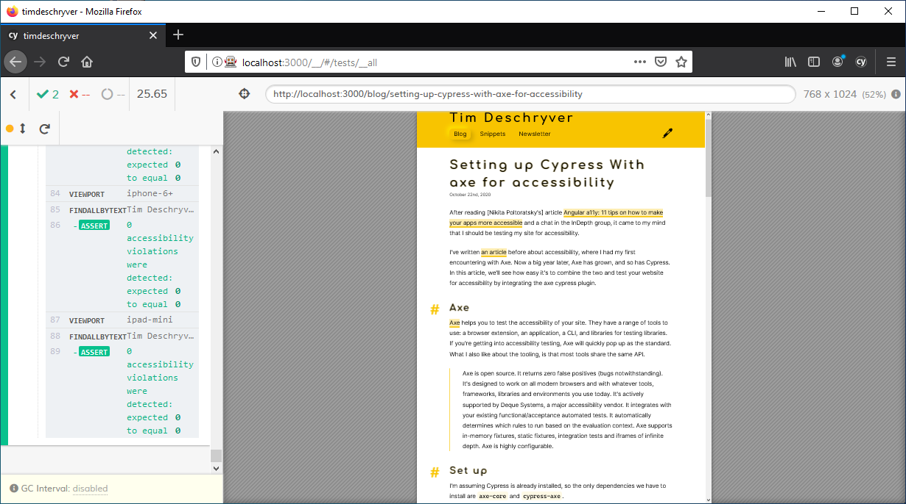

After reading [Nikita Poltoratsky's](https://twitter.com/NikPoltoratsky) article [Angular a11y: 11 tips on how to make your apps more accessible](https://indepth.dev/angular-a11y-11-tips-on-how-to-make-your-apps-more-accessible/) and a chat in the [InDepth](https://indepth.dev) group, it came to my mind that I should be testing my [blog](https://timdeschryver.dev) for accessibility.

I've written [an article](/blog/test-for-accessibility-and-help-millions-of-people) before about accessibility, where I had my first encountering with axe. Now a big year later, axe has grown, and so has Cypress. In this article, we'll see how easy it's to combine the two and test your website for accessibility by integrating the axe methods as Cypress commands.

## Axe

[Axe](https://www.deque.com/axe/) helps you to test the accessibility of your site.
They have a range of tools in their arsenal: a browser extension, an application, a CLI, and libraries for different testing libraries. If you're getting into accessibility testing, axe will quickly pop up as the standard.
What I also like about the tooling, is that most tools share the same API.

> Axe is open source.
> It returns zero false positives (bugs notwithstanding).
> It's designed to work on all modern browsers and with whatever tools, frameworks, libraries and environments you use today.
> It's actively supported by Deque Systems, a major accessibility vendor.
> It integrates with your existing functional/acceptance automated tests.
> It automatically determines which rules to run based on the evaluation context.
> Axe supports in-memory fixtures, static fixtures, integration tests and iframes of infinite depth.
> Axe is highly configurable.

## Set up

I'm assuming Cypress is already installed, so the only dependencies we have to install are `axe-core` and `cypress-axe`.

```bash
npm i --save-development axe-core cypress-axe
```

After that the installation is complete, add the commands to the `support/index.js` file.

```js:cypress/support/index.js
import 'cypress-axe'
```

Now, the axe commands are available on the `cy` object and we're ready to use axe in our tests.

## Configuration

The first step is to inject axe.
To inject axe, simply invoke the `cy.injectAxe` command.
This must be done **after** the page is loaded.

```js
cy.injectAxe()
```

After axes is injected, we can check the page's accessibility with the `cy.checkA11y` command.
This command will make the test fail when it uncovers accessibility issues.

```js
cy.checkA11y()
```

By default, it will scan the whole page but it also can be [configured](https://www.deque.com/axe/axe-for-web/documentation/api-documentation/#parameters-axerun) to run against a specific element, or to exclude some elements.

For example, I use this method to exclude a specific button (which I should fix...) with a CSS selector. It's also possible to pass DOM Nodes, by using the `document.querySelectorAll` method.

```js
cy.checkA11y({
  exclude: ['.article-action'],
})
```

The `checkA11y` command also accepts a second argument, to set [options](https://www.deque.com/axe/axe-for-web/documentation/api-documentation/#options-parameter). I think most of these options will remain untouched for most of the time, except for the `rules` and `runOnly` properties. With it, you can enable or disable certain rules, or a standardized set of rules (as tags).

```js
cy.checkA11y(
  {
    exclude: ['.article-action'],
  },
  {
    rules: {
      'empty-heading': { enabled: false },
    },
  },
)
```

The last command that is available, is `configureAxe`.
For more advanced use cases, this command is used to define custom rules or to modify existing checks and rules.
With it, the default reporting can be changed, as well as the locale for the output messages.

```js
cy.configureAxe({
  branding: {
    brand: String,
    application: String,
  },
  reporter: 'option',
  checks: [Object],
  rules: [Object],
  locale: Object,
})
```

## Assert a page's accessibility

When we put everything together, the simplest test case looks as follows.
After a page navigation, inject axe, and lastly, check the accessibility of the page.

```js:'cypress/fixtures/home.test.js
describe('Home', () => {
  it('should be accessible', () => {
    cy.visit('/')
    cy.injectAxe()
    cy.checkA11y()
  })
})
```

When Cypress runs, it will throw and log an `AssertionError` when the page isn't accessible.
Just like most of the Cypress errors, it's possible to click on the accessibility error, which prints out more information in the console window of the DevTools. The log includes the rule id, the impact, the impacted nodes, and a url to get more information about the violation, including certain fixes.



When it doesn't spot violations, you will end up with a green test.



## Automating a whole website

For small static sites you can manually test each page this way, but I don't want to add a new test for each article that I write.
To automate the process, I created a Cypress task to read the website's sitemap to iterate over all my pages.

```js:'cypress/plugins/index.js
const fetch = require('node-fetch')

module.exports = (on, config) => {
  on('task', {
    sitemapLocations() {
      return fetch(`${config.baseUrl}/sitemap.xml`, {
        method: 'GET',
        headers: {
          'Content-Type': 'application/xml',
        },
      })
        .then(res => res.text())
        .then(xml => {
          const locs = [...xml.matchAll(`<loc>(.|\n)*?</loc>`)].map(([loc]) =>
            loc.replace('<loc>', '').replace('</loc>', ''),
          )
          return locs
        })
    },
  })
  return config
}
```

```js:cypress/integration/smoke.test.js
it('should be accessible', () => {
  cy.task('sitemapLocations').then(pages => {
    pages.forEach(page => {
      cy.visit(page)
      cy.injectAxe()

      cy.checkA11y(
        {
          exclude: ['.article-action'],
        },
        {
          rules: {
            'empty-heading': { enabled: false },
            'scrollable-region-focusable': { enabled: false },
          },
        },
      )
    })
  })
})
```

## Different screen resolutions

To make sure the website is also accessible on smaller devices, I use Cypress's [`cy.viewport` command](https://docs.cypress.io/api/commands/viewport.html) to set the size of the screen. The viewport command accepts a width and height as argument, or a preset.

In my test, I create an array of different viewports and iterate over them.

```js{4-9}:cypress/integration/smoke.test.js
it('should be accessible', () => {
  cy.visit(page)
  cy.injectAxe()
  ;[[1920, 1080], 'macbook-11', 'iphone-6', 'ipad-mini'].forEach(size => {
    if (Cypress._.isArray(size)) {
      cy.viewport(size[0], size[1])
    } else {
      cy.viewport(size)
    }

    cy.checkA11y(
      {
        exclude: ['.article-action'],
      },
      {
        rules: {
          'empty-heading': { enabled: false },
          'scrollable-region-focusable': { enabled: false },
        },
      },
    )
  })
})
```

## Different color schemes

My blog has a light theme and a dark theme. To determine which theme to use, it looks at the user's preferences to set its theme. Because the different color schemes I wanted to test both themes, especially for the contrast.

To know which theme to render, I use the [`prefers-color-scheme` CSS media feature](https://developer.mozilla.org/en-US/docs/Web/CSS/@media/prefers-color-scheme). In a Cypress test, this can be stubbed during the `cy.visit`.

```js{2-10}:cypress/integration/smoke.test.js
it('should be accessible', () => {
  cy.visit(page, {
    onBeforeLoad(win) {
      cy.stub(win, 'matchMedia')
        .withArgs('(prefers-color-scheme: dark)')
        .returns({
          matches: false,
        })
    },
  })
  cy.injectAxe()

  cy.checkA11y(
    {
      exclude: ['.article-action'],
    },
    {
      rules: {
        'empty-heading': { enabled: false },
        'scrollable-region-focusable': { enabled: false },
      },
    },
  )
})
```

## The result

I ended up with the following code to test the accessibility of my blog, and I'm happy with it.
It did find some accessibility issues, but it also found missing and duplicate header links.

Everyone, including myself, benefits from these tests.
And let's be honest, if you're already using Cypress these tests can be set up quickly, with minimal effort.
With it, you gain a website that is more accessible and with fewer issues.

```js:cypress/integration/smoke.test.js
/// <reference types="Cypress" />

describe('a11y', () => {
  describe('dark theme', () => {
    it('should be accessible', () => {
      cy.task('sitemapLocations').then(pages => {
        pages.forEach(page => {
          cy.visit(page, {
            onBeforeLoad(win) {
              cy.stub(win, 'matchMedia')
                .withArgs('(prefers-color-scheme: dark)')
                .returns({
                  matches: true,
                })
            },
          })
          testA11y()
        })
      })
    })
  })

  describe('light theme', () => {
    it('should be accessible', () => {
      cy.task('sitemapLocations').then(pages => {
        pages.forEach(page => {
          cy.visit(page, {
            onBeforeLoad(win) {
              cy.stub(win, 'matchMedia')
                .withArgs('(prefers-color-scheme: dark)')
                .returns({
                  matches: false,
                })
            },
          })
          testA11y()
        })
      })
    })
  })
})

function testA11y() {
  cy.injectAxe()
  ;[
    [1920, 1080],
    'macbook-15',
    'macbook-13',
    'macbook-11',
    'iphone-6',
    'iphone-6+',
    'ipad-mini',
  ].forEach(size => {
    if (Cypress._.isArray(size)) {
      cy.viewport(size[0], size[1])
    } else {
      cy.viewport(size)
    }
    cy.findAllByText('Tim Deschryver')
    cy.checkA11y(
      {
        exclude: ['.article-action'],
      },
      {
        rules: {
          'empty-heading': { enabled: false },
          'scrollable-region-focusable': { enabled: false },
        },
      },
    )
  })
}
```

This gives the following result when a page doesn't make the accessibility test.



When all violations and issues are fixed, the tests in test run turn green.



> Did you notice that Cypress added support for Firefox and more 🤩?
> See the [Introduction post of Cypress 4.0](https://www.cypress.io/blog/2020/02/06/introducing-firefox-and-edge-support-in-cypress-4-0/) for more info.
