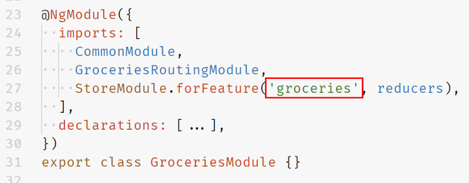
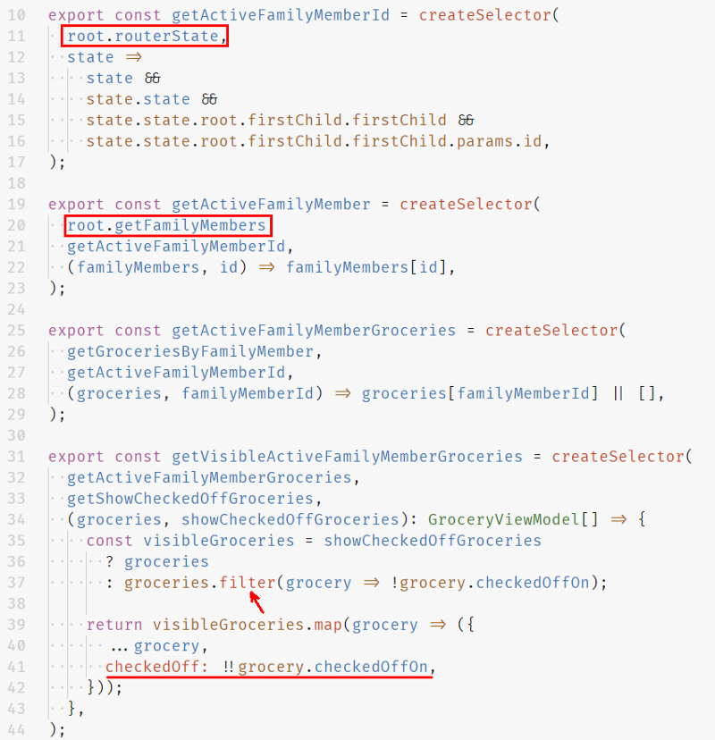

### The problem

As you’re building your application you’ll be creating different feature modules with maintainability and a small footprint in mind. This way your modules have a clear boundary and will only be loaded when they are needed.

But there are times where you need some information (data) from another module to build your views (components). This is a question that I’m starting to see popping up a lot lately. In this post I will provide an answer to this question in particular.

### NgRx Selectors: the basics

In an application that uses NgRx the whole application state is stored in the store as an (often deeply nested) object, also known as the state tree. As you bootstrap your application this state tree will start off small and it will grow in size as more and more modules are loaded into the application.

The state tree is the single source of truth of the application. Once data is stored it becomes available within the application. To access the state within the components to build up the views, selectors are used.

A selector is a [pure function](https://medium.com/javascript-scene/master-the-javascript-interview-what-is-a-pure-function-d1c076bec976) that takes the state as an argument and returns a slice of the store’s state. Instead of just returning the data stored in the store, a selector can compute derived data based on the available data. This allows you to only store the basics, keeping the state tree as compact as possible. Another important part is that selectors could be composed, that is: a selector can take one or multiple other selectors as its input

> If you’re familiar with working with databases, a selector can be compared with a query

Because selectors are pure functions they can use an optimization technique called memoization, meaning that it only gets executed when one of its arguments is changed.

See [Alex Okrushko](https://twitter.com/AlexOkrushko)’s talk [NgRx: Selectors are more powerful than you think](https://www.youtube.com/watch?v=E7GKnjGCXzU) for more information and some more advanced concepts.

### The solution

To build up to the solution we’ll be creating a small application, where a whole family can fill in their groceries per family member.

**The root state  
**In the root module we have our family members and we’ll also use [@ngrx/router-store](https://github.com/ngrx/platform/blob/master/docs/router-store/README.md) to keep track of the router’s state. The entire root state looks as follows:

```ts
export interface State {
  family: {
    familyMembers: {
      [id: string]: {
        id: string
        name: string
        avatar: string
      }
    }
  }
}
```

Resulting in:

```json
{
  "family": {
    "familyMembers": {
      "dad": {
        "id": "dad",
        "name": "Bob",
        "avatar": "👨"
      },
      "daughter": {
        "id": "daughter",
        "name": "Emily",
        "avatar": "👧"
      },
      ...
    }
  },
  "router": {...}
}
```

#### The root selectors

To start off simple, the first step is to create the **selectors** to select the family members to create a landing page.


Inside the component, use the created `getFamilyMembers` selector to retrieve the list of family members from the store. Because this is an observable we have to use the `async` pipe to get the value of the family member list. Notice that we also use the Angular 6.1 `keyvalue` pipe. This is only needed because the state is stored in a normalized way and is simply plucked from the state tree. We could have also transformed the objects into an array in the selector, making it so the `keyvalue` pipe is not necessary.


Resulting in the following home page:


#### The feature state

Since this is a grocery application, the feature state will consist of the groceries and a visibility filter to show or hide checked off groceries. We’ll lazily load this module, meaning that the code won’t be loaded during the initial load but will be once the user navigates to the groceries page.

> This also means the NgRx code won’t be loaded initially. In other words, you can’t select data from the lazy loaded module at this point. Also, the reducers and the effects won’t get invoked when an action is dispatched.

When the feature module is loaded, NgRx will append the feature’s reducers to the current reducers. This results in the following state tree:

```json
{
  "family": {...},
  "router": {...},
  "groceries": {
    "groceries": {
      "ids": [],
      "entities": {}
    },
    "visibility": {
      "showCheckedOffGroceries": false
    }
  }
}
```

#### The feature module

The groceries state is added to the state tree as `groceries` because this is how I defined it.



#### The feature selectors

Now that we know how the feature state looks, we can write the selectors to select the data.


Notice that we’re using `createFeatureSelector` to select the state of `groceries`. Here again we have to pass `groceries` as a parameter to select the groceries slice from the state tree. Also notice the `fromGroceries.selectAll` method to select all the groceries, this is a baked in selector that comes with [@ngrx/entity](https://github.com/ngrx/platform/tree/master/docs/entity).

With this done we can create our first selector that returns derived data. We’ll use the `getGroceries` selector and return the groceries grouped by family member which makes it easier to lookup the groceries for a specific family member later.


**Creating selectors for a grocery page specific to a family member  
**With our state and groceries selectors in place we can create the grocery page for a family member. This page will be accessible via `/groceries/:id`, e.g. `/groceries/mom`. To show the groceries of the mom in this case we’ll have to pluck the family member id from the URL, select the family member from the store, and finally select the groceries of the family member from the store.

Time for a little recap before we continue: we defined the family members state and router state in the root module and the groceries state in the groceries feature module. But because all our application state is defined in a single state tree we can simply import the selectors from our root and use them as is, together with the selectors we created in the groceries module. The latter I like to call the base selectors.

Time to write the selectors needed to create the grocery page.



Notice that we also filter out the groceries based on if they are checked off or not. We also add an extra `checkedOff` boolean property to make it easier to work with in our view, in comparison to a nullable date.

With these selectors in place we can use `getActiveFamilyMember` and `getVisibleActiveFamilyMemberGroceries` in the component and build the following view:


**Creating selectors for a grocery page for the whole family  
**To give one more example, I’m also going to show you the selectors needed to create a page to show all the groceries of the whole family.

Just like before, the `getFamilyMembers` selector from the root module is being used and also the base selector `getGroceriesByFamilyMember`.


We don’t need anything more, so we can create our family view:


### Recap

As you can already see in the examples above sharing data between modules can be peanuts if selectors are used. This comes with the extra benefit that:

- it’s fast, selectors are memoized
- you can keep your state compact, it’s possible to derive data inside selectors
- you can re-use selectors, because selectors are composable
- components aren’t tightly coupled with the state tree anymore, making it easier to modify the state tree structure

Keep in mind that if a feature module is being lazy loaded, that in order to select the data, the module must have been loaded.

If you want to see the project, you can take a look at the [GitHub repo](https://github.com/timdeschryver/ngrx-family-grocery-list), or play with it in [StackBlitz](https://stackblitz.com/github/timdeschryver/ngrx-family-grocery-list).

A big thank you to [Nate Lapinski](https://twitter.com/nate_lapinski), [Max Wizard K](https://twitter.com/maxkoretskyi), [Alex Okrushko](https://twitter.com/AlexOkrushko) and [Todd Palmer](https://medium.com/u/11477bb8a02e) for reviewing this post.

### Here are some more resources if you want to know more

[Parameterized selectors](./blog/parameterized-selectors)

[Normalizing state](./blog/normalizing-state)

[Advanced NgRx](https://slides.com/gerardsans/angularsp-advanced-ngrx#/)

### Did you know you can also create your custom selector factory

https://twitter.com/gerardsans/status/1037359745466884096
