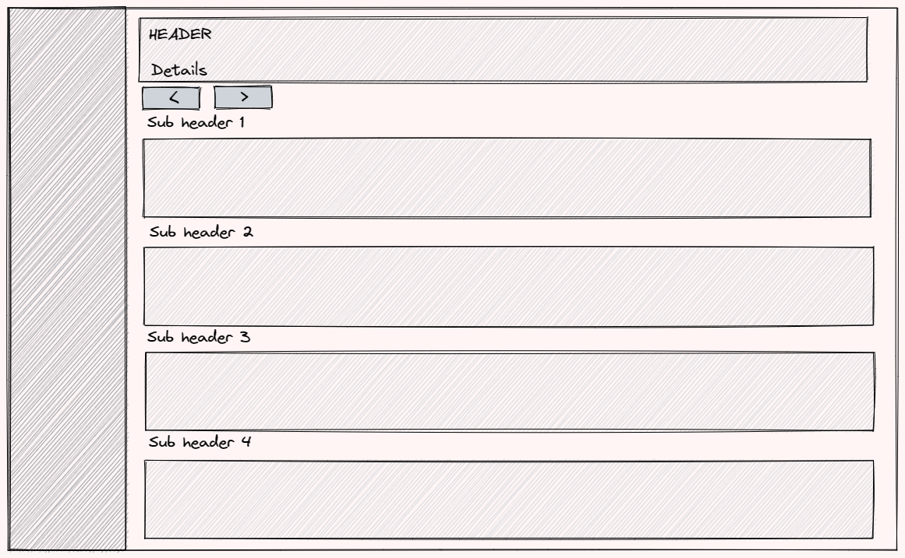

This week I got to work on a project that had some difficulties to render an Angular template efficiently.
During a (re)render, the screen froze and became unresponsive until the render cycle settled.
The template itself wasn't too fancy, it's just a couple of CRUD tables with tabular data to show the working schedule of an employer on a monthly basis. Each table (a week) does have between 10 and 30 rows, in total, this means that there are between 50 and 150 rows on the screen.



While the code wasn't optimized, I was a bit surprised that Angular has difficulties rendering the view.
That's why I send out a [tweet](https://twitter.com/tim_deschryver/status/1425404252743245831) with my recent experience. Some helpful friends responded to my tweet with improvements to solve this rendering problem.

All of the suggestions are valid (and easy to make) tweaks to reduce the number of change detection cycles, which is the underlying problem.
For example:

- to use the `OnPush` strategy instead of the `Default` strategy;
- to use pure pipes to format properties to a human-readable text, to prevent extra method invocations;
- to use the `trackBy` method, to prevent rows to be re-rendered in a `*ngFor` element;
- to use a virtual scroller, to only show a few rows at a time;

But to solve the problem, I went with a different route which led me to success before.

I like to extract most (or all) of the logic outside of the component/template, to prepare a model before it reaches the component. This doesn't require you to know about specific Angular APIs, and it keeps the component small and clean. I also find this easier to test, debug, and to possibly change the behavior in the future.

To get an understanding of what I mean by saying "preparing the model", let's first take a look at the code that was causing problems.

```html:component.html
<div *ngFor="let message of criticalMessages().filter(onlyUnique)">{{ message }}</div>
<div *ngFor="let message of infoMessages().filter(onlyUnique)">{{ message }}</div>

<div *ngFor="let parent of parents">
    <h2>{{ parent.title }}</h2>
    <table>
        <tr *ngFor="let child of getChildRows(parent)" [class]="getRowClass(child)">
            <td><icon [icon]="getIcon(child)"></icon></td>
            <td>{{ formatDate(child) }}</td>
            <td [class]="getNameClass(child)">{{ formatName(child) }}</td>
            <td [class]="getAddressClass(child)">{{ formatAddress(child) }}</td>
            <td>{{ formatDetails(child) }}</td>
            <td>
                <button *ngIf="canEditChild(child)">Edit</button>
                <button *ngIf="canDeleteChild(child)">Delete</button>
            </td>
        </tr>
    </table>
</div>
```

```ts:component.ts
@Component({})
export class Component {
    // parent has a list of children
    @Input() parents: Parent[];
    // a message can be critical or info and is bound to a child
    @Input() messages: Message[];

    criticalMessages() {
        return messages.filter((message) => message.type === 'critical');
    }

    infoMessages() {
        return messages.filter((message) => message.type === 'info');
    }

    onlyUnique(value: Message, index: number, self: Message[]) {
        return self.map((message) => message.description).indexOf(message.description) === index;
    }

    getChildRows(child: Child) {
        const rows = child.listOne.concat(listTwo);
        return rows.sort((a, b) => (a.date < b.date ? -1 : 1));
    }

    getIcon(child: Child) {
        return this.messages
            .filter((message) => message.type === 'critical')
            .some((message) => message.childId === child.id)
            ? 'red-dot'
            : '';
    }

    getRowClass(child: Child) {
        // simple logic based on child properties
    }

    getNameClass(child: Child) {
        // simple logic based on child properties
    }

    getAddressClass(child: Child) {
        // simple logic based on child properties
    }

    canEditChild(child: Child) {
        // simple logic based on child properties
    }

    canDeleteChild(child: Child) {
        // simple logic based on child properties
    }
}
```

If you're an experienced Angular developer, I'm sure that you can spot the red flags in the code that we just saw.
To get everyone on the same page, the main problem is that there are a lot of methods that are used inside of the template. While this is probably bearably noticeable at first, it can become a problem when the logic inside these methods gets more expensive. For every change detection cycle, all of the methods are executed. This means that a single method can be invoked multiple times before a render cycle has been completed.

> If this is new information, I strongly suggest watching [Optimizing an Angular application](https://www.youtube.com/watch?v=ybNj-id0kjY) by [Minko Gechev](https://twitter.com/mgechev). It sure helped me when I started my Angular journey.

Now that we know the cause of the problem, we also know why we need to do our absolute best to reduce the number of change detection cycles and why it's important to keep methods in a template to a bare minimum.

Instead of using the proposed fixes, let's take a look at the solution if the data is pre-processed.

By looking at the template and the code, we notice that there's logic to build up the template.
For example, the two heaviest methods are a method to concat two collections before sorting them, and the second-heaviest method is to only display the unique messages. Besides those, there were also a handful of simpler methods, for example, to format multiple properties, or to show/hide a button.

If we move all of this view logic to outside the component, these methods are only invoked once, instead of with each change detection cycle.

The application that I'm working on uses [NgRx](https://ngrx.io), which has the concept of [selectors](https://ngrx.io/guide/store/selectors). To me, selectors are the ideal location to move the view logic to.
Don't worry if you're not using NgRx, this technique is also applicable to other state management tools, with just pure RxJS, and even across different frameworks.

```ts:selectors.ts
export const selectViewModel = createSelector(
  // get all the parents
  selectParents,
  // get all the children
  selectChildren,
  // get all the critical and info messages
  selectMessages,
  (parents, children, messages) => {
    // map the child id of critical messages into a set
    // this makes it easy and fast to lookup if a child has a critical message
    const messagesByChildId = messages
      ? new Set(
          messages
            .filter((message) => message.type === 'critical')
            .map((message) => message.childId),
        )
      : new Set();

  // use a Set to get unique messages
    const criticalMessages = messages
      ? [
          ...new Set(
            messages
              .filter((message) => message.type === 'critical')
              .map((message) => message.description),
          ),
        ]
      : [];

  // use a Set to get unique messages
    const infoMessages = messages
      ? [
          ...new Set(
            messages
              .filter((message) => message.type === 'info')
              .map((message) => message.description),
          ),
        ]
      : [];

    return {
      criticalMessages: criticalMessages,
      infoMessages: infoMessages,
      parents: parents.map((parent) => {
        return {
          title: parent.title,
          children: childrenForParent(parent.listOne, parent.listTwo)
            .map((child) => {
              return {
                id: child.id,
                icon: messagesByChildId.has(child.id) ? 'red-dot' : '',
                date: child.date,
                state: child.confirmed ? 'confirmed' : 'pending',
                edited: child.edited,
                name: formatName(child),
                address: formatAddress(child),
                details: formatDetails(child),
                canEdit: canEdit(child),
                canDelete: canDelete(child),
              };
            })
            .sort(),
        };
      });
    };
  },
);

// 💡 Tip: create a type for the view model with `ReturnType` and `typeof`
export type ViewModel = ReturnType<typeof selectViewModel>;
```

With the above selector, I find it easier to see what's going on and to spot possible mistakes.
You can also see how much simpler the component gets to be after this refactor.
There's no logic anymore in the component, the template just loops over the collections and uses the properties of the (view)model. Nice and simple.

```html:component.html
<div *ngFor="let message of viewModel.criticalMessages">{{ message }}</div>
<div *ngFor="let message of viewModel.infoMessages">{{ message }}</div>

<div *ngFor="let parent of viewModel.parents">
  <h2>{{ parent.title }}</h2>

  <table>
    <tr *ngFor="let child of parent.children">
      <td><icon [icon]="child.icon"></icon></td>
      <td>{{ child.date }}</td>
      <td [attr.state]="child.state">{{ child.name }}</td>
      <td [attr.state]="child.state" [attr.edited]="child.edited">{{ child.address }}</td>
      <td>{{ child.details }}</td>
      <td>
        <button *ngIf="child.canEdit">Edit</button>
        <button *ngIf="child.canDelete">Delete</button>
      </td>
    </tr>
  </table>
</div>
```

Besides that it's easier to read, you also don't have to worry about the Angular change detection mechanism.
The logic inside the selector is only executed when the data changes, not on every change detection cycle.
This makes it very efficient.

Another advantage of this technique is that it's straightforward to test.

To test the selector, I use the `projector` method on the selector.
The `projector` exists for exactly this reason, making it easy for us to test the logic inside the selector.
With it, we can call the selector with fixed variables, and then we assert the result of the selector.
This is faster to execute and to write, compared to writing and running a component test.

```ts:selectors.test.ts
it('consists of unique messages', () => {
  const result = selectViewModel.projector(
    [{ id: 1, title: 'Parent 1' }],
    [],
    [
      { type: 'critical', message: 'critical message 1' },
      { type: 'critical', message: 'critical message 2' },
      { type: 'critical', message: 'critical message 1' },
      { type: 'info', message: 'info message 1' },
    ],
  );
  expect(result[0].criticalMessages).toEqual(['critical message 1', 'critical message 2']);
  expect(result[0].infoMessages).toEqual(['info message 2']);
});
```

When you do this and the view is still on the slow end, you can still resort to the Angular optimization techniques that were mentioned earlier. From my experience, for the applications that I create, this "fix" is usually sufficient, but it's always good to know that you have an extra pair of tricks in your bag.

### Key Takeaways

- Complex logic doesn't belong in the template nor in the component
- Use `ngFor` and `ngIf` only as terminal operations (from a precomputed dataset)
- Abstract the selection logic using selectors if you're using NgRx
