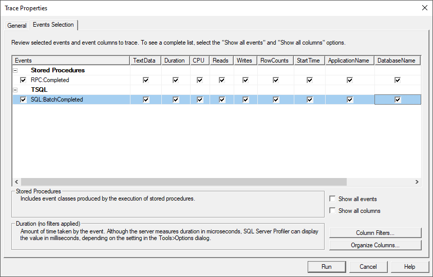

When I started out as a C# developer, I was lucky that I had a great mentor who gave me all sorts of tips and tricks.
One of the best, if not the best, tip my mentor gave me was the SQL Server Profiler.
At that time I didn't get why that could help me, nor did I know how to use it properly.
Now, several years later I'm happy that my mentor introduced me to the profiler, as I use it regularly and I believe the profiler makes me a better developer. To this day, I still thank my mentor for introducing the SQL Profiler to me.

## SQL Server Profiler

If you haven't heard about the SQL Server Profiler before, I would recommend reading the [documentation](https://docs.microsoft.com/en-us/sql/tools/sql-server-profiler/sql-server-profiler). In the documentation you can read [how the start profiler](https://docs.microsoft.com/en-us/sql/tools/sql-server-profiler/start-sql-server-profiler?view=sql-server-ver15) and multiple use cases for it.

> SQL Server Profiler is an interface to create and manage traces and analyze and replay trace results. Events are saved in a trace file that can later be analyzed or used to replay a specific series of steps when diagnosing a problem.

In my own words, with the SQL Profiler you can see **everything** that is happening on the SQL server.
While the SQL Server Profiler is often used to analyze a live system, I've found that it can also be used to my advantage during the development phase.
By using the SQL Profiler, I was able to quickly detect problems that would have taken longer without it.
Even for third party software, the profiler can be used to troubleshoot a behavior.

While I was writing this article I noticed that the profiler has become deprecated in favor of the [SSMS XEvent Profiler](https://docs.microsoft.com/en-us/sql/relational-databases/extended-events/use-the-ssms-xe-profiler?view=sql-server-ver15).
Luckily, there seems to be an alternative that I will explore soon.

> I explored the Exenteded Events, and the profiler in [Getting to know SQL Server Extended Events](/blog/getting-to-know-sql-server-extended-events)

## My setup

You can choose between several default profiles when you start the SQL Profiler.
The thing is, that all of those profiles select too many events and too much information from those events.
Because of this, many developers that I know often quit using the profiler immediately, or after giving it some tries.

The key to using the SQL Profiler successfully is to only capture the important data.
That's why I created my own profile template, which is based on a template I found in one of the [sqlcentral](https://www.sqlservercentral.com/) articles.

I'm only interested in completed statements and queries while I'm busy analyzing.
From those queries, I find the duration, the CPU the query consumes, and the number of reads and writes the most important factors.
With only these properties, it becomes easy to troubleshoot a system or to find slow-running queries, and not get lost in all the clutter of the SQL Profiler.

Now let's see what it can be used for.

## Debugging purposes

One of the tasks of a developer is to figure out what is happening in a system.
When the developer is new to an existing application that can take some time, and one of the best ways to learn an application is by fixing bugs.

A common debugging practice is to look at the code and to start debugging from an entry-point, _a Controller_, and to work your way down to the bottom, _the database_. This is a good way to learn a new system, but it can also time-consuming. When you debug a system from top to bottom, you might end up in parts of the application that aren't important at that time.

That's why I prefer to debug from the bottom, _the database_, to the top.
With the SQL Server Profiler, I get to see which queries are executed and the parameters of those queries.
With that information, I can verify my thinking and if something seems off I know where I should start looking at the problem.

As you know by now, the SQL Profiler provides insights into what is happening on the SQL level.
This provides you a live view into what's happening in a live environment, which is mostly undebuggable otherwise.
Because you can see the invoked SQL code of the environment, it can help you to spot the cause of a bug.
I'm not saying this solves everything but if you know the application's codebase well, it gives you a starting point to fix that bug as soon as possible.

## Performance tuning

The SQL Server Profiler can be really useful when a system suffers from performance issues.
From my experience, the culprit at those moments is usually a bad-performing query.

If you remember [my setup](#my-setup) to start the SQL Profiler, you know that we can take a look at the different parameters, most importantly, the duration of a query and the number of reads it takes to execute the query.
If one of those parameters, or both, are high, it's probably a sign that the query could be rewritten in a better, faster way.
Once a query is rewritten, the SQL Profiler can also be used compared with the previous version.

Besides analyzing the query based on the parameters, it's also easy to spot N+1 queries.
You won't be able to rewrite all N+1 queries, but it could sign of a bad architectural decision.
Or worse, a bug in your code.

## Conclusion

I believe that the SQL Server Profiler isn't only valuable to Database Administrators.
The SQL Profiler can be a useful tool for every developer that is dealing with databases.
I compare it to your favorite utility knife that you're always using, and can't live without.

From my personal experience, I can say that it helped me troubleshoot and fix (production) issues quickly.
Most of the time when I'm acting as a rubber duck, the first thing I ask is to open the SQL Profiler.
Because it's visual, it helps me to ask the questions if the SQL output is expected or not, and what the expected behavior should be.
By asking these questions, the developer asking for help knows where to look in order to solve the problem.
