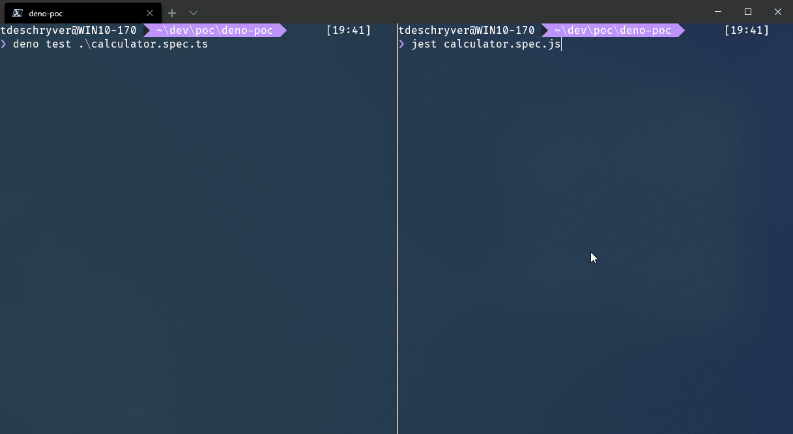
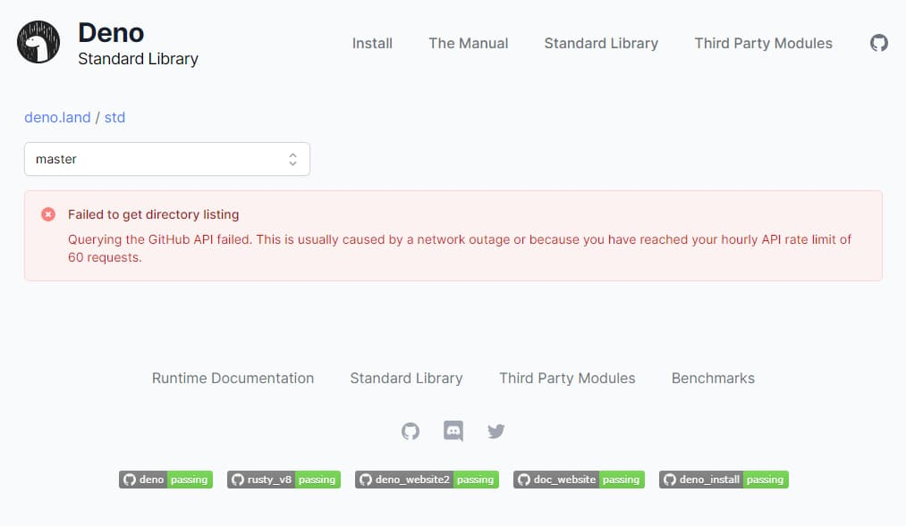
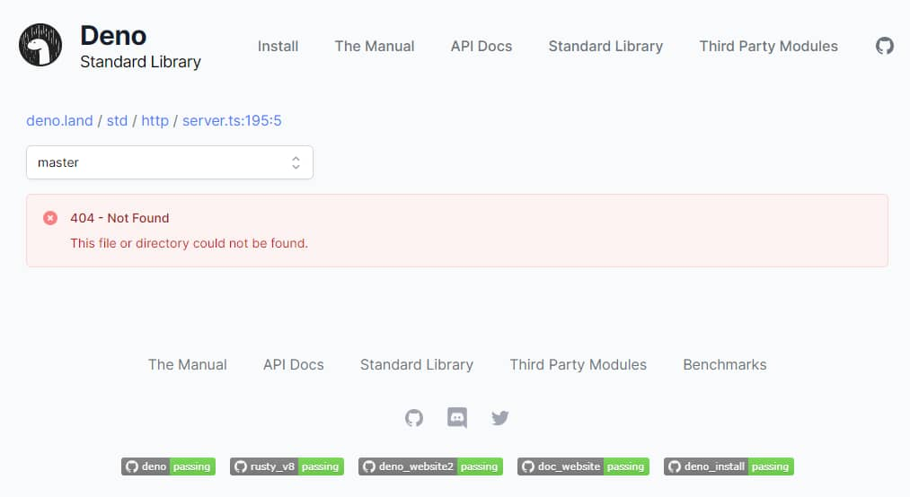

The release of Deno 1.0 was the topic of this week, there was always someone talking about it everywhere I looked.
Having not yet taken a look myself, I had to try it out now.
As my first experience with Deno, I created a minimal API server. In this post I jotted down my thoughts for the initial developer experience.

To get up and running with Deno, see the [installation guide](https://deno.land/#installation) and [getting started guide](https://deno.land/#getting-started).

## It's easy and fast

It's easy to get things right at the first try with Deno, I was up and running in no time.
After having installed Deno, I just opened up an IDE and started to write code that could directly be run with the `deno run` command.
This is different from what I'm used to, especially if you want to write in TypeScript where it's needed to configure the workspace, and where multiple packages need to be installed.

The compilation also feels faster, although I haven't measured it.

No more fatigue to choose a test runner because Deno has one built in the core, included are some [assertion helpers](https://deno.land/std/testing/README.md)!
While running tests, I also got the feeling that it's faster than existing test runners.
The time to boot up the tests is considerably faster, while the time to run the tests when it's booted is roughly the same.



## Watch mode

With the evolution of frameworks and libraries throughout the last years, I'm used to having a watch mode built-in to re-compile the code.
Frankly speaking, this is something I can't live without because it's easy to use and a productivity booster.
Sadly, it isn't a core feature of Deno.

At first, I had to shut down the server via the CLI, and had to start it again.
After two or three times I was already tired of it, so I went looking for a solution.

Luckily, some third party modules have implemented the watch mode feature.
While I was trying out Deno, I was using the [denon](https://github.com/eliassjogreen/denon) module and I didn't experience any problems with it.

## Documentation

The current state of the documentation is good enough for now.
It's to the point and from my experience, it provides an answer to the questions I had, or to the problems I was running against.
I think the written documentation might be too dense for the likings of some people, but it's more focused around code snippets, which I liked.

From the looks of it, the more advanced parts of the Deno API have a more detailed documentation, with some examples.

If you're looking for the documentation of modules you will have to rely on the README pages of those modules, for example [https://deno.land/std/http](https://deno.land/std/http).

One feature that I missed was a search functionality to quickly browse the documentation.

## Browsing modules

Taking a look at the existing modules to read the documentation and to browse the code can be done with the
[Standard Modules (**std**)](https://deno.land/std) and [Third Party Modules (**x**)](https://deno.land/x) pages.

At first, this was OK and it was surprisingly faster than searching for more information via a search engine, but I quickly ran into the problem that I couldn't anymore.
Apparently, there's an hourly limit? And we were passed it...
This made it harder to finish the code that I started working on, as I had to go back to using my google-fu.



Another point of critique is that the code isn't browsable when a module throws an error.
For example, in the CLI the stack trace will print out that the error occurred at [https://deno.land/std/http/server.ts:195:5](https://deno.land/std/http/server.ts:195:5).
When we click on the link, it results in a page mentioning that the file cannot be found.
To see the code that threw the error, the line number has to be removed manually.



## Debugging

Although I don't like to debug my code using a debugger, debugging an incoming request was easy to set up with Visual Studio Code.
I followed the [debugger section](https://deno.land/manual/tools/debugger) in the docs and it was quick and simple to get it working.
Previously, I had some problems with it, but this time it just worked.

## Visual Studio Code plugin

To make Visual Studio Code aware that I was working in a Deno environment, I used the [Deno extension](https://marketplace.visualstudio.com/items?itemName=justjavac.vscode-deno).
This plugin configures TypeScript for the workspace and it gets rid of red squigglies while importing modules (because they include the `*.ts` extension). It seems like there's also an auto-formatting feature on the backlog.

## Formatting

Deno comes with a command to format files, nice!

```bash
deno fmt
```

Sadly, the formatting is opinionated and can't be changed [for now(?)](https://github.com/denoland/deno/issues/3827).
This can hurt our feelings, as we as developers often think that our way of formatting is superior to others.

## Conclusion

In the first place, I focused on the Developers Experience because I think that plays an important factor in the future of a project.

While Deno is at its early stages, it has me triggered to follow the next iterations because there's more work to be done.
I liked what I've seen so far, although I just explored a small region of the Deno land.

It's nice to have a breath of fresh air in the JavaScript runtime ecosystem.
I think good things will come out of it, for both Node.js and Deno, and I'm looking forward to it.

## More resources about Deno

- [10 Things I Regret About Node.js - Ryan Dahl - JSConf EU](https://www.youtube.com/watch?v=M3BM9TB-8yA)
- [Deno, a new way to JavaScript - Ryan Dahl - HolyJS](https://www.youtube.com/watch?v=HjdJzNoT_qg)
- [Deno is a New Way to JavaScript - Ryan Dahl & Kitson Kelly - TSConf EU](https://www.youtube.com/watch?v=HjdJzNoT_qg)

## Special thanks

Thanks [Lars Gyrup Brink Nielsen](https://twitter.com/LayZeeDK) to review this post.
