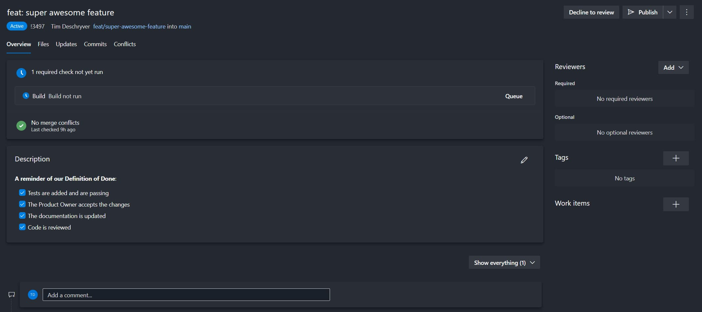

Seeing a Pull Request that is incomplete isn't fun, and may be the cause of unneeded stress.
The reviewer wants to give feedback about the things that are missing but doesn't want to come over as a know-it-all.
While the reviewee disagrees and might be shocked about some remarks.  
In a team that isn't effective, and isn't openly talking about this, this can be the cause of frustrations that over-time pile up making it an environment where everyone is tense.

But what makes a Pull Request (in)complete?
From one person's perspective, "complete" has a totally different meaning than for another person.
Some things might be obvious to someone, but might be unknown for someone else.
That's where a clear Definition of Done (DoD) helps a team to be aligned.

In a nutshell, a Definition of Done is a document in which a set of rules are defined to be explicit when a user story qualifies as being complete.
This document is created in group, this way all team members have the opportunity to express what they find important, and this results that the Definition of Done has the buy-in from the whole team.

To give some inspiration, some rules that are frequently added to a team's Definition of Done are:

- Tests are added and are passing
- The Product Owner accepts the changes
- The documentation is updated
- Code is reviewed

Creating the Definition of Done is one thing, but following the rules is another thing.
It also has to be clear for new developers that join the team that this document exists, and the rules that are defined within it.

To remind the team of our Definition of Done I like to use an Azure DevOps Pull Request template.
The template is used within Azure DevOps as the description of a Pull Request.
This makes the team aware of the Definition of Done each time a Pull Request is created.


To create your own template, create a new folder `.azuredevops` within the root of your project, and also create a `pull_request_template.md` file.

```md:.azuredevops/pull_request_template.md
**A reminder of our Definition of Done**:

- [ ] Tests are added and are passing
- [ ] The Product Owner accepts the changes
- [ ] The documentation is updated
- [x] Code is reviewed
```

The `[ ]` syntax displays a checkbox, which the developer can check off if it's done.

The reviewer sees the following screen while reviewing the Pull Request.


