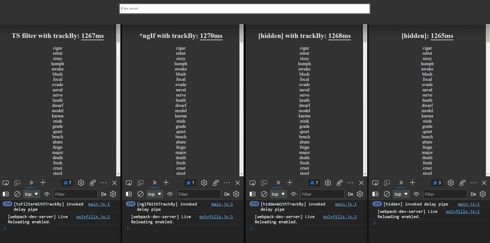

In this post, we take a look at the [hidden HTML attribute](https://developer.mozilla.org/en-US/docs/Web/HTML/Global_attributes/hidden) as an alternative to the `*ngIf` Angular directive.

> From MDN: The hidden global attribute is a Boolean attribute indicating that the element is not yet, or is no longer, relevant. For example, it can be used to hide elements of the page that can't be used until the login process has been completed. Browsers won't render elements with the hidden attribute set.

To provide the best possible user experience, `[hidden]` makes client-side filters smooth, very smooth, whereas the `*ngIf` directive could potential block the render cycle. Although this might just take a few milliseconds it's still sensible for a user. I don't know about you, but I know that this behavior would get on my nerves if it was me who had to interact with an application that's slightly lagging behind my input.

The end result is clearly visible in the following GIF, where multiple solutions are compared next to each other.
In the example, a user filters a list of 250 words based on a query _- think of it as a wordle helper -_.
Because the Angular renderer is fast by default for elements that don't contain logic, the example uses a `delay` (which set to 5ms) pipe to mimic the logic of the to-be rendered element.



## Breaking it down

The initial cost is equal for all solutions because they all have the same amount of elements to create and render.
Afterward, the solution that's using the `hidden` attribute in combination with the `trackBy` method is the clear winner.

If we think about it, the result makes a lot of sense.
`hidden` simply hides/unhides the elements based on an attribute that is set, thus it only needs to pay the cost of instantiate the components (the `delay` pipe in the example) once.
The other solutions are re-creating and re-rendering elements and with that is the delay pipe re-invoked, which is delaying the rendering operation.
To verify this, the `delay` pipe is logging every invocation.

In the last few seconds of the GIF, it's clearly visible that only the `hidden` with `trackBy` implementation is the only solution that can keep up with the user input (repeatedly searching on "a" and immediately clearing it again).

> The fastest code is the code which does not run. - Robert Galanakis

### hidden VS \*ngIf

The example shows that the three examples are initially equally fast, and also when the results in the list are shrinking. For example, the list starts out unfiltered and the user starts typing "karma" in the search box. Because all of the elements are already rendered, the elements that don't meet the criteratia are destroyed and removed.

The difference occurs if the opposite happens, when the results in the list are growing.
In this case, the example that's using `hidden` has a clear advantage.  
For example, when the list is queried (and only contains a few results) and the user clears the query in the search box.
Now, the destroyed elements have to be re-instantiated and re-renderend for the implementations that don't use the `hidden` attribute. This makes all the difference.

### trackBy

Using [`trackBy`](https://angular.io/api/core/TrackByFunction) is an essential utility method to write a performant client-side filter.

`trackBy` is used in an `*ngFor` loop to uniquely identify the objects within the collection.
Angular uses this information to determine if the DOM needs to be updated, e.g. to add or remove elements from the DOM.
When the object is already present in the DOM, it doesn't need to be re-created and appended to DOM, Angular simply re-uses the existing element.

That's why the difference between the examples that are using `trackBy` are outperforming the example that isn't.
The example that isn't using `trackBy` creates and renders all of the components over and over again with every keystroke.
Not good.

For smaller collections, this won't make a big difference but it's proving its value for each extra entry in the collection.
Because the solution that's using the `hidden` attribute renders the entire collection, the importance of the `trackBy` method increases. For the other solutions `trackBy` won't make such a big difference because the collection that's rendered is smaller, and the new elements would still need to be re-rendered nonetheless when they're re-added to the DOM.

## Code

### Delay pipe

The `delay` pipe represents the logic of the element(s) that need to be shown on the screen.
This logic can be on your end, 3rd party code, and the Angular code that's executed.

```ts:delay.pipe.ts
import { Pipe, PipeTransform } from '@angular/core';

@Pipe({
  name: 'delay',
})
export class DelayPipe implements PipeTransform {
  transform(value: string, delay: number, invoker: string): string {
    console.log(`[${invoker}] invoked delay pipe`);
    const stopAt = Date.now() + delay;
    while (Date.now() < stopAt) {}
    return value;
  }
}
```

### Component using \*ngIf

The next component iterates over the `words$` collection and uses the `*ngIf` directive to render the words that match the query.

```ts{17-21, 35, 43-45}:ng-if-with-trackby.component.ts
import { ChangeDetectionStrategy, Component } from '@angular/core';
import {
  BehaviorSubject,
  combineLatest,
  delay,
  distinctUntilChanged,
  filter,
  map,
} from 'rxjs';
import { WordsService } from '../words.service';

@Component({
  selector: 'app-ng-if-with-trackby',
  template: `
    <h2>*ngIf with trackBy</mark></h2>

    <ng-container *ngFor="let word of words$ | async; trackBy: trackByWord">
      <div *ngIf="word.visible">
        {{ word.word | delay: wordsService.delay:'ngIfWithTrackBy' }}
      </div>
    </ng-container>
  `,
  changeDetection: ChangeDetectionStrategy.OnPush,
})
export class NgIfWithTrackbyComponent {
  words$ = combineLatest([
    this.wordsService.words$,
    this.wordsService.query$,
  ]).pipe(
    map(([words, query]) => {
      const queryParts = query.split(' ');
      return words.map((word) => {
        return {
          word,
          visible: queryParts.every((q) => word.includes(q)),
        };
      });
    })
  );

  constructor(public wordsService: WordsService) {}

  trackByWord(_: number, { word }: { word: string }) {
    return word;
  }
}
```

### Component filtering results in the TypeScript code

The next component iterates over all found words, which are filtered in the TypeScript code based on the query.

```ts{10-12, 23, 29-31}:ts-filter-with-trackby.component.ts
import { ChangeDetectionStrategy, Component } from '@angular/core';
import { BehaviorSubject, combineLatest, delay, distinctUntilChanged, filter, map } from 'rxjs';
import { WordsService } from '../words.service';

@Component({
  selector: 'app-ts-filter-with-trackby',
  template: `
    <h2>TS filter with trackBy</h2>

    <ng-container *ngFor="let word of words$ | async; trackBy: trackByWord">
      <div>{{ word | delay: wordsService.delay:'tsFilterWithTrackBy' }}</div>
    </ng-container>
  `,
  changeDetection: ChangeDetectionStrategy.OnPush,
})
export class TsFilterWithTrackbyComponent {
  words$ = combineLatest([
    this.wordsService.words$,
    this.wordsService.query$,
  ]).pipe(
    map(([words, query]) => {
      const queryParts = query.split(' ');
      return words.filter((word) => queryParts.every((q) => word.includes(q)));
    })
  );

  constructor(public wordsService: WordsService) {}

  trackByWord(_: number, word: string) {
    return word;
  }
}
```

### Component using hidden

The next component iterates over the `words$` collection and uses the `hidden` attribute to hide the words that don't match the query.

```ts{10-14, 28, 36-38}:hidden-with-trackby.component.ts
import { ChangeDetectionStrategy, Component } from '@angular/core';
import { BehaviorSubject, combineLatest, delay, distinctUntilChanged, filter, map } from 'rxjs';
import { WordsService } from '../words.service';

@Component({
  selector: 'app-hidden-with-trackby',
  template: `
    <h2>[hidden] with trackBy</h2>

    <ng-container *ngFor="let word of words$ | async; trackBy: trackByWord">
      <div [hidden]="!word.visible">
        {{ word.word | delay: wordsService.delay:'hiddenWithTrackBy' }}
      </div>
    </ng-container>
  `,
  changeDetection: ChangeDetectionStrategy.OnPush,
})
export class HiddenWithTrackbyComponent {
  words$ = combineLatest([
    this.wordsService.words$,
    this.wordsService.query$,
  ]).pipe(
    map(([words, query]) => {
      const queryParts = query.split(' ');
      return words.map((word) => {
        return {
          word,
          visible: queryParts.every((q) => word.includes(q)),
        };
      });
    })
  );

  constructor(public wordsService: WordsService) {}

  trackByWord(_: number, { word }: { word: string }) {
    return word;
  }
}
```

## Writing tests for elements that are hidden

It's easy to verify that elements aren't rendered because they don't appear in the DOM.
This is not true for elements that are set to `hidden` because these elements are always present in the DOM structure.
Luckily most of the testing libraries provide the functionality to check if an element is visible.

- Jest with [@testing-library/jest-dom](https://github.com/testing-library/jest-dom#tobevisible)
- Jasmine with [@testing-library/jasmine-dom](https://github.com/testing-library/jasmine-dom#tobevisible)
- [Playwright](https://playwright.dev/docs/selectors#selecting-visible-elements)
- [Cypress](https://filiphric.com/cypress-basics-check-if-element-exists)

## Conclusion

The `hidden` attribute is a simple but powerful HTML attribute that can be set on an element to hide it from a user (and screen readers).
Using the `hidden` attribute results in a better experience when the visibility of elements in a larger collection need to frequently be toggled. Don't just blindly use `*ngIf` all over the place.

Another way to make client-side rendering faster is to use a virtual scroller, for example the [virtual scroller](https://material.angular.io/cdk/scrolling/overview#virtual-scrolling) CDK implementation of Angular Material. This makes it faster because there are only a few elements of the collection are rendered. In our case the behavior of virtual scrolling wasn't desired.

```html
<!-- static -->
<div hidden>I am hidden</div>
<!-- dynamic -->
<div [attr.data-hidden]="hiddenExpression">`hiddenExpression` decides if I'm visible</div>
```

The code used in this post can be found on [GitHub](https://github.com/timdeschryver/hidden-performance) or directly on [StackBlitz](https://stackblitz.com/github/timdeschryver/hidden-performance).

<iframe src="https://stackblitz.com/github/timdeschryver/hidden-performance?ctl=1&embed=1&file=src/app/app.component.ts" title="Performant client-side filter with trackBy and [hidden] example" loading="lazy"></iframe>
