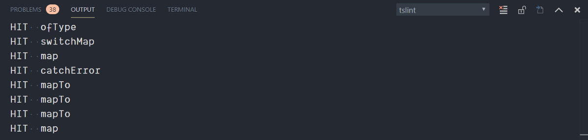
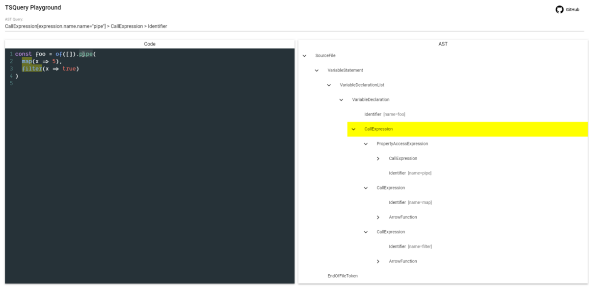

After reading yet another twitter thread asking about the number of RxJS operators used in a project, I thought to myself that creating a small tool that does exactly this could be a fun little project.

After some time thinking about the best possible way to accomplish this task, I had split up the task into smaller ones to make it myself easier.

I had to:

* iterate over every file
* search for RxJS operators
* keep count
* print out the result

Keeping these smaller tasks in mind I noticed TSLint could be used for the first two tasks, doing most of the heavy lifting for me. This came in handy because I also wanted to dabble with TSLint and AST, or [Abstract Syntax Tree](https://en.wikipedia.org/wiki/Abstract_syntax_tree), awesome two birds with one stone!

This post recounts the process I went through to create this new utility which I call rxjs-operator-counter.

### Iterating files inside a project

Following the [Developing TSLint rules](https://palantir.github.io/tslint/develop/custom-rules/) guide from TSLint, this was a straightforward task. The first step was to create a new file `src/rules/operatorCounterRule.ts` and import both `typescript` and `tslint`. Before I could use these dependencies, they had to be installed from npm with `npm install typescript tslint`. In the created file it was now possible to create a custom TSLint rule, extending from the `AbstractRule` class provided by `tslint`.

After doing this, there was an error because the custom rule didn’t implement the `apply` function. With a single click, this function could be implemented. My utility was iterating over the files and I could now already check off the first step ✔️!

```ts
import * as ts from 'typescript'  
import * as Lint from 'tslint'

export class Rule extends Lint.Rules.AbstractRule {  
  apply(sourceFile: ts.SourceFile): Lint.RuleFailure[] {  
    throw new Error("Method not implemented.");  
  }  
}
```

### Searching for RxJS operators

If you’re familiar with RxJS you know that all of the operators are used within the `pipe` function, the question was how to find all of the pipe operators. Here again, another tool could luckily help me and it’s called [AST explorer](https://astexplorer.net/).

The code you and I write can be represented as a big syntax tree with different nodes, the most common nodes being declarations, expressions, statements, and identifiers. AST, gives us a nice interactive overview of these nodes and allows us to take a detailed look at specific nodes, simply by clicking on different parts of the code. The AST Explorer helped me a lot, I didn’t have to dig through documentation text but I could simply visualize the tree with all of its properties.


To find the `pipe` function I first started from the top down, `CallExpression > PropertyAccessExpression> Identifier with as name pipe`. To do this I created a custom syntax walker extending from [syntax walker](https://github.com/palantir/tslint/blob/master/src/language/walker/syntaxWalker.ts) , which gave me a lot of basic functionality to find these expressions. While implementing it in this manner, I’ve encountered some problems, e.g. with nested pipe operators in an NgRx effect. With the knowledge I’ve gained during this implementation, I also found out that it would be a whole lot easier to just query for identifiers having `pipe` as name. Here again, TSLint has us covered with the [`visitIdentifier`](https://github.com/palantir/tslint/blob/master/src/language/walker/syntaxWalker.ts#L169) function. This function gets called everytime TSLint encounters an Identifier in the AST, so the only thing I had to do was to filter out the non `pipe` identifiers with a simple `if` statement.

```ts
class OperatorCounterWalker extends Lint.RuleWalker {  
  visitIdentifier(node: ts.Identifier) {  
    if (node.text !== 'pipe') return  
  }  
}
```

With this in place, I still had to get the arguments from within the `pipe` function, which are the operators I was looking for. After taking another look at the syntax tree, I noticed I could get the operator names if I started from the `pipe` identifier, going two levels up and then to read the arguments property from this parent node.


The full implementation of the walker looks like this:

```ts
class OperatorCounterWalker extends Lint.RuleWalker {  
  visitIdentifier(node: ts.Identifier) {  
    if (node.text !== 'pipe') return

    const member = node.parent as ts.PropertyAccessExpression  
    if (!member) return

    const call = member.parent as ts.CallExpression  
    if (!call || !call.arguments) return

    call.arguments  
      .filter(ts.isCallExpression)
      .map(argument => argument.expression as ts.Identifier)
      .filter(Boolean)
      .forEach(identifier =>
         this.addFailureAtNode(identifier, identifier.text))
  }  
}
```

With the walker finished, I had to modify my `Rule` to call the `OperatorCounterWalker` walker for every file it encountered.

```ts
export class Rule extends Lint.Rules.AbstractRule {  
  apply(sourceFile: ts.SourceFile): Lint.RuleFailure[] {  
    return this.applyWithWalker(  
      new OperatorCounterWalker(sourceFile, this.getOptions()  
    )  
  )  
}
```

✔️, the second step is completed.

### Keeping count of the operators and logging the results

If you took a close look at the walker implementation above, you already noticed `this.addFailureAtNode`. With `this.addFailureAtNode` we let TSLint know that we’ve encountered an error, the second parameter is the failure description. But in rxjs-operator-counter there aren’t errors to log or fix. To keep track of the operators, I used this failure bucket and used the operator name as the failure description. After this, I could iterate over all of the failures and increment the counter when I found a failure with the same operator name (failure description). To get the failure description, in this case the operator name from the failure, the function `failure.getFailure` is used. I added this logic to the rule itself:

```ts
export class Rule extends Lint.Rules.AbstractRule {  
  apply(sourceFile: ts.SourceFile): Lint.RuleFailure[] {  
    const failures = this.applyWithWalker(  
      new OperatorCounterWalker(sourceFile, this.getOptions())  
    )

 const hits = failures  
      .map(failure => failure.getFailure())  
      .reduce<{[operator: string]: number}>((counter, operator) => {  
        counter[operator] = (counter[operator] || 0) + 1  
        return counter  
      }, {})  
    console.log(hits)

    return failures  
  }  
}
```

A good old fashioned `console.log` is sufficient at this point to print out the results.

The problem with the code above is that it will run for every file. In other words, the results would get logged for every file and you would have to accumulate the results yourself across the different files to obtain the total amount.

### Linting the whole workspace

To solve this problem, I had to create a [TSLint library](https://palantir.github.io/tslint/usage/library/). With a library it becomes possible to call the linter programmatically, allowing me to lint all the files and accumulate the results into a total result. Following the [TSLint guide](https://palantir.github.io/tslint/usage/library/), this wasn’t as big of a task as I had expected, again…

In the library, the first thing to do is to create a custom linter. In order to create the linter, I needed to load the `tsconfig.json` from the user’s workspace and I also had to define a couple of options. These options consisted of defining the rules directory where the `operatorCounterRule` is located and also to mention that this linter won’t fix the encountered failures. Now that the linter was created, I could get the files included in the `tsconfig.json` and iterate over each one of them. At this point, the linter is created and I could access the files, the only thing left to do was to lint every file. With a simple iteration I lint file by file, by using the `lint` function on the linter itself.

The last piece of the puzzle was to provide the linter configuration, which can usually be found in the `tslint.json`. The only problem here is that I wanted to have a simple command that can be run without the need of adding or changing something in your application. Therefore the only solution was to create and provide this config myself. Instead of creating a `tslint.json` file myself and loading it in, it was easier to do this directly in code.

``` ts
// linter options
const options: Lint.ILinterOptions = {  
    fix: false,  
    rulesDirectory: path.join(__dirname, 'rules'),  
}

// load tsconfig
const program = Lint.Linter.createProgram('tsconfig.json', './')

// create our own linter with its configuration
const linter = new Lint.Linter(options, program)  
const rules = new Map<string, Partial<Lint.IOptions>>([  
  [  
    'operator-counter',  
    {  
      ruleName: 'operator-counter',  
    },  
  ],  
])  
const lintConfiguration = {  
    rules,  
    jsRules: rules,  
    rulesDirectory: [options.rulesDirectory],  
    extends: [''],  
};

// iterate files in the workspace
const files = Lint.Linter.getFileNames(program)  
files.forEach(file => {  
  // get the source code
  const fileContents = program.getSourceFile(file).getFullText()

  // do the linting
  linter.lint(file, fileContents, lintConfiguration)  
})
```

And ta-da, all of the files are now linted in one go and I could copy paste the logic to calculate the result that previously has been created. The only difference is that it now would print the application’s total result once, instead of the results on a file basis.

```ts
// all failures in the workspace  
const results = linter.getResult()

// copy pasted code  
const hits = results.failures  
    .map(x => x.getFailure())  
    .reduce<{[operator: string]: number}>((counter, operator) => {  
      counter[operator] = (counter[operator] || 0) + 1  
      return counter  
    }, {})

console.log(green().underline(`Results: ${EOL}`))

// sort the results based on the count and the operator name  
Object.entries(hits)  
    .sort(  
      ([key1, count1], [key2, count2]) =>  
        count2 - count1 || key1.localeCompare(key2)  
    )  
    .forEach(([key, count]) => console.log(green().bold(`${key}: ${count}`)))
```

To make it a bit easier to read, I sorted the results and used the [kleur library](https://github.com/lukeed/kleur) to add some color to the printed result.

✔️ ✔️, I could check off both of the last items on the list!

### The result

This all resulted in the following command, `npx rxjs-operator-counter`. Which you can run in a typescript workspace and it will show you the total amount of operators used inside of it.


### Testing

Testing this command happened at two different stages. At first, I wasn’t really familiar and that’s why the tests were manual verifications. As I dug more and more into the TSLint resources and after creating the custom linter I had a eureka moment and from then on the tests could be run automatically.

For the manual tests, it’s sufficient to add the rule and the rule directory in `tslint.json` as follows:

```json
{  
  "rulesDirectory": "./src/rules",  
  "rules": {  
    "operator-counter": true  
  }  
}
```

Once the above configuration was added, I had to compile the TypeScript files to JavaScript with the `tsc` command, reload VSCode and navigate to a file. Because I added a `console.log` statement when an operator was found, these logs could be found in the output window scoped to `tslint`. Whenever a file was modified, the process of building and re-opening VSCode had to be repeated.



This process was a bit cumbersome and I had to manually verify the output. But once the custom linter was written, I could also call the linter programmatically in the tests and verify the output.

To test the result, I had created some files in a fixtures folder. When this set up was done, I could simply start crawling the fixtures folder by providing a `tsConfig` path. Oof, no more manual testing!

```ts
import { crawl } from '../src/crawler'

test(`test run`, () => {  
  let log = ''  
  console.log = jest.fn(message => (log += message))  
  crawl({  
    tsConfigPath: './tests/fixtures/tsconfig.json',  
  })

  expect(log).toMatchSnapshot()  
})
```

### Refactoring with TSQuery

> TSQuery allows you to query a TypeScript AST for patterns of syntax using a CSS style selector system.

[TSQuery](https://github.com/phenomnomnominal/tsquery) is a library made by [Craig Spence](https://twitter.com/phenomnominal) which allows you to select AST nodes with a query. For rxjs-operator-counter this means I didn’t have to manually walk the AST tree myself, reducing the code to only 2 lines (not counting the class definition). I could remove the walker completely, and only had to create `RuleFailure`s from the corresponding nodes returned by `tsquery`. It took me a while to come up with the right query for my case and I asked for a second pair of eyes to get this working. Thanks to [Nicholas Jamieson](https://twitter.com/ncjamieson) for coming up with the query needed to find the operator names, which is:

```txt
CallExpression[expression.name.name=”pipe”]
  > CallExpression
  > Identifier
```

As you can see, a TSQuery selector resembles a CSS selector. This makes queries easier to comprehend when you start out.

```ts
export class Rule extends Lint.Rules.AbstractRule {  
  static ruleName = 'operator-counter'
  static query =
   'CallExpression[expression.name.name="pipe"] > CallExpression > Identifier'

  apply(sourceFile: ts.SourceFile): Lint.RuleFailure[] {
    const hits = tsquery(sourceFile, Rule.query, {
      visitAllChildren: true,
    })  
    return hits.map(
      (operator: ts.Identifier) =>
        new Lint.RuleFailure(
          sourceFile,
          operator.getStart(),
          operator.getEnd(),
          operator.text,
          Rule.ruleName
        )  
    )  
  }  
}
```

A tip to create your own TSQuery selectors is to take a look at [TSQuery Playground](https://tsquery-playground.firebaseapp.com/) which can be compared to the AST Explorer and is made by [Uri Shaked](https://twitter.com/UriShaked).



### Conclusion

This was a fun little project and it was also the ideal project to get my feet wet with TSLint and AST. Now that I have had some contact with it, I feel a lot more confident about being able to create my own TSLint rules and linters. The functionality provided by TSLint, TSQuery, and the tooling around them are spot on! It surely made it easier in my case to get started in this unknown terrain.

If you want, feel free to use the command `npx rxjs-operator-counter` inside your own projects or take a look at the code on [GitHub](https://github.com/timdeschryver/rxjs-operator-counter).

#### Resources were helpful

* The [TSLint docs](https://palantir.github.io/tslint/)
* My first encounters with TSLint: [rxjs-tslint](https://github.com/ReactiveX/rxjs-tslint) by [Minko Gechev](https://twitter.com/mgechev) and [rxjs-tslint-rules](https://github.com/cartant/rxjs-tslint-rules) by [Nicholas Jamieson](https://twitter.com/ncjamieson)
* TSQuery: [Easier TypeScript tooling with TSQuery](https://medium.com/@phenomnominal/easier-typescript-tooling-with-tsquery-d74f04f2b29d) and [Custom TSLint rules with TSQuery](https://medium.com/@phenomnominal/custom-typescript-lint-rules-with-tsquery-and-tslint-144184b6ff2d) both by [Craig Spence](https://twitter.com/phenomnominal)
* TSQuery: [YES! I Compiled 1,000,000 TypeScript files in Under 40 Seconds. This is How.](https://medium.com/@urish/yes-i-compiled-1-000-000-typescript-files-in-under-40-seconds-this-is-how-6429a665999c) by [Uri Shaked](https://twitter.com/UriShaked)
* [AST for Beginners](https://www.youtube.com/watch?v=CFQBHy8RCpg) by [Kent C. Dodds](https://twitter.com/kentcdodds)

#### Bonus

* Run `npx rxjs-operator-counter` on JavaScript files by adding the `allowJs` compiler option
* Take a look at the [results](https://bigtsquery.firebaseapp.com/query?selector=CallExpression%5Bexpression.name.name%3D%22pipe%22%5D%20%3E%20CallExpression%20%3E%20Identifier) from the TSQuery selector in BigTSQuery, also made by [Uri Shaked](https://twitter.com/UriShaked), that allows you to run TypeScript AST Queries across all public TypeScript code on GitHub.
* Run `npx ng-app-counter` created by [Rustam](https://medium.com/u/541c855dc583), to count your modules, components, directives, pipes, … The code can be found on [GitHub](https://github.com/Jamaks/ng-app-counter).
* [dtslint](https://github.com/Microsoft/dtslint): A utility built on TSLint for linting TypeScript declaration files, which also uses TSLint in a smart way.
