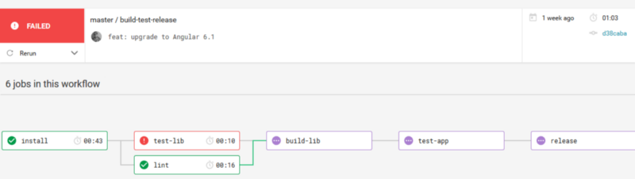
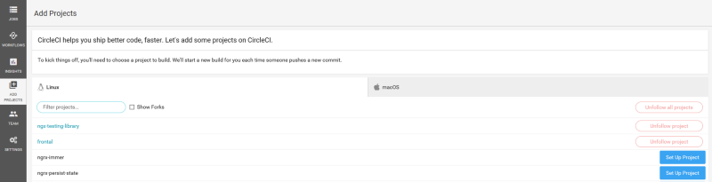
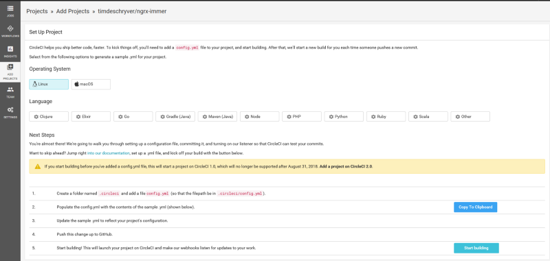
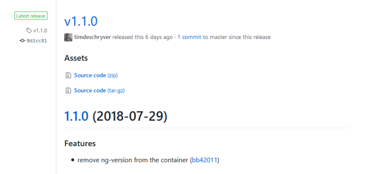
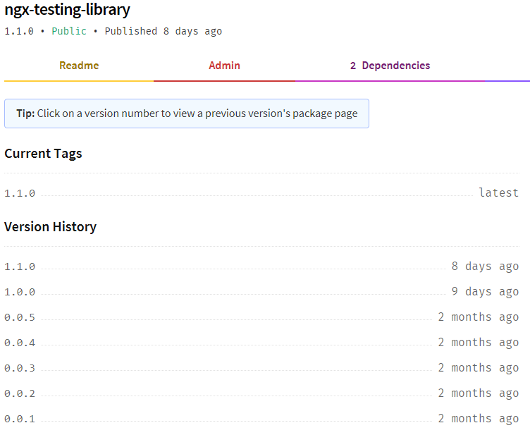
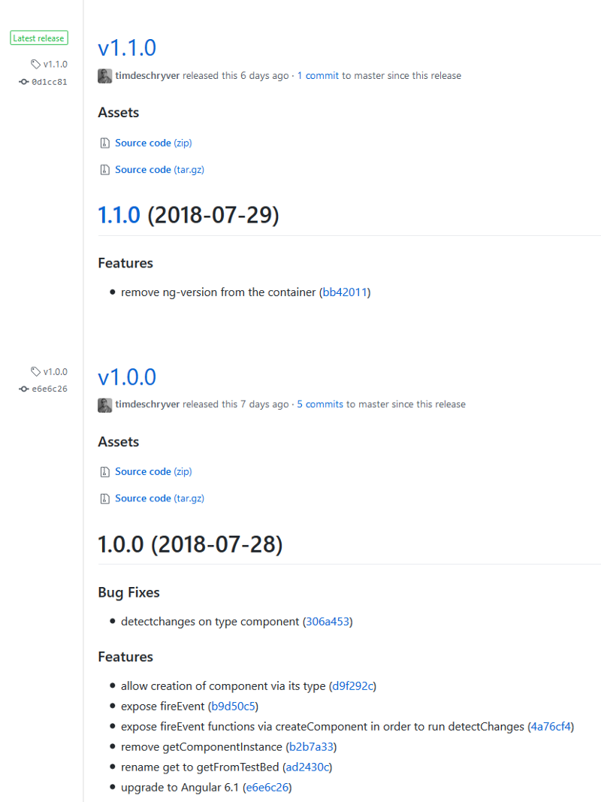

Are you, like me, getting tired of releasing your Angular library manually? And how about keeping that CHANGELOG up to date? In this post I’m taking you along in my journey towards a fully automated process for my [ngx-testing-library](https://github.com/timdeschryver/ngx-testing-library) library!

### The Angular DevOps Series

This post is the first post of the **Angular DevOps Series**. The series also includes a post by fellow Angular in Depth writer, [Todd Palmer](https://medium.com/u/11477bb8a02e), who walks you through the details of deploying an Angular application with Travis CI to GitHub pages. And, [Andrew Evans](https://twitter.com/AndrewEvans0102) shows you how to deploy to Firebase with CircleCI.

- [Semantically release your Angular library](https://blog.angularindepth.com/the-angular-devops-series-semantically-release-your-angular-library-7d78afb4c845)
- [CT/CI with Travis CI and GitHub Pages](https://blog.angularindepth.com/the-angular-devops-series-ct-ci-with-travis-ci-and-github-pages-3c02664f078)
- [Deploying to Firebase with CircleCI](https://blog.angularindepth.com/deploying-an-angular-site-to-firebase-with-circleci-ed881cb6a2fa)
- [CT and Code Coverage with TeamCity](https://blog.angularindepth.com/the-angular-devops-series-ct-and-code-coverage-with-teamcity-21e3d0ed77eb)

### Introduction

As a bit of background, [ngx-testing-library](https://github.com/timdeschryver/ngx-testing-library) is created with the `ng generate library` command and has tests written in the library as well as tests in the example application using it. To build and test my changes, I’m already using [CircleCI](https://circleci.com/) as my **Continuous Integration (CI)** server.

Before we start let’s make a list of what we’re trying to accomplish after we push a commit:

🔲 Only release when the build passes

🔲 Only release when the push has been made to the master branch

🔲 Release the new version to **npm**

🔲 Release the new version to **GitHub**

🔲 Keep the **CHANGELOG** up to date️

### CI/CD Server

The first step towards automation is having a CI server. It will run the tests, create a build, and release the build. Because I’m already happily using [CircleCI](https://circleci.com/) for my CI, I decided to stick with it. There are some other possibilities, the most popular being [Travis CI](https://travis-ci.org/) or [Jenkins](https://jenkins.io/). Note that the CI snippets in this post are written for a CircleCI project, other CI servers are also supporting the same functionality but with a different syntax.

### 📦🚀 semantic-release

> Fully automated version management and package publishing

In my quest for automation I quickly stumbled upon [semantic-release](https://github.com/semantic-release/semantic-release). I had already encountered this library in some OSS projects and heard good stuff about it. After giving it a quick glance it seemed like it had everything I needed and more, so I decided to go with it.

Like the name _semantic-release_ implies, this tool will release your library using the [semantic versioning specification](https://semver.org/) (**SemVer**). In short SemVer is giving a meaning to the version number, it translates the version number to **MAJOR.MINOR.PATCH**, also known as **BREAKING.FEATURE.PATCH**.

1. **MAJOR** version when you make an **incompatible** API change
2. **MINOR** version when you add functionality in a **backwards-compatible** manner
3. **PATCH** version when you make **backwards-compatible** bug fixes

Based on the **commit messages**, semantic-release increments one or none of these versions. These commit messages must follow the [Angular commit message convention](https://github.com/angular/angular.js/blob/master/DEVELOPERS.md#-git-commit-guidelines). An example is as follows, where the header is required and the body and footer are optional:

```bash
<type>(<scope>): <subject>
<BLANK LINE>
<body>
<BLANK LINE>
<footer>
```

The following types can be used:

### Some examples

```bash
# Resulting in a patch release
fix(dish): don't overcook rare steaks

# Resulting in a minor release
feat(dish): add mac and cheese

# Resulting in a major release
feat(chef): add chef Bob

BREAKING CHANGE:
Chef Louis has been fired, all dishes must go to chef Bob
```

To help you out, you can either use [commitizen](https://github.com/commitizen/cz-cli) or [commitlint](https://github.com/marionebl/commitlint) to follow this convention.

Oof, it seems like we have been derailed a bit here, back to semantic-release. To setup semantic-release inside your project we first have to install the **cli** globally or use the `npx` command. After this we can start setting up semantic-release with `semantic-release init`. You will have to answer a couple of questions but after this you’re good to go.

```bash
npm i semantic-release-cli -g
semantic-release-cli init
What is your npm registry? [http://registry.npmjs.org/](http://registry.npmjs.org/)
Which authentication method is this npm registry using? Token based
What is your npm username? tdeschryver
What is your npm password? [hidden]
What is your GitHub username? timdeschryver
What is your GitHub password? [hidden]
What is your GitHub two-factor authentication code? [hidden]
What CI are you using? Circle CI
What is your CircleCI API token? [hidden]
Do you want a `config.yml` file with semantic-release setup? Yes
Do you want to overwrite the existing `config.yml`? No
```

If you’re using CircleCI you can generate a token at [https://circleci.com/account/api](https://circleci.com/account/api)

The `semantic-release init` command changes the following items in the `package.json` file:

- changes the version number to `0.0.0-development`. I’ve changed this to `0.0.0-semantically-released` to make it clear that we’re using semantic versioning
- adds the GitHub repository in `package.json`
- also adds a `semantic-release` script in `package.json`

Because we’re releasing a library which is located in the `projects` folder, e.g. `./projects/ngx-testing-library`, we’ll also have to make these changes manually inside the project’s `package.json`, eg `./projects/ngx-testing-library/package.json`. This is because the project’s `package.json` will be used when we release a new version of the library.

### Configuring the build steps

Note that I already had a **CircleCI config file**. Because of this the semantic-release init command didn’t create one. If you’re running the cli in a clean repository it will create the following `config.yml` for you.

If I add the release script to my existing config, it looks like this:

Without going into too much detail, the above configuration will do the following:

- install all the dependencies and cache them to not have to install them in every step and in every build;
- run a linter, after the install step;
- run the tests for the library, after the install step;
- build the library and cache the `dist` folder, after the lint and library tests;
- test the example application, after the library has been build;
- make a new release based on the cached `dist` folder, after the example application tests ;

This build process can be seen (live), if you go to the workflows tab.



If one of the steps fails, it aborts the following build steps.

This will release our whole directory, but we **only want to release our library which is located in the** `**dist**` **folder**, more specifically `dist/ngx-testing-library`. Therefore we have to set the `pkgRoot` inside the semantic-release configuration, we can do this by adding a `release` entry inside the `package.json`.

### Configuring CircleCI

To enable **CircleCI** you can login using your GitHub account. Once you’re logged in you can enable CircleCI on a per-project basis. This can be done by going to the [Add project tab](https://circleci.com/add-projects/gh/username). Go to your project and click on **Set up project** and follow the instructions on the page.





Once your project is configured, you’ll have to add a **GitHub and npm token** in order to release a new version as a CI step. This can be done via the [environment variables tab](https://circleci.com/gh/username/repository/edit#env-vars) of your project.

If you don’t have a GitHub token you can generate one via the [settings](https://github.com/username/repository/settings/keys) of your GitHub repository.


The same applies for an npm token, if you don’t have one you can generate one via your [profile settings](https://www.npmjs.com/settings/username/tokens).


Once both of the tokens are generated you can set them as environment variables in CircleCI by using `GH_TOKEN` for your GitHub token and `NPM_TOKEN` for your NPM token.


If you push a commit to your GitHub repository by using the commit message convention, it will now publish your library/application.

Finally, we can start checking a couple of items off our list! So far we have:

✅ Only release when the build passes

🔲 Only release when the push has been made to the master branch

✅ Release the new version to **npm**

✅ Release the new version to **GitHub**

🔲 Keep the **CHANGELOG** up to date️

This means there would also be a new release if you push to another branch which is not the master branch. This is something we, and definitely our users, wouldn’t want.

### Configuring the release step

To only release a new version when the master branch receives a push we’ll have to add a filter on the release job.

This means we can check off another item from our list!

✅ Only release when the build passes

✅ Only release when the push has been made to the master branch

✅ Release the new version to **npm**

✅ Release the new version to **GitHub**

🔲 Keep the **CHANGELOG** up to date️

The last item to tick off is updating the **CHANGELOG** automatically.

### CHANGELOG

When **semantic-release** releases a new version to GitHub, it also adds the commit message(s) related to the release in the **release notes**. Because of this I don’t see the need to maintain a **CHANGELOG** since it’s already documented with each release. For example, these are the release notes of the `ngx-testing-library`:



These release notes can be seen via the release page in a GitHub repository, for example [https://github.com/timdeschryver/ngx-testing-library/releases](https://github.com/timdeschryver/ngx-testing-library/releases). The only step left is to refer to the release page inside the [CHANGELOG](https://github.com/timdeschryver/ngx-testing-library/blob/master/CHANGELOG.md).

If you would want to generate a CHANGELOG, I would suggest taking a look at the [standard-version](https://github.com/conventional-changelog/standard-version) library. For an example you can always take a look at the [angular-ngrx-material-starter](https://github.com/tomastrajan/angular-ngrx-material-starter) project.

[changelog referenecs to the release page](./images/8.png)

With this last step we can check off every item on the list!

✅ Only release when the build passes

✅ Only release when the push has been made to the master branch

✅ Release the new version to NPM

✅ Release the new version to GitHub

✅ Keep the CHANGELOG up to date️

### Result and conclusion

By simply installing `semantic-release` and holding ourselves (and contributors/your team) to a commit message convention, which is not a bad thing, we can automate our whole release flow.

With each commit against the master branch we test and build our library, and make sure we didn’t break anything by testing the example app. If everything turns green we release a new version to **GitHub** and **npm**.

As a last note I would say go check out [ngx-testing-library](https://github.com/timdeschryver/ngx-testing-library) and while you’re there you might as well give it a ⭐️.

#### TLDR

- use `semantic-release` and `semantic-release-cli`
- configure the CI build steps inside `./.circleci/config.yml`
- configure semantic-release to only release the `dist` folder via `pkgRoot`
- configure the CircleCI environment variables
- use the Angular commit guidelines

✅ Only release when the build passes

✅ Only release when the push has been made to the master branch


✅ Release the new version to NPM



✅ Release the new version to GitHub

✅ Keep the CHANGELOG up to date️



### Not to miss: GitHub Actions

With [GitHub Actions](https://github.com/features/actions) we can do the same directly via GitHub, which does the same job but without the need to glue different services together.

For more information about GitHub Actions, I’m going to refer you to [Sarah Drasner](https://twitter.com/sarah_edo)’s post [Introducing GitHub Actions](https://css-tricks.com/introducing-github-actions/)
